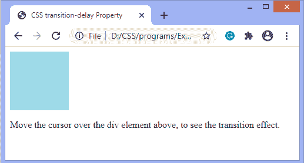
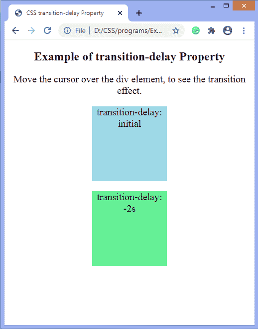
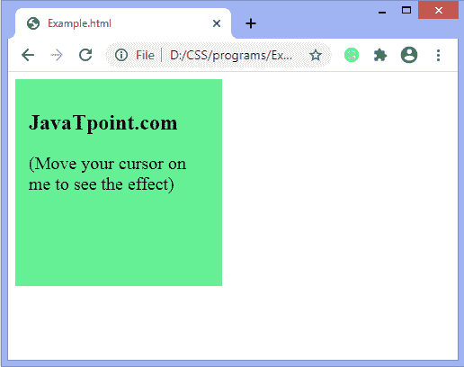

# CSS 转换延迟属性

> 原文：<https://www.javatpoint.com/css-transition-delay-property>

此 CSS 属性指定开始过渡效果的持续时间。该属性的值定义为**秒**或**毫秒(毫秒)**。CSS 过渡是添加的效果，用于将元素从一种样式逐渐更改为另一种样式，而不使用 flash 或 [JavaScript](https://www.javatpoint.com/javascript-tutorial) 。

在不使用**过渡-延迟的情况下，**动画将从元素上的悬停开始，但是使用这个 [CSS](https://www.javatpoint.com/css-tutorial) 属性，我们可以将动画延迟一段时间。

### 句法

```css

transition-delay: time | initial | inherit;

```

**跃迁-延迟**属性的默认值为 **0，**这意味着跃迁将立即开始，没有任何延迟。

### 属性值

**时间:**指定过渡开始前等待的时间(以秒或毫秒为单位)。

**初始值:**将该属性设置为默认值。

**inherit:** 它从其父元素继承该属性。

延迟可以是负的、正的或零。

**过渡延迟**属性的负值将立即开始过渡效果，即效果将被动画化，就像它已经开始一样。此属性的正值会导致过渡效果在给定时间内开始。

我们可以指定多个延迟，这对转换几个属性很有帮助。每个延迟将应用于相关属性，如**转换属性**属性所定义。例如，假设我们提供两个**转换延迟**值。第一个值影响由**过渡属性**属性给出的第一个属性。第二个**转换延迟**影响由**转换**属性给出的属性名称列表中的第二个属性。

让我们看一些**跃迁延迟**属性的例子。

### 示例 1

在本例中，我们使用了**过渡属性、过渡持续时间**和**过渡延迟**属性。 **0.5s** 延迟开始过渡效果，即给定时间后 div 元素的背景颜色会改变。

```css

<!DOCTYPE html>
<html>
<head>
<title>
CSS transition-delay Property
</title>
<style>
div{
width: 100px;
height: 100px;
background: lightblue;
transition-property: background-color;
transition-duration: 1s;
transition-delay: 0.5s;              

/* For Safari browser */
-webkit-transition-property: background-color;
-webkit-transition-duration: 1s;
-webkit-transition-delay: 0.5s;
}
div:hover {
background-color: brown;
}
</style>
</head>
<body>
<div></div>
<p> Move the cursor over the div element above, to see the transition effect. </p>
</body>
</html>

```

[Test it Now](https://www.javatpoint.com/oprweb/test.jsp?filename=css-transition-delay-property1)

**输出**



### 示例 2

在这个例子中，有两个 **div** 元素。在第一个 div 中，我们使用了**过渡延迟**属性的值**初始**。在第二个 div 中，我们应用了**转换延迟**属性的负值，即 **-2s** 。我们必须将光标移到 div 元素上才能看到过渡效果。

```css

<!DOCTYPE html>
<html>
<head>
<title>
CSS transition-delay Property
</title>

<style>
p{
font-size: 20px;
}
.first{
width: 150px;
height: 150px;
background-color: lightblue;
transition-property: width;
transition-duration: 1s;
transition-delay: initial;

/* For Safari browser */
-webkit-transition-property: width;
-webkit-transition-duration: 1s;
-webkit-transition-delay: initial;

}
.second{
width: 150px;
height: 150px;
background-color: lightgreen;
transition: width 1s, height 2s, background-color 2s;
transition-delay: -2s;
}

.first:hover {
width: 300px;
}
.second:hover{
width: 250px;
height: 250px;
background-color: brown;
}
</style>
</head>

<body>
<center>
<h2> Example of transition-delay Property </h2>
<p> Move the cursor over the div element, to see the transition effect. </p>
<div class = "first">
<p> transition-delay: initial </p>
</div>
<div class = "second">
<p> transition-delay: -2s </p>
</div>
</center>
</body>
</html>

```

[Test it Now](https://www.javatpoint.com/oprweb/test.jsp?filename=css-transition-delay-property2)

**输出**



### 例子

现在，还有一个例子，其中有多重过渡效应。这里，过渡影响宽度、高度和变换。在**毫秒(毫秒)**即**2.5 毫秒**内还有一个**过渡延迟**。

```css

<!DOCTYPE html>
<html>
<head>
<style>
div {
padding:15px;
width: 200px;
height: 200px;
background: lightgreen;
transition: background-color 1s, width 2s, height 2s, transform 2s;
transition-delay: 1.5ms;
}
p{
font-size: 20px;
}
div:hover {
width: 300px;
height: 300px;
-webkit-transform: rotate(360deg); /* Chrome, Safari, Opera */
transform: rotate(360deg);
background-color: orange;
}
</style>
</head>
<body>
<div>
<h2>JavaTpoint.com</h2>
<p> (Move your cursor on me to see the effect)</p></div>
</body>
</html>

```

[Test it Now](https://www.javatpoint.com/oprweb/test.jsp?filename=css-transition-delay-property3)

**输出**



* * *