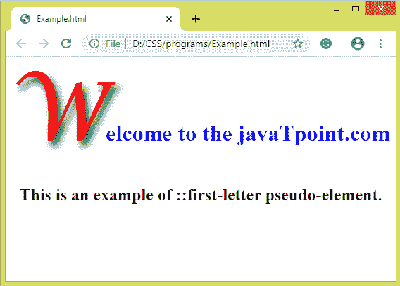
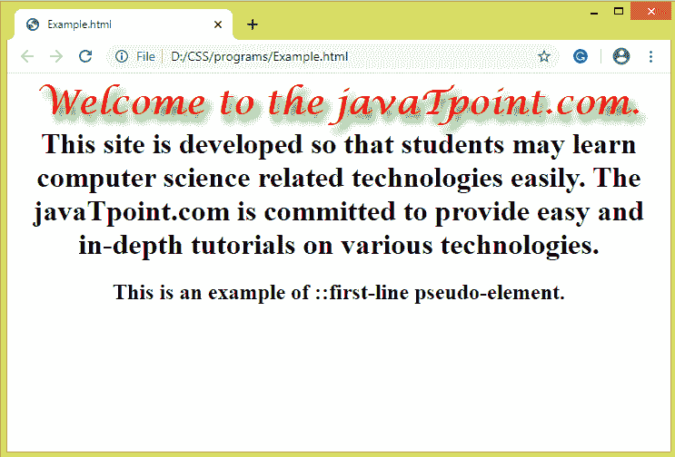
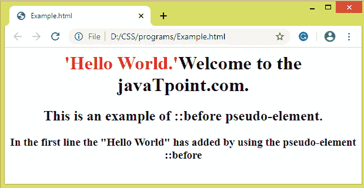
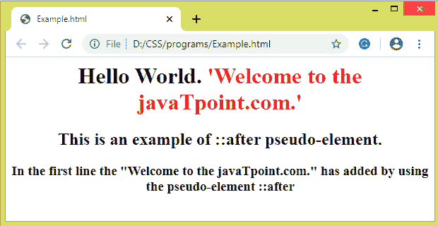
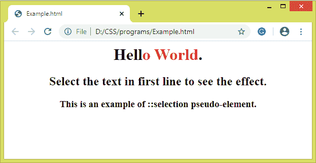
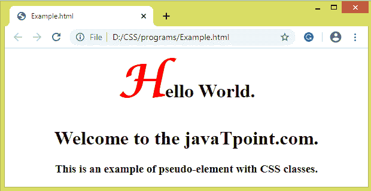

# 伪元素

> 原文：<https://www.javatpoint.com/css-pseudo-elements>

伪类可以被定义为一个关键字，该关键字被组合到一个选择器中，该选择器定义了所选元素的特殊状态。与伪类不同，伪元素用于为元素的特定部分设置样式，而伪类用于为元素设置样式。

例如，伪元素可用于为元素的第一个字母或第一行设置样式。伪元素也可用于在元素之后或之前插入内容。

### 句法

伪元素有一个简单的语法，如下所示:

```html

selector::pseudo-element {
  property: value;
}

```

我们在语法中使用了**双冒号符号(::伪元素)**。在 CSS3 中，双冒号代替了伪元素的单冒号符号。W3C 试图区分伪元素和伪类。所以建议使用**双冒号符号(::伪元素)**而不是使用单冒号符号 **(:)** 。

在 CSS1 和 CSS2 中，伪元素和伪类都使用单个冒号 **(:)** 语法。为了向后兼容，单冒号语法对 CSS1 和 CSS2 中的伪元素有效。

虽然有几个 [CSS](https://www.javatpoint.com/css-tutorial) 伪元素，但我们正在讨论一些最常用的。广泛使用的 CSS 伪元素列表如下:

| 伪元素 | 描述 |
| **::首字母(:首字母)** | 它选择文本的第一个字母。 |
| **:一线(:一线)** | 它设置文本第一行的样式。 |
| **:之前(:之前)** | 它用于在元素内容之前添加一些内容。 |
| **::后(:后)** | 它用于在元素内容之后添加一些内容。 |
| **:选择** | 它用于选择用户选择的元素区域。 |

让我们讨论上面的伪元素，以及一个例子。

## ::第一个字母伪元素

顾名思义，它影响文本的第一个字母。它只能应用于块级元素。它不支持所有的 CSS 属性，而是支持下面给出的一些 CSS 属性。

*   颜色属性**(如颜色)**
*   字体属性**(如字体样式、字体系列、字体大小、字体颜色等)**。
*   边距属性**(如上边距、右边距、下边距、左边距)**。
*   边框属性**(如边框顶部、边框右侧、边框底部、边框左侧、边框颜色、边框宽度等)**。
*   填充属性**(如填充-顶部、填充-右侧、填充-底部和填充-左侧)**。
*   背景属性**(如背景色、背景重复、背景图像、背景位置)**。
*   文字相关属性**(如文字阴影、文字变换、文字装饰等。)**。
*   其他属性有**垂直对齐**(仅当**浮动**为“**无**”)**字距、行高、行距等。**

### 例子

```html

<html> 
<head> 
    <style> 
	body{
	text-align: center;
	}
    h1::first-letter { 
	font-family: Lucida Calligraphy;
	font-size: 3cm;
	color: red;
	text-shadow: 5px 8px 9px green;
    } 
	h1{
	color: blue;
	}
    </style> 
</head> 
<body> 
    <h1> Welcome to the javaTpoint.com </h1> 
	<h2> This is an example of ::first-letter pseudo-element. </h2>
</body> 
</html>

```

[Test it Now](https://www.javatpoint.com/oprweb/test.jsp?filename=CSSPseudoelements1)

**输出**



## 第一行伪元素

类似于**:首字母**伪元素，但是影响整行。它将特殊效果添加到文本的第一行。它支持以下 CSS 属性:

*   颜色属性**(如颜色)**
*   字体属性**(如字体样式、字体系列、字体大小、字体颜色等)**。
*   背景属性**(如背景色、背景重复、背景图像、背景位置)**。
*   其他属性有**字间距、字母间距、行高、垂直对齐、文本转换、文本修饰。**

### 例子

在这个例子中，我们将看到使用**:第一行**元素为元素的第一行添加特效。

```html

<html> 
<head> 
    <style> 
	body{
	text-align: center;
	}
    h1::first-line { 
	font-family: Lucida Calligraphy;
	font-size: 1cm;
	color: red;
	text-shadow: 5px 8px 9px green;
    } 
    </style> 
</head> 
<body> 
    <h1> Welcome to the javaTpoint.com. This site is developed so that students may learn computer science related technologies easily. The javaTpoint.com is committed to provide easy and in-depth tutorials on various technologies. </h1> 
	<h2> This is an example of ::first-line pseudo-element. </h2>
</body> 
</html>

```

[Test it Now](https://www.javatpoint.com/oprweb/test.jsp?filename=CSSPseudoelements2)

**输出**



## 伪元素之前的::号

它允许我们在元素内容之前添加一些东西。它用于在元素的特定部分之前添加一些内容。一般与**内容**属性一起使用。

我们还可以使用这个伪元素在内容之前添加常规字符串或图像。

### 例子

```html

<html> 
<head> 
    <style> 
	body{
	text-align: center;
	}
    h1::before { 
	content: "'Hello World.'";
	color: red;
    } 
    </style> 
</head> 
<body> 
    <h1>Welcome to the javaTpoint.com. </h1> 
	<h2> This is an example of ::before pseudo-element. </h2>
	<h3> In the first line the "Hello World" has added by using the pseudo-element ::before </h3>
</body> 
</html>

```

[Test it Now](https://www.javatpoint.com/oprweb/test.jsp?filename=CSSPseudoelements3)

**输出**



## 伪元素后的::号

它的工作原理类似于**:在**伪元素之前，但是它在元素的内容之后插入内容。它用于在元素的特定部分之后添加一些内容。通常，它与 content 属性一起使用。

它还允许我们在内容后添加常规字符串或图像。

### 例子

```html

<html> 
<head> 
    <style> 
	body{
	text-align: center;
	}
    h1::after { 
	content: "'Welcome to the javaTpoint.com.'";
	color: red;
    } 
    </style> 
</head> 
<body> 
    <h1> Hello World. </h1> 
	<h2> This is an example of ::after pseudo-element. </h2>
	<h3> In the first line the "Welcome to the javaTpoint.com." has added by using the pseudo-element ::after </h3>
</body> 
</html>

```

[Test it Now](https://www.javatpoint.com/oprweb/test.jsp?filename=CSSPseudoelements4)

**输出**



## :选择伪元素

它用于为用户选择的元素部分设置样式。我们可以使用以下 CSS 属性:

*   **颜色。**
*   **背景色。**
*   其他属性包括**光标、轮廓、**等。

### 例子

```html

<html> 
<head> 
    <style> 
	body{
	text-align: center;
	}
	h1::selection {
	color: red;
    } 
    </style> 
</head> 
<body> 
    <h1> Hello World. </h1> 
	<h2> Select the text in first line to see the effect. </h2>
	<h3> This is an example of ::selection pseudo-element. </h3>
	</body> 
</html>

```

[Test it Now](https://www.javatpoint.com/oprweb/test.jsp?filename=CSSPseudoelements5)

**输出**



## CSS 类和伪元素

伪元素可以与 CSS 类相结合，为具有该类的特定元素设置样式。下面给出了组合 CSS 类和伪元素的语法。

### 句法

它可以写成:

```html

selector.class::pseudo-element {
property: value
}

```

### 例子

此示例将影响那些具有 **class="example"** 的

# 元素的第一个字母，而不是影响所有的< h1 >元素。

```html

<html> 
<head> 
    <style> 
	body{
	text-align: center;
	}
	h1.example::first-letter {
	color: red;
	font-size: 2cm;
	font-family: Lucida Calligraphy;
    } 
    </style> 
</head> 
<body> 
    <h1 class="example"> Hello World. </h1> 
    <h1> Welcome to the javaTpoint.com. </h1> 
	<h3> This is an example of pseudo-element with CSS classes.</h3>
	</body> 
</html>

```

[Test it Now](https://www.javatpoint.com/oprweb/test.jsp?filename=CSSPseudoelements6)

**输出**



* * *