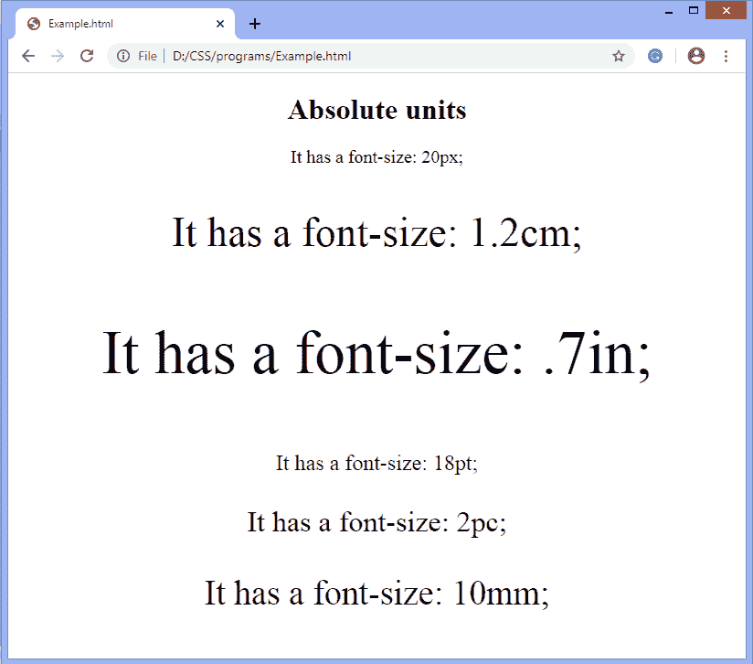
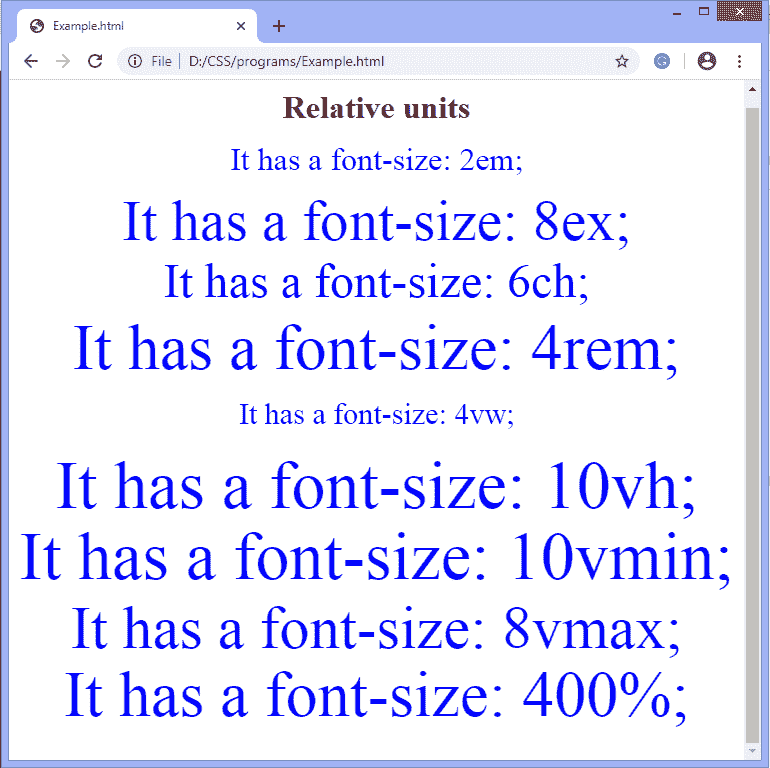
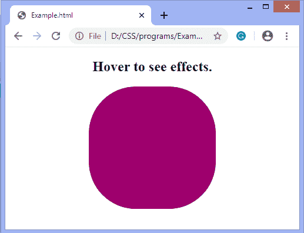
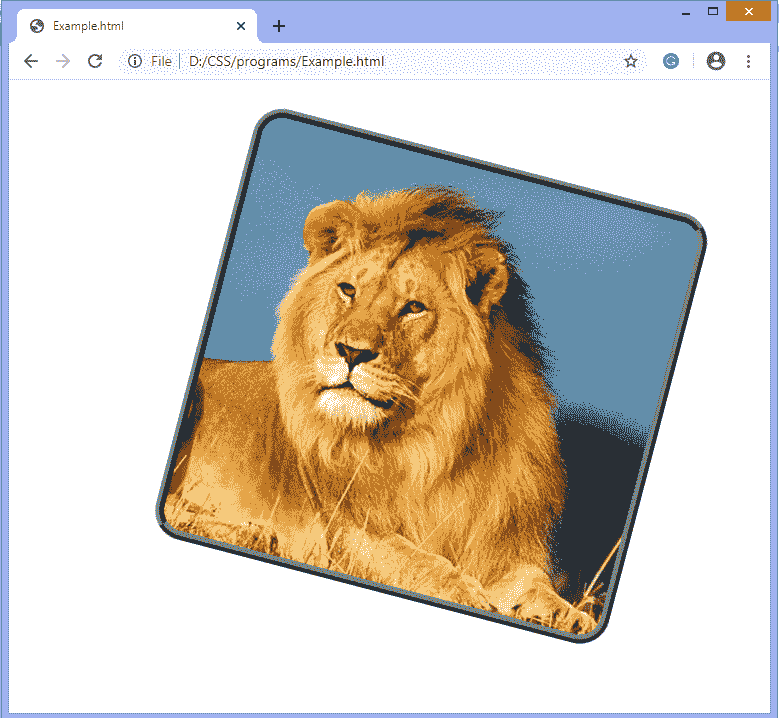

# CSS 单位

> 原文：<https://www.javatpoint.com/css-units>

CSS 中有各种单位来表示度量和长度。CSS 单元用于确定属性大小，这是我们为元素或其内容设置的。CSS 中的单位需要定义度量，如*边距:20px*其中 **px** (或像素)为 CSS 单位。它们用于设置边距、填充、长度等。

我们不能在数字和单位之间使用空格。值 0 可以省略单位。CSS 的某些属性允许长度为负值。

[CSS](https://javatpoint.com/css-tutorial) 中的长度单位有两种:

*   绝对长度。
*   相对长度。

## 绝对长度

这些是固定长度的单位，用绝对单位表示的长度正好是这个尺寸。不建议在屏幕上使用，因为屏幕大小变化太大。因此，当输出媒介已知时，应该使用绝对单位，例如打印布局。

当项目中不考虑响应性时，绝对单位是有用的。它们对响应站点不太有利，因为当屏幕改变时，它们不会缩放。

通常，绝对长度被认为总是相同的大小。绝对长度单位列表如下:

| 单位 | 名字 | 说明 |
| **厘米** | 厘米 | 它用于定义厘米的度量。 |
| **毫米** | 毫米 | 它用于以毫米为单位定义测量值。 |
| 中的 | 英寸 | 它用于定义以英寸为单位的测量。
1 英寸= 96px = 2.54cm 厘米 |
| pt | 点 | 它用于定义以点为单位的测量。
1pt = 1 英寸的 1/72。 |
| **pc** | 网络相册 | 它用于定义以 picas 为单位的度量。
1pc = 12pt 所以，有 6 picas 就相当于 1 英寸。 |
| **px** | 像素 | 它用于以像素为单位定义测量。
1px = 1/96 英寸 |

### 例子

在本例中，我们使用段落的**字体大小**属性来定义使用上述绝对长度单位的值。

```html

<!DOCTYPE html>
<html>
<head>
<style>
body{
text-align: center;
}
</style>
</head>
<body>
<h1> Absolute units </h1>
<p style = "font-size: 20px;" > It has a font-size: 20px; </p>
<p style = "font-size: 1.2cm;" > It has a font-size: 1.2cm; </p>
<p style = "font-size: .7in;" > It has a font-size: .7in; </p>
<p style = "font-size: 18pt;" > It has a font-size: 18pt; </p>
<p style = "font-size: 2pc;" > It has a font-size: 2pc; </p>
<p style = "font-size: 10mm;" > It has a font-size: 10mm; </p>
</body>
</html>

```

[Test it Now](https://www.javatpoint.com/oprweb/test.jsp?filename=CSS-units1)

**输出**



## 相对长度

相对单位是很好的风格的响应网站，因为他们相对于窗口大小或父缩放。它们指定相对于另一个长度属性的长度。

根据设备的不同，如果屏幕的大小变化太大，那么相对长度单位是最好的，因为它们在不同的渲染介质之间可以更好地缩放。我们可以使用相对单位作为响应单位的默认值。它帮助我们避免不同屏幕尺寸的更新样式。

相对长度单位列表如下:

| 单位 | 名字 |
| 全身长的 | 它与元素的字体大小有关。 |
| 不包括 | 它相对于元素字体的 x 高度。很少使用。x 高度由小写字母“x”的高度决定。 |
| 荣誉勋爵 | 它类似于单位 ex，但不是使用字母 x 的高度，而是测量整数“0”(零)的宽度。 |
| 雷姆 | 它是根元素的字体大小 |
| 可变区 | 它相对于视口的高度。
1vh =视口高度的 1%或 1/100。 |
| 大众汽车（Volkswagen 的缩写） | 它相对于视口的宽度。
1vw =视口宽度的 1%或 1/100 |
| 虚拟机(VMM) | 它相对于视口的较小尺寸。
1vmin =视口较小尺寸的 1%或 1/100。 |
| 威玛 | 它相对于视口的较大尺寸。
1vmax =视口较大尺寸的 1%或 1/100。 |
| % | 它用于将度量定义为相对于另一个值的百分比。 |

### 例子

```html

<!DOCTYPE html>
<html>
<head>
<style>
body{
text-align: center;
}
p{
line-height: 0.1cm;
color: blue;
}
</style>
</head>
<body>
<h1> Relative units </h1>
<p style = "font-size: 2em;" > It has a font-size: 2em; </p>
<p style = "font-size: 8ex;" > It has a font-size: 8ex; </p>
<p style = "font-size: 6ch;" > It has a font-size: 6ch; </p>
<p style = "font-size: 4rem;" > It has a font-size: 4rem; </p>
<p style = "font-size: 4vw;" > It has a font-size: 4vw; </p>
<p style = "font-size: 10vh;" > It has a font-size: 10vh; </p>
<p style = "font-size: 10vmin;" > It has a font-size: 10vmin; </p>
<p style = "font-size: 8vmax;" > It has a font-size: 8vmax; </p>
<p style = "font-size: 400%;" > It has a font-size: 400%; </p>
</body>
</html>

```

[Test it Now](https://www.javatpoint.com/oprweb/test.jsp?filename=CSS-units2)

**输出**



## CSS 单位:时间

有些动画属性需要用时间来表示值。

| 单位 | 说明 |
| s | 它是以秒为单位的持续时间。 |
| 女士 | 它是以毫秒为单位的持续时间。
1 毫秒= 1/100 秒 |

### 例子

```html

<!DOCTYPE html>
<html>
<head>
<style> 
div
{
width: 200px;
height: 200px;
background: red;
border-radius: 50px;
transition-property: background, width, height;
transition-duration: 1s, 2s, 3s;
}

div:hover
{
width:300px;
background: blue;
height:300px;
border-radius: 80px;
}
</style>
</head>
<body>
<center>
<h2>Hover to see effects.</h2>
<div></div>
</center>
</body>
</html>

```

[Test it Now](https://www.javatpoint.com/oprweb/test.jsp?filename=CSS-units3)

**输出**



## CSS 单位:角度

CSS 中的变换属性需要用角度来表示值

| 单位 | 说明 |
| （同 degree）度 | 它用度数来表示角度。 |
| 毕业生 | 它用梯度表示角度，即 1/400 圈。 |
| 转动 | 它轮流表示角度，即 360 度。 |

### 例子

```html

<!DOCTYPE html>
<html>
<head>
<style>

img
  {
  border:9px ridge gray;
  border-radius:30px;
  margin:10px; 
  transition-duration:2s;
    }

#img1:hover{ 
transform: rotate(30deg);
transform-origin: bottom left 50px;
}

</style>
</head>

<body>
<center>
  

</center>
  </body>
</html>

```

[Test it Now](https://www.javatpoint.com/oprweb/test.jsp?filename=CSS-units4)

**输出**


