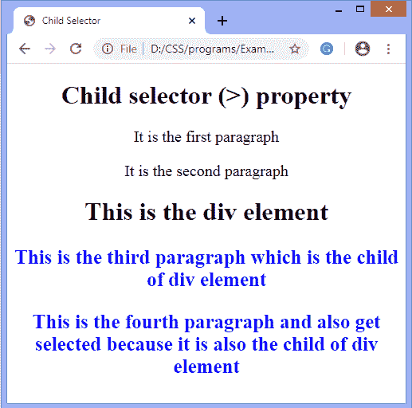

# CSS 组合器

> 原文:[https://www.javatpoint.com/css-combinators](https://www.javatpoint.com/css-combinators)

CSS Combinators 澄清了两个选择器之间的关系，而 CSS 中的选择器用于选择样式化的内容。

一个 [CSS 选择器](https://www.javatpoint.com/css-selector)中可以有多个简单的选择器，在这些选择器之间，我们可以包含一个组合子。组合器将选择器组合起来，为它们提供有用的关系和内容在文档中的位置。

[CSS](https://javatpoint.com/css-tutorial) 中有四种组合子，列举如下:

*   常规同级选择器(~)
*   相邻同级选择器(+)
*   子选择器(>)
*   后代选择器(空间)

## 常规同级选择器(~)

它使用**符号(~)** 作为元素之间的分隔符。它选择跟随第一个选择器的元素的元素，它们都是同一父元素的子元素。它可用于选择共享公共父元素的元素组。

当我们必须选择一个元素的兄弟元素时，即使它们不是直接相邻的，这也是有用的。

### 句法

```

element ~ element {
   /*style properties*/
}

```

假设我们必须选择所有 **< div >** 元素的兄弟 **< p >** 元素，那么我们可以把它写成:

```

div ~ p {
   /*style properties*/
}

```

下图帮助我们理解通用同级选择器(~)。


在此图中，绿色的块是使用通用同级选择器后受影响的选定块。

### 例子

在本例中，我们选择了位于 [**< h1 >**](https://www.javatpoint.com/html-heading) 之后的 **< p >** 元素。有一个 **< div >** 元素不会被选中，div 里面的段落元素也不会被选中。但是那些在 **< div >** 之后的**p>**元素会受到影响。

此示例将说明通用同级选择器(~)的使用。

```

<!DOCTYPE html>
<html>
<head>
<title>General Sibling Selector</title>
<style>
body{
text-align: center;
}
h1 ~ p{
color: blue;
font-size: 25px;
font-weight: bold;
text-align: center;
}
div {
font-size: 32px;
}
</style>
</head>

<body>
<h1>General sibling selector (~) property</h1>
<p>It is the first paragraph element which will get effected.</p>
<div> It is the div element
<p> It is the paragraph under the div element </p>
</div>
<p>It is the paragraph element after the div</p>
<p>It is the paragraph element which will also get affected</p>
</body>
</html>

```

[Test it Now](https://www.javatpoint.com/oprweb/test.jsp?filename=CSS-Combinators1)

**输出**


## 相邻同级选择器(+)

它使用**加(+)** 符号作为元素之间的分隔符。只有当元素紧跟在第一个元素之后，并且这两个元素都是同一父元素的子元素时，它才匹配第二个元素。这个同级选择器选择相邻的元素，或者我们可以说紧挨着指定标签的元素。

它只选择紧挨着指定的第一个元素的元素。

### 句法

```

element + element {
   /*style properties*/
}

```

如果我们必须选择紧接在另一个段落之后的段落，那么通过使用相邻的选择器，它将被写成如下:

```

p + p {
   /*style properties*/
}

```

下图有助于我们理解相邻同级选择器(+)。


在此图中，绿色的块是使用相邻的同级选择器后受影响的选定块。紧接在另一个段落元素之后的是那些段落元素的选择。

### 例子

在这个例子中，我们选择了紧接在**元素之后的 **< p >** 元素。有一个 **< div >** 元素不会被选中，div 后的段落元素也不会被选中。但是第三段旁边的 **< p >** 元素会受到影响。**

此示例将说明相邻同级选择器(+)的使用。

```

<!DOCTYPE html>
<html>
<head>
<title> Adjacent Sibling Selector </title>
<style>
body{
text-align: center;
}
p + p{
color: Blue;
font-size:25px;
font-weight: bold;
text-align: center;
}
p {
font-size: 32px;
}
</style>
</head>

<body>
<h1> Adjacent sibling selector (+) property</h1>
<p> It is the first paragraph </p>
<p> It is the second paragraph which is immediately next to the first paragraph, and it get selected. </p>
<div> This is the div element </div>
<p> This is the third paragraph which does not get affected </p>
<p> This paragraph is also selected because it immediately next to third paragraph </p>
</body>
</html>

```

[Test it Now](https://www.javatpoint.com/oprweb/test.jsp?filename=CSS-Combinators2)

**输出**


## 子选择器(>)

它使用大于 **( > )** 符号作为元素之间的分隔符。它选择父代的直接后代。该组合子只匹配文档树中的直接子元素。与后代选择器相比，它更严格，因为它只在第一个选择器是其父选择器时才选择第二个选择器。

父元素必须始终放置在**“>”**的左侧。如果我们去掉指定它为子组合子的大于 **( > )** 符号，那么它将成为后代选择器。

### 句法

```

element > element {
   /*style properties*/
}

```

如果我们必须选择属于 **< div >** 元素的子元素的段落元素，那么通过使用子选择器，它将被编写如下:

```

div > p {
   /*style properties*/
}

```

下图帮助我们理解子选择器(>)。


在此图中，绿色的块是使用子选择器后受影响的选定块。如图所示，只有 div 元素的直接子元素的段落元素被选中。

### 例子

在这个例子中，我们选择了 **< p >** 元素，它们是**T6】div>**元素的子元素。它只选择那些 div 元素的直接子元素的段落元素。

此示例将说明子同级选择器(>)的使用。

```

<!DOCTYPE html>
<html>
<head>
<title> Child Selector </title>
<style>
body{
text-align: center;
}

div > p{
color: Blue;
font-size:25px;
font-weight:bold;
text-align:center;
}
p {
font-size: 20px;
}

</style>
</head>

<body>
<h1> Child selector (>) property</h1>
<p> It is the first paragraph </p>
<p> It is the second paragraph </p>
<div>
<h1>This is the div element</h1>
<p> This is the third paragraph which is the child of div element </p>
<p> This is the fourth paragraph and also get selected because it is also the child of div element </p>
</div>
</body>
</html>

```

[Test it Now](https://www.javatpoint.com/oprweb/test.jsp?filename=CSS-Combinators3)

**输出**



## 后代选择器(空间)

它使用空格作为元素之间的分隔符。CSS 后代选择器用于匹配特定元素的后代元素，并使用单个空格来表示它。“后代”一词表示嵌套在 DOM 树中的任何位置。它可以是直接子级，也可以是深于五级，但仍将被称为后代。

它结合了两个选择器，其中第一个选择器代表一个祖先(父、父的父等)。)，第二个选择器代表后代。如果第二个选择器匹配的元素的祖先元素与第一个选择器匹配，则选择第二个选择器匹配的元素。

### 句法

```

element element {

   /*style properties*/
}

```

如果我们必须选择一个 **< div >** 元素的子元素的段落元素，那么通过使用后代选择器，它将被编写如下:

```

div  p {
   /*style properties*/
}

```

下图帮助我们理解后代选择器。


### 例子

```

<!DOCTYPE html>
<html>
<head>
<title> Descendant Selector </title>
<style>
body{
text-align: center;
}
div p{
color: blue;
font-size:28px;
font-weight: bold;
text-align: center;
}
p,div {
font-size: 25px;
}

</style>
</head>

<body>
<div>
<p> This is 1st paragraph in the div. </p>
<p> This is 2nd paragraph in the div. </p>
<span>
This is the span element in the div
<p> This is the paragraph in the span. It will also be affected. </p>
</span>
</div>

<p> Paragraph 4\. It will not be affected because it is not in the div. </p>

</body>
</html>

```

[Test it Now](https://www.javatpoint.com/oprweb/test.jsp?filename=CSS-Combinators4)

**输出**


* * *