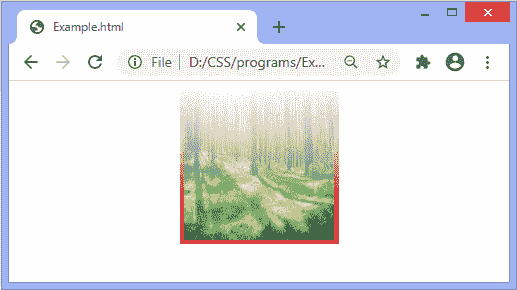

# CSS 屏蔽

> 原文：<https://www.javatpoint.com/css-masking>

CSS 中的**遮罩**属性用于通过在特定点裁剪或遮罩图像来隐藏元素。遮罩定义如何使用图像或图形元素作为亮度或 alpha 遮罩。这是一种图形操作，可以完全或部分隐藏元素或对象的部分。

使用遮罩，可以显示或隐藏图像中不透明度不同的部分。在 [CSS](https://www.javatpoint.com/css-tutorial) 中，通过使用**遮罩-图像**属性来实现遮罩，我们必须提供一个图像作为遮罩。

让我们用一些插图来理解它。

### 例子

在本例中，我们将在图像元素上放置一个遮罩。这里，有两个特定的图像，我们正在对它们应用遮罩，最终的图像是通过将整个遮罩图像放在一起，拉伸它们等来构建的。

```css

<!DOCTYPE html>
<html>
<head>
<style>
div img{
width: 200px;
height: 200px;
}
#masked{
width: 300px;
height: 300px;
-webkit-mask-box-image: url(box.png) 25;

}
</style>
</head>

<body>
<center>
<div id = "one">
<h2> Original Images </h2>


</div>
<h2> After masking </h2>

</center>
</body>
</html>

```

[Test it Now](https://www.javatpoint.com/oprweb/test.jsp?filename=CSSmasking1)

**输出**


还有一个例子，我们也在使用图像进行掩蔽。我们使用了两张图像，其中一张是包含条纹的蒙版图像。

### 示例 2

这是在图像元素上放置遮罩的另一个示例。

```css

<!DOCTYPE html>
<html>
<head>
<style>
div img{
width: 200px;
height: 200px;
}
#masked{
width: 300px;
height: 300px;
-webkit-mask-box-image: url(stripes.png);
background-color: black;

}
</style>
</head>

<body>
<center>
<div id = "one">
<h2> Original Images </h2>


</div>
<h2> After masking </h2>

</center>
</body>
</html>

```

[Test it Now](https://www.javatpoint.com/oprweb/test.jsp?filename=CSSmasking2)

**输出**


### 示例 3

我们可以使用 CSS 渐变作为遮罩图像的来源。

```css

<!DOCTYPE html>
<html>
<head>
<style>
#masked{
width: 300px;
height: 300px;
-webkit-mask-image: -webkit-gradient(linear, right top, right bottom, from(rgba(0,0,0,0)), to(rgba(0,0,0,0.9)));
border: 9px ridge red;
}
</style>
</head>

<body>
<center>

</center>
</body>
</html>

```

[Test it Now](https://www.javatpoint.com/oprweb/test.jsp?filename=CSSmasking3)

**输出**



### 示例 4

```css

<!DOCTYPE html>
<html>
<head>
<style>
#masked{
width: 300px;
height: 300px;
border-radius: 0px;
-webkit-mask-image: radial-gradient(circle at 50% 50%, blue 40%, rgba(0,0,0,0.3) 70%);
border: 9px ridge red;
}
</style>
</head>

<body>
<center>

</center>
</body>
</html>

```

[Test it Now](https://www.javatpoint.com/oprweb/test.jsp?filename=CSSmasking4)

**输出**


### 示例 4

```css

<!DOCTYPE html>
<html>
<head>
<style>
#circle{
width: 300px;
height: 300px;
-webkit-mask-image: radial-gradient(circle at 50% 50%, blue 40%, rgba(0,0,0,0.3) 70%);
border: 9px ridge red;
}
#ellipse{
width: 300px;
height: 300px;
-webkit-mask-image: radial-gradient(ellipse 80% 30% at 50% 50%, blue 40%, rgba(0,0,0,0.3) 55%);
border: 9px ridge red;
}
</style>
</head>

<body>
<center>


</center>
</body>
</html>

```

[Test it Now](https://www.javatpoint.com/oprweb/test.jsp?filename=CSSmasking5)

**输出**


* * *