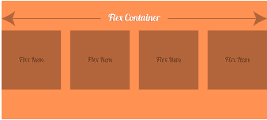

# CSS Flexbox

> 哎哎哎:# t0]https://www . javatppoint . com/CSS-flexbox

CSS3 柔性框又称 CSS Flexbox，是 CSS3 中一种新的布局模式。

CSS3 flexbox 用于使元素在用于不同屏幕尺寸和不同显示设备时表现可预测。它提供了一种更有效的方式来布局、对齐和在容器中的项目之间分配空间。

主要是为了让 CSS3 能够改变它的项目？最适合所有可用空间的宽度和高度。它优于块模型。

CSS3 flexbox 包含 flex 容器和 flex 项目。

**灵活容器:**灵活容器指定父级的属性。它通过将元素的 display 属性设置为 flex 或 inline-flex 来声明。

**弹性项:**弹性项指定子对象的属性。灵活容器中可能有一个或多个灵活项目。



**注意:** Flexbox 指定如何在 flex 容器中设置 flex 项目。它沿伸缩线设置伸缩容器内的伸缩项。默认情况下，每个 flex 容器只有一条 flex 线。flex 容器之外和 flex 项目之内的一切都被认为是正常的。

让我们举一个例子来展示 flex 容器中的三个 flex 项目。默认情况下，它们沿着水平伸缩线从左到右设置:

**见本例:**

```css

  flex item 1
  flex item 2
  flex item 3

```

[Test it Now](https://www.javatpoint.com/oprweb/test.jsp?filename=css-flexbox1)

您也可以使用方向属性来变更挠曲线的方向。如果要将方向线设置为从右向左，则将方向属性设置为 rtl。

**见本例:**

```css

  flex item 1
  flex item 2
  flex item 3

```

[Test it Now](https://www.javatpoint.com/oprweb/test.jsp?filename=css-flexbox2)

* * *

## CSS3 弹性框属性

以下是 CSS3 Flexbox 属性的列表:

| 财产 | 描述 |
| 显示 | 它用于指定用于 html 元素的框的类型。 |
| 挠曲方向 | 它用于指定 flex 容器内的灵活项目的方向。 |
| 调整内容 | 当项目没有使用主轴上的所有可用空间时，它用于水平对齐伸缩项目。 |
| 对齐项目 | 当项目没有使用横轴上的所有可用空间时，它用于垂直对齐 flex 项目。 |
| 柔性包装 | 它指定如果在一个 flex 行上没有足够的空间，flex 项是否应该换行。 |
| 对齐内容 | 它用于修改 flex-wrap 属性的行为。它类似于对齐项目，但它不是对齐伸缩项目，而是对齐伸缩线。 |
| 柔性流 | 它为 flex-direction 和 flex-wrap 指定了一个简写属性。 |
| 命令 | 它指定了一个灵活项相对于同一容器中其他灵活项的顺序。 |
| 自动校准 | 它用于弹性项目。它重写容器的 align-items 属性。 |
| 弯曲 | 它指定了 flex 项相对于同一容器中其他 flex 项的长度。 |

* * *

## 支持浏览器

| 财产 | 铬 |  IE |  Firefox | 歌剧 |  Safari |
| 基础支撑
(单线弹性箱) | 29.0
21.0 -webkit- | Eleven | 22.0
18.0 -月- | 12.1-网络工具包- | 6.1-网络工具包- |
| 多线弹性箱 | 29.021.0 -webkit | Eleven | Twenty-eight | 17.0
15.0 -webkit-
12.1 | 6.1-网络工具包- |

* * *