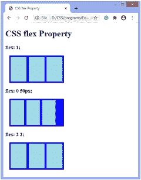
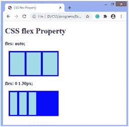

# CSS 弹性属性

> 原文:[https://www.javatpoint.com/css-flex-property](https://www.javatpoint.com/css-flex-property)

CSS 中的 flex 属性是**伸缩生长、伸缩收缩、**和伸缩基础的简写。它只对弹性项起作用，所以如果容器的项不是弹性项，**弹性**属性不会影响相应的项。

此属性用于设置弹性项的长度。有了这个 [CSS](https://www.javatpoint.com/css-tutorial) 属性，子元素和主容器的定位就很容易了。它用于设置伸缩项如何缩小或增大以适应空间。

**伸缩**属性可以由一个、两个或三个值指定。

*   当存在单值语法时，该值必须是一个数字或关键字，如 **none、auto、**或 **initial** 。
*   当有双值语法时，第一个值必须是一个数字(用作**伸缩-增长**)，第二个值可以是一个数字(用于**伸缩-收缩**)或一个有效的宽度值(用作**伸缩-基础**)。
*   当有三值语法时，值必须遵循以下顺序:a **数字**代表**伸缩，a**数字**数字**代表**伸缩，**和有效的**宽度**值代表**伸缩基础**。

### 句法

```

flex: flex-grow flex-shrink flex-basis | auto | none | initial | inherit;

```

### 属性值

**伸缩生长:**它是一个正的无单位数，决定了伸缩生长因子。它指定该项目与其他灵活项目相比将增长多少。不允许负值。如果省略，则设置为值 **1** 。

**挠曲收缩:**决定挠曲收缩系数的是正的无单位数。它指定了与其他弹性项相比，该项将收缩多少。不允许负值。如果省略，则设置为值 **1** 。

**弹性基准:**它是以相对或绝对单位表示的长度，定义了弹性项的初始长度。它用于设置弹性项的长度。其值可以是**自动、继承、**或后跟长度单位的数字，如 **em、px、**等。不允许负值。如果省略，则设置为值 **0** 。

**自动:**弹性属性的这个值相当于 **1 1 自动**。

**无:**弹性属性的该值相当于 **0 0 自动**。它既不会增加也不会减少弹性物品。

**初始值:**将属性设置为默认值。相当于 **0 0 自动**。

**inherit:** 它从其父元素继承属性。

### 例子

在本例中，有三个容器，每个容器有三个弹性项。集装箱的**宽度**和高度为 **300px** 和 **100px** 。

我们正在应用**flex:1；**至第一个容器的挠性件，**挠性件:0 50px**至第二个容器的挠性件，**挠性件:22；**连接到第三个容器的伸缩件。

```

<!DOCTYPE html>
<html>
<head>
<title>
CSS flex Property
</title>

<style>
.container {
width: 200px;
height: 100px;
border: 1px solid black;
display: flex;
margin: 15px;
background-color: blue;
}

.flex-item{
flex: 1; // unitless number: flex-grow
}
.flex-item1{
flex: 0 50px; // flex-grow, flex-basis
}
.flex-item2{
flex: 2 2; // flex-grow, flex-shrink
}
.flex-item, .flex-item1, .flex-item2 {
background-color: lightblue;
margin: 4px;
}
</style>
</head>

<body>
<h1> CSS flex Property </h1>
<h3> flex: 1; </h3>
<div class = "container">
<div class = "flex-item">
</div>
<div class = "flex-item">
</div>
<div class = "flex-item">
</div>
</div>
<h3> flex: 0 50px; </h3>
<div class = "container">
<div class = "flex-item1">
</div>
<div class = "flex-item1">
</div>
<div class = "flex-item1">
</div>
</div>
<h3> flex: 2 2; </h3>
<div class = "container">
<div class = "flex-item2">
</div>
<div class = "flex-item2">
</div>
<div class = "flex-item2">
</div>
</div>
</body>
</html>

```

[Test it Now](https://www.javatpoint.com/oprweb/test.jsp?filename=css-flex-property1)

**输出**



### 例子

在本例中，有两个容器，每个容器有三个弹性项。集装箱的**宽**和**高**分别为 **200px** 和 **100px** 。

我们正在应用**flex:auto；**至第一个容器的柔性物品，**柔性:0 1 30px**连接到第二个容器的伸缩件。

```

<!DOCTYPE html>
<html>
<head>
<title>
CSS flex Property
</title>

<style>
.container {
width: 200px;
height: 100px;
border: 1px solid black;
display: flex;
margin: 15px;
background-color: blue;
}

.flex-item{
flex: auto;
}
.flex-item1{
flex: 0 1 30px;
}

.flex-item, .flex-item1{
background-color: lightblue;
margin: 4px;
}
</style>
</head>

<body>
<h1> CSS flex Property </h1>
<h3> flex: auto; </h3>
<div class = "container">
<div class = "flex-item">
</div>
<div class = "flex-item">
</div>
<div class = "flex-item">
</div>
</div>
<h3> flex: 0 1 30px; </h3>
<div class = "container">
<div class = "flex-item1">
</div>
<div class = "flex-item1">
</div>
<div class = "flex-item1">
</div>
</div>

</body>
</html>

```

[Test it Now](https://www.javatpoint.com/oprweb/test.jsp?filename=css-flex-property2)

**输出**



* * *