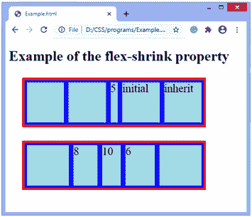
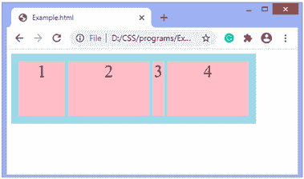

# CSS 伸缩属性

> 原文:[https://www.javatpoint.com/css-flex-shrink-property](https://www.javatpoint.com/css-flex-shrink-property)

CSS **伸缩**属性指定一个项目将比容器的其他项目缩小多少。它设置弹性项的弹性收缩系数(一个决定弹性项收缩程度的数字)。

我们可以在弹性项之间分配负空间，这样一些项会比其他项占用更多的负空间。可以通过将**伸缩**属性的值设置为 **2** 来完成。所以，带有**伸缩收缩的伸缩项:2；**将比**收缩两倍:1；**即占用的负空间是其他的两倍。**挠曲收缩**值越高，项目收缩越大。

当分配负空间时，弹性收缩系数与弹性基数相乘。**弹性基础**是项目的初始大小。

它只对弹性项起作用，所以如果容器中的项不是弹性项，**弹性收缩**属性不会影响相应的项。通常，此 [CSS](https://www.javatpoint.com/css-tutorial) 属性与其他 flex 属性一起使用，即 **flex-grow** 和 **flex-basis** ，通常由 [**flex**](https://www.javatpoint.com/css-flex-property) 简写来定义，以确保设置所有值。

### 句法

```

flex-shrink: number| initial | inherit;

```

### 价值观念

**数字:**是决定挠曲收缩系数的正数。其默认值为 1，表示默认情况下项目不会收缩。它不允许负值。该值指定该项目与其他灵活项目相比将缩小多少。

**初始值:**将该属性设置为默认值。

**inherit:** 它从其父元素继承该属性。

### 例子

在本例中，有两个容器，每个容器有五个弹性项。集装箱的**宽**和**高**分别为 **400px** 和 **100px** 。

在第一个容器中，我们应用**伸缩:5；**至第三项，**伸缩:初始；**至第四项，**伸缩:继承；**至第五项。

在第二个容器中，我们应用**伸缩:8；**到第二项，**伸缩:10；**至第三项，**伸缩:6；**至第四项。

```

<!DOCTYPE html>
<html>
<head>
<style>
.container {
width: 400px;
height: 100px;
border: 5px solid red;
display: flex;
background-color: blue;
margin: 30px;
}
.flex-item{
background-color: lightblue;
font-size: 25px;
margin: 5px;
flex-grow: 1;
flex-shrink: 1;
flex-basis: 100px;
}

</style>
</head>
<body>

<h1> Example of the flex-shrink property </h1>
<div class="container">
<div class = "flex-item"></div>
<div class = "flex-item"></div>
<div class = "flex-item" style = "flex-shrink: 5;"> 5 </div>
<div class = "flex-item" style = "flex-shrink: initial;"> initial </div>
<div class = "flex-item" style = "flex-shrink: inherit;"> inherit </div>
</div>
<div class="container">
<div class = "flex-item"></div>
<div class = "flex-item" style = "flex-shrink: 8;"> 8 </div>
<div class = "flex-item" style = "flex-shrink: 10;"> 10 </div>
<div class = "flex-item" style = "flex-shrink: 6;"> 6 </div>
<div class = "flex-item"></div>
</div>

</body>
</html>

```

[Test it Now](https://www.javatpoint.com/oprweb/test.jsp?filename=css-flex-shrink-property1)

**输出**



让我们看看另一个**伸缩**属性的例子。

### 例子

在这个例子中，有一个容器，有五个弹性项。集装箱的**宽**和**高**分别为 **400px** 和 **100px** 。我们将**伸缩**属性应用于其中两个项目，这两个项目将比其他项目占用更多的负空间。柔性项的**柔性基础**的值为 **150px** 。

```

<!DOCTYPE html>
<html>
<head>
<style>

.container {
width: 400px;
height: 100px;
padding: 10px;
display: flex;
background-color: lightblue;
}

.flex-item {
background-color: pink;
margin: 3px;
text-align: center;
font-size: 30px;
flex-basis: 150px;
flex-grow: 0;
}
</style>
</head>
<body>
<div class="container">
<div class="flex-item" style = "flex-shrink: 3;"> 1 </div>
<div class="flex-item" > 2 </div>
<div class="flex-item" style = "flex-shrink: 5;" > 3 </div>
<div class="flex-item" > 4 </div>
<div class="flex-item" > 5 </div>
</div>
</body>
</html>

```

[Test it Now](https://www.javatpoint.com/oprweb/test.jsp?filename=css-flex-shrink-property2)

**输出**



* * *