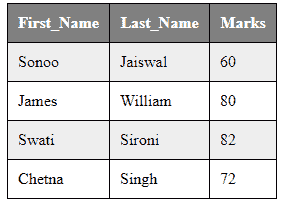

# CSS 表格

> 原文：<https://www.javatpoint.com/css-table>

我们可以在 HTML 表格上应用样式，以获得更好的外观和感觉。在使用 CSS 设计表格时，有一些 CSS 属性被广泛使用:

*   边界
*   边界崩溃
*   填料
*   宽度
*   高度
*   文本对齐
*   颜色
*   背景色

## CSS 表格边框

我们可以使用 CSS 边框属性为表格、th 和 td 标签设置边框。

```html
<style>
table, th, td {
    border: 1px solid black;
}
</style>

```

[Test it Now](https://www.javatpoint.com/oprweb/test.jsp?filename=htmltable4)

**输出:**

```html

| 名字 | 姓氏 | 马克斯 |

| 我是子 | 杰史瓦 | Sixty |

| 詹姆斯 | 威廉 | Eighty |

| 斯瓦蒂语 | Sironi 的 | Eighty-two |

| 切特那 | 辛格 | seventy-two |

```

## CSS 表格边框折叠

借助边界折叠属性，我们可以只在一个边界内折叠所有边界。

```html
<style>
table, th, td {
    border: 2px solid black;
    border-collapse: collapse;
}
</style>

```

[Test it Now](https://www.javatpoint.com/oprweb/test.jsp?filename=htmltable5)

**输出:**

```html

     名字 |
     姓 |
     马克斯 |

| 我是子 | 杰史瓦 | Sixty |

| 詹姆斯 | 威廉 | Eighty |

| 斯瓦蒂语 | Sironi 的 | Eighty-two |

| 切特那 | 辛格 | seventy-two |

```

## CSS 表格填充

我们可以使用 CSS 填充属性为表格标题和表格数据指定填充。

```html
<style>
table, th, td {
    border: 1px solid black;
    border-collapse: collapse;
}
th, td {
    padding: 10px;
}
</style>

```

[Test it Now](https://www.javatpoint.com/oprweb/test.jsp?filename=htmltable6)

**输出:**

```html

     名字 |
     姓 |
     马克斯 |

| 我是子 | 杰史瓦 | Sixty |

| 詹姆斯 | 威廉 | Eighty |

| 斯瓦蒂语 | Sironi 的 | Eighty-two |

| 切特那 | 辛格 | seventy-two |

```

## CSS 表格:设置偶数和奇数单元格的样式

我们可以设计偶数和奇数表格单元格的样式，以获得更好的外观和感觉。在这段代码中，我们在偶数和奇数单元格上显示不同的背景颜色。此外，我们还更改了 The background color and color of the label.

CSS 代码:

```html
<style>
table, th, td {
    border: 1px solid black;
    border-collapse: collapse;
}
th, td {
    padding: 10px;
}
table#alter tr:nth-child(even) {
    background-color: #eee;
}
table#alter tr:nth-child(odd) {
    background-color: #fff;
}
table#alter th {
    color: white;
    background-color: gray;
}
</style>

```

[Test it Now](https://www.javatpoint.com/oprweb/test.jsp?filename=htmltable8)

**输出:**



* * *