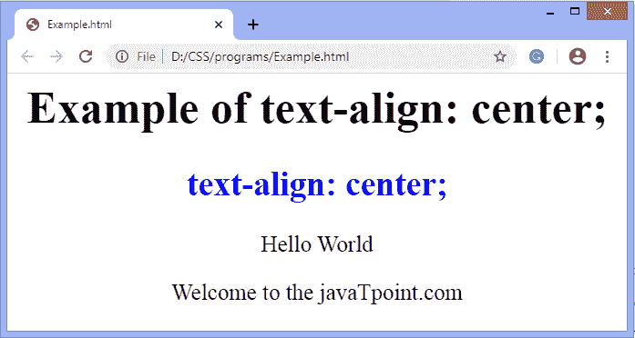

# 如何在 CSS 中居中文本？

> 原文：<https://www.javatpoint.com/how-to-center-text-in-css>

在 HTML 中， **<居中>** 标签用于元素居中。正确而现代的文本居中方式是使用 CSS 属性。这可能是最简单的任务，但是当我们有更多的元素或大代码时，它有时会令人困惑。 [CSS](https://www.javatpoint.com/css-tutorial) 中的**文本对齐**属性负责文本的对齐。此 CSS 属性用于设置表格单元格框或块元素的水平对齐方式。它类似于垂直对齐属性，但在水平方向上。

虽然**文本对齐**属性包括像**对齐、居中、右、左、初始、继承**这样的值，但是使用**中心**值，我们可以将文本对齐到中心。

所以，**文本对齐:居中；**用于将文本与中心对齐。

### 句法

```css

text-align: center;

```

### 例子

```css

<html>  
   <head>  
   </head>  
<style>  
body{
text-align: center;
font-size: 25px;
}
h2{  
color: blue;  
}  
</style>  
   <body>  
   <h1>Example of text-align: center; </h1>  

   <h2> 
      text-align: center;  
      </h2>  
  <div>
  <p>Hello World</p>
  <p> Welcome to the javaTpoint.com </p>
  </div>
      </body>  
</html>  

```

[Test it Now](https://www.javatpoint.com/oprweb/test.jsp?filename=HowtocentertextinCSS1)

**输出**



* * *