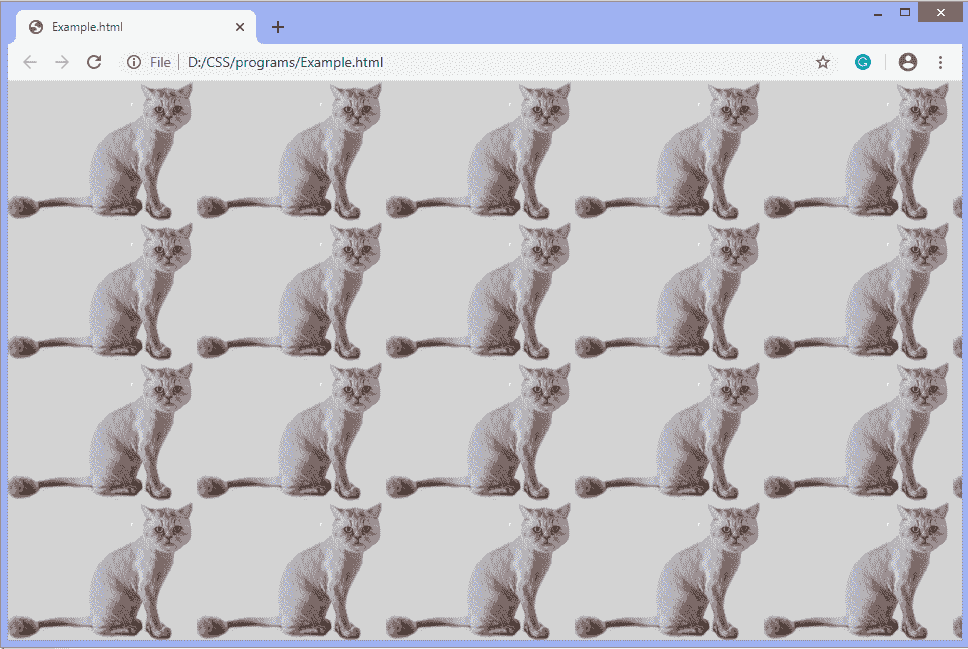
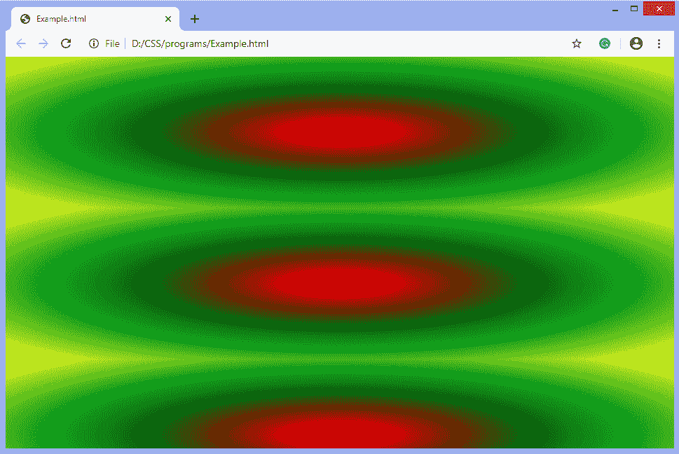
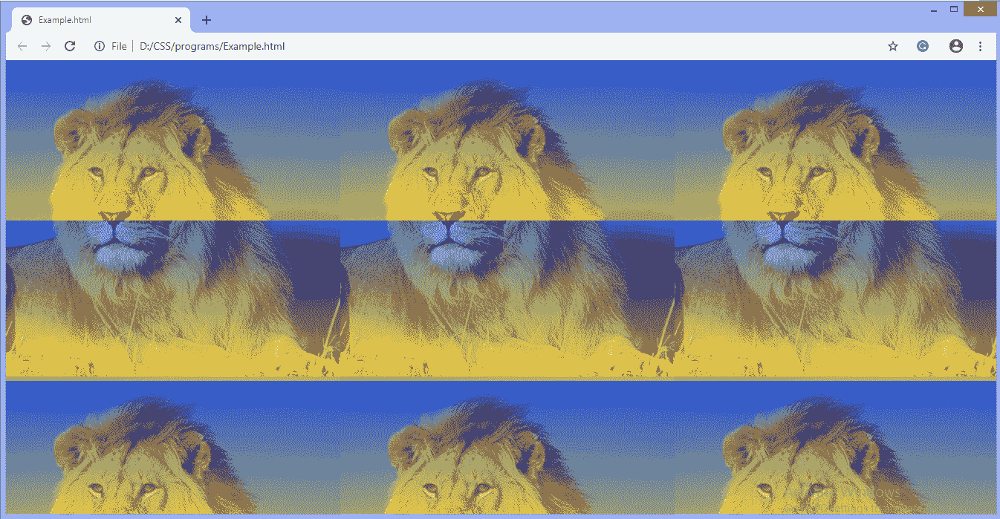

# 如何在 CSS 中添加背景图像？

> 原文：<https://www.javatpoint.com/how-to-add-background-image-in-css>

CSS 中的**背景图像**属性用于将图像设置为元素的背景。使用这个 CSS 属性，我们可以为一个元素设置一个或多个背景图像。

默认情况下，图像位于元素的左上角，水平和垂直重复。应该根据文本颜色选择背景图像。文本和背景图像的不良组合可能是网页设计不佳和不可读的原因。

该属性的 **url()** 值允许我们包含任何图像的文件路径。它将显示元素的背景。我们可以使用多个图像或渐变和图像的混合作为背景。如果背景图像加载失败，或者我们正在使用渐变，但是它们在相应的浏览器上不受支持，那么我们可以使用回退值(用作替换的值)作为元素的背景颜色。

### 句法

```

background-image: url();

```

### 价值观念

**url():** 是图像的 [URL](https://www.javatpoint.com/url-full-form) 。如果我们想指定一个以上的图像，我们可以用逗号分隔网址。

### 例子

```

<!DOCTYPE html>  
<html>  
<head>  
<style>  
body {  
  background-image: url("cat.png");
  background-color: lightgray;
  }
</style>  
</head>  
<body>  
</body>  
</html>

```

[Test it Now](https://www.javatpoint.com/oprweb/test.jsp?filename=HowtoaddbackgroundimageinCSS1)

**输出**



### 例子

```

<!DOCTYPE html>  
<html>  
<head>  
<style>  
body {  
  height: 200px;
  background-color: #cccccc;
  background-image: radial-gradient(red, green, yellow); }
</style>  
</head>  
<body>  
</body>  
</html>

```

[Test it Now](https://www.javatpoint.com/oprweb/test.jsp?filename=HowtoaddbackgroundimageinCSS2)

**输出**



### 例子

```

<!DOCTYPE html>  
<html>  
<head>  
<style>  
body {  
  height: 200px;
  background-color: #cccccc;
background-image: linear-gradient(rgba(0, 0, 255, 0.5),rgba(255, 255, 0, 0.5)), url("lion.png");
}
</style>  
</head>  
<body>  
</body>  
</html>

```

[Test it Now](https://www.javatpoint.com/oprweb/test.jsp?filename=HowtoaddbackgroundimageinCSS3)

**输出**



* * *