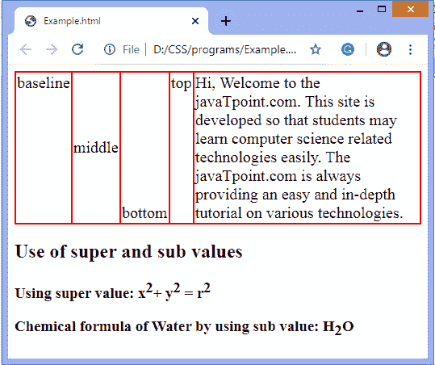
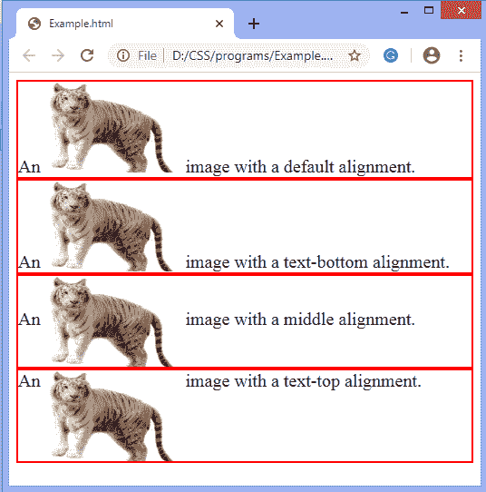

# 如何用 CSS 垂直对齐文字？

> 原文：<https://www.javatpoint.com/how-to-vertically-align-text-with-css>

CSS 中的**垂直对齐**属性用于定义内嵌或表格单元格框的垂直对齐。这是 CSS 不言自明的属性之一。

**垂直对齐** CSS 属性控制元素如何相邻设置。当此属性应用于表格单元格时，它不会影响单元格本身，而是影响单元格内容。

该属性有多个有效值:**基线、顶部、底部、中间、文本顶部、文本底部、子、超级、**和**长度(**中的**px、cm、em、**等。 **)** 。该属性的**子**和**超**值一般用于文本的[下标和上标](https://www.javatpoint.com/css-superscript-and-subscript)。

这个 [CSS](https://www.javatpoint.com/css-tutorial) 属性可以用来垂直对齐表格中单元格的内容。它可以在一行文本中垂直对齐图像。此属性不能用于垂直对齐块级元素。

让我们通过一些例子来理解这个特性。

### 例子

```

<!DOCTYPE html>  
<html>  
<head>  
<style>  
table, th, td{
border: 2px solid red;
border-collapse: collapse;
font-size: 20px;
}
#super{
vertical-align: super;
}
#sub{
vertical-align: sub;
}
</style>  
</head>  
<body>  

<table>
<td style="vertical-align: baseline;">baseline</td>
<td style="vertical-align: middle;">middle</td>
<td style="vertical-align: bottom;">bottom</td>
<td style="vertical-align: top;">top</td>
<td style="vertical-align: text-top;">Hi, Welcome to the javaTpoint.com. This site is developed so that students may learn computer science related technologies easily. The javaTpoint.com is always providing an easy and in-depth tutorial on various technologies. </td>
</table>
<h2> Use of super and sub values </h2>
<h3>Using super value: x<span id="super">2</span>+ y<span id="super">2</span> = r<span id="super">2</span></h3>
<h3> Chemical formula of Water by using sub value: H<span id="sub">2</span>O</h3>
</body>  
</html>   

```

[Test it Now](https://www.javatpoint.com/oprweb/test.jsp?filename=how-to-vertically-align-text-with-css1)

**输出**



现在，还有一个例子，我们将文本与图像对齐。

### 例子

```

<!DOCTYPE html>  
<html>  
<head>  
<style>
div{
font-size: 20px;
border: 2px solid red;
}
img{
width:150px;
height: 100px;
}
img.top {
 vertical-align: text-top; 
 }
img.bottom { 
vertical-align: text-bottom; 
}
img.middle { 
vertical-align: middle; 
}
</style>
</head>  
<body>  
<div>An  image with a default alignment.</div>
<div>An  image with a text-bottom alignment.</div>

<div>An  image with a middle alignment.</div>

<div>An  image with a text-top alignment.</div>
</body>  
</html>

```

[Test it Now](https://www.javatpoint.com/oprweb/test.jsp?filename=how-to-vertically-align-text-with-css2)

**输出**



* * *