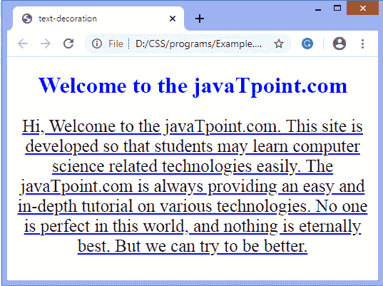
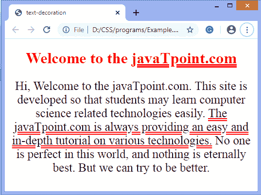

# 如何在 CSS 中给文本加下划线？

> 原文：<https://www.javatpoint.com/how-to-underline-text-in-css>

**文本修饰** CSS 属性用于修饰文本的内容。它可以在文本的上方、下方和整个文本中添加线条。这个 CSS 属性用几种线条装饰文本。是**文字-装饰-线条、文字-装饰-色彩**、**T5【文字-装饰-风格** 的简写。

属性**文本-装饰-线条**用于给文本加下划线。该属性有三个值，即**跨线、下划线、**或**跨线**。所以**下划线**这个值是用来给 [CSS](https://javatpoint.com/css-tutorial) 中的文字加下划线的。该值在内联文本下绘制下划线。

### 例子

```html

<!DOCTYPE html>   
<html>   
<head>   
    <title>text-decoration</title>   
    <style>   
        h1 {   
            color: blue;   
        }   
        body {   
            text-align: center;   
        }   
         p{  
          font-size: 25px;  
          }  
        #p1 {   
            text-decoration: underline;   
	text-decoration-color: blue;
        }   
    </style>   
</head>   

<body>   
    <h1>Welcome to the javaTpoint.com</h1>   
    <div>   
        <p id="p1">
		Hi, Welcome to the javaTpoint.com. This site is developed so that students may learn computer science related technologies easily. The javaTpoint.com is always providing an easy and in-depth tutorial on various technologies. No one is perfect in this world, and nothing is eternally best. But we can try to be better.
		</p>   
    </div>   
</body>   
</html>

```

[Test it Now](https://www.javatpoint.com/oprweb/test.jsp?filename=how-to-underline-text-in-css1)

**输出**



没有 [CSS](https://www.javatpoint.com/css-tutorial) 属性可以仅对句子中的单个单词或具有多个单词的元素应用下划线。因此，实现这一点的最佳方式是将带下划线的单词包装在 span 元素中，然后将下划线应用于这些跨度。

让我们通过下面的例子来看看如何给一些选定的单词加下划线。

### 例子

在本例中，我们还使用了**文本装饰样式**属性，该属性为所选文本的下划线提供样式。我们正在使用该房产的双倍**价值。这里，有两个包含要加下划线的文本的 **< span >** 元素。**

```html

<!DOCTYPE html>   

<html>   
<head>   
    <title>text-decoration</title>   
    <style>   
        h1 {   
            color: red;   
        }   
        body {   
            text-align: center;   
        }   
         p{  
          font-size: 25px;  
          }  
        span {   
            text-decoration: underline;   
			text-decoration-color: red;
			text-decoration-style: double;
        }   
    </style>   
</head>   

<body>   
    <h1>Welcome to the <span>javaTpoint.com<span></h1>   
    <div>   
        <p id="p1">
		Hi, Welcome to the javaTpoint.com. This site is developed so that students may learn computer science related technologies easily. <span>The javaTpoint.com is always providing an easy and in-depth tutorial on various technologies.</span> No one is perfect in this world, and nothing is eternally best. But we can try to be better.
		</p>   
    </div>   
</body>   
</html>

```

[Test it Now](https://www.javatpoint.com/oprweb/test.jsp?filename=how-to-underline-text-in-css2)

**输出**



* * *