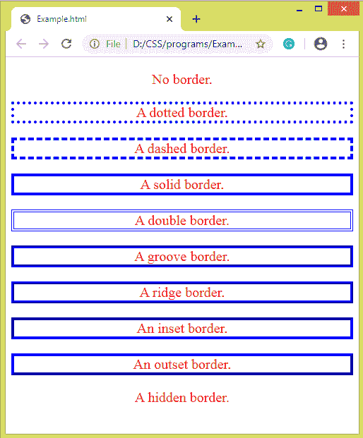
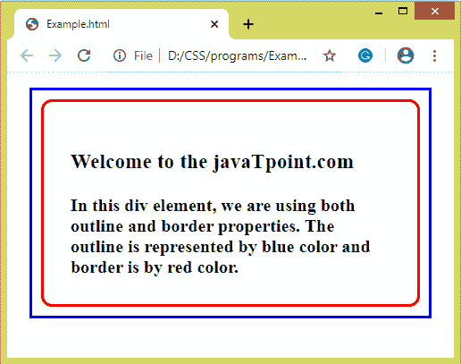

# 如何在 CSS 中添加边框？

> 原文：<https://www.javatpoint.com/how-to-add-border-in-css>

**边框**是 CSS 中的一个简写属性，用于在元素上添加边框。它允许我们指定盒子的边框。它设置边框的宽度、样式和颜色。该 [CSS](https://javatpoint.com/css-tutorial) 属性包括以下边框属性:

*   **边框宽度:**边框宽度属性用于设置边框的宽度。我们也可以使用预定义的值**细、中、**和**粗**来设置边框的宽度。它设置边框的厚度。其默认值为**中**。
    该属性不能单独使用。它总是与其他边框属性(如“边框样式”属性)一起使用，以首先设置边框；否则，它将不起作用。
    边框的宽度可以因每一侧而异。可以使用边框底宽、**边框顶宽、**边框右宽、**边框左宽**来完成。
*   **边框样式:**该属性指定边框的样式。它定义了边框是实线、虚线、双点、凹槽还是其他可能的值。如果不设置此属性，即不设置边框样式，其他任何边框属性都不起作用。如果不指定**边框样式**，边框将不可见。这是因为这个 [CSS](https://www.javatpoint.com/css-tutorial) 属性的默认值是 **none** 。
    与**边框宽度**类似，边框的样式可以因每一侧而异。可以使用属性**边框-底部样式、边框-顶部样式、边框-右侧样式**和**边框-左侧样式**来完成。
*   **边框颜色:**它允许我们改变边框的颜色。我们可以通过使用颜色名称、RGB 值或十六进制值来设置颜色。类似于**边框宽度**和**边框样式**，我们可以单独更改边框的颜色，即我们可以更改元素边框的底部、顶部、左侧和右侧的颜色。可以使用**边框-底部颜色、边框-顶部颜色、边框-右侧颜色**和**边框-左侧颜色**来完成。
    不能单独使用**边框颜色**属性。它必须与“边框样式”属性等其他边框属性一起使用来设置边框；否则，它将不起作用。

## 边框与轮廓

虽然边框和轮廓非常相似，但轮廓和边框之间有如下一些区别:

*   使用轮廓，我们不能为元素的四边应用不同的轮廓宽度、样式和颜色，而在边框中，我们可以为元素的所有四边应用提供的值。
*   边框是元素尺寸的一部分，而轮廓不是元素尺寸的一部分。意思是，无论我们对元素应用多厚的轮廓，它的尺寸都不会改变。

让我们看一个例子来理解边框属性。

### 例子

```css

<!DOCTYPE html>  
<html>  
<head>  
<style>  
p{
border: 4px blue;
font-size: 20px;
color: red;
text-align: center;
}
p.none {border-style: none;}  
p.dotted {border-style: dotted;}  
p.dashed {border-style: dashed;}  
p.solid {border-style: solid;}  
p.double {border-style: double;}  
p.groove {border-style: groove;}  
p.ridge {border-style: ridge;}  
p.inset {border-style: inset;}  
p.outset {border-style: outset;}  
p.hidden {border-style: hidden;}  
</style>  
</head>  
<body>  
<p class="none">No border.</p>  
<p class="dotted">A dotted border.</p>  
<p class="dashed">A dashed border.</p>  
<p class="solid">A solid border.</p>  
<p class="double">A double border.</p>  
<p class="groove">A groove border.</p>  
<p class="ridge">A ridge border.</p>  
<p class="inset">An inset border.</p>  
<p class="outset">An outset border.</p>  
<p class="hidden">A hidden border.</p>  
</body>  
</html>  

```

[Test it Now](https://www.javatpoint.com/oprweb/test.jsp?filename=how-to-add-a-border-in-css1)

**输出**



现在，还有一个例子，我们同时使用**轮廓**和**边界**属性。

### 例子

```css

<!DOCTYPE html>  
<html>  
<head>  
<style>  
div {
  border: 3px solid red;
  outline: 3px solid blue;
  border-radius: 12px;
  font-size: 20px;
  font-weight: bold;
  margin: 30px;
  padding: 30px;
  outline-offset: 0.5em;
}  
</style>  
</head>  
<body>  
<div>
<h3> Welcome to the javaTpoint.com </h3>
In this div element, we are using both outline and border properties. The outline is represented by blue color and border is by red color.
</div>
</body>  
</html>  

```

[Test it Now](https://www.javatpoint.com/oprweb/test.jsp?filename=how-to-add-a-border-in-css2)

**输出**



* * *