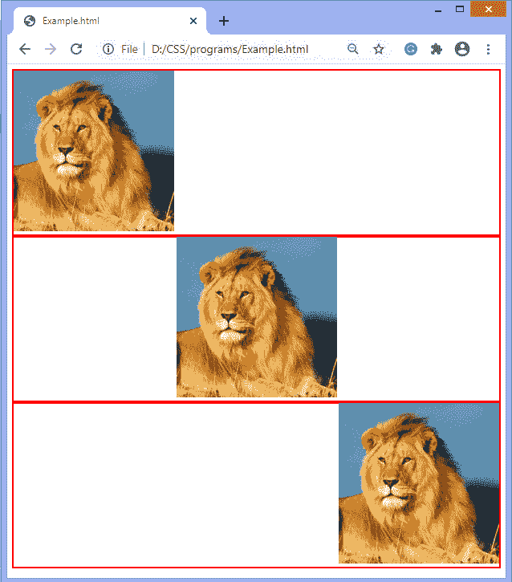
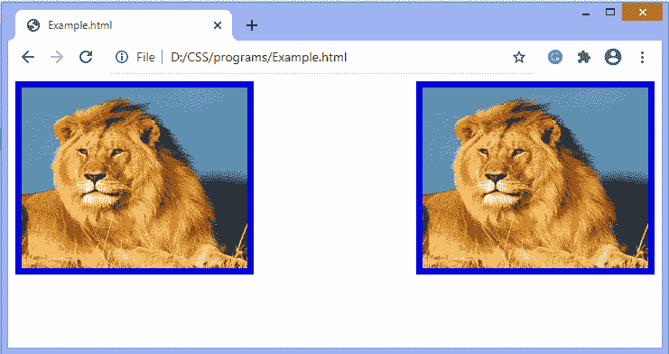

# 如何在 CSS 中对齐图像？

> 原文：<https://www.javatpoint.com/how-to-align-images-in-css>

图像是任何网络应用程序的重要组成部分。通常不建议在 web 应用程序中包含大量图像，但是在需要的地方使用图像是很重要的。 [CSS](https://www.javatpoint.com/css-tutorial) 帮助我们控制 web 应用中图像的显示。

对齐图像意味着将图像定位在中心、左侧和右侧。我们可以使用**浮动**属性和**文本对齐**属性来对齐图像。

如果图像在 div 元素中，那么我们可以使用**文本对齐**属性来对齐 div 中的图像。

### 例子

在本例中，我们使用**文本对齐**属性来对齐图像。图像在 div 元素中。

```

<!DOCTYPE html>  
<html>  
<head>  
<style>  
div {  
 border: 2px solid red;
 }
 img{
 height: 250px;
 width: 250px;
 }
#left {  
 text-align: left;
 }
 #center {  
 text-align: center;
 }
 #right{  
 text-align: right;
 }</style>  
</head>  
<body> 
<div id ="left">

</div> 
<div id ="center">

</div>
<div id ="right">

</div>
</body>  
</html>    

```

[Test it Now](https://www.javatpoint.com/oprweb/test.jsp?filename=how-to-align-images-in-css1)

**输出**



## 使用浮点属性

[CSS 浮动属性](https://www.javatpoint.com/css-float)是定位属性。它用于将一个元素向左或向右推，允许其他元素环绕它。它通常用于图像和布局。

元素仅水平浮动。所以只能向左或向右浮动元素，不能上下浮动。浮动元素可以尽可能向左或向右移动。简单地说，它意味着浮动元素可以显示在最左边或最右边。

### 例子

```

<!DOCTYPE html>  
<html>  
<head>  
<style>  
 img{
 height: 200px;
 width: 250px;
 border: 7px ridge blue;
 }
#left{  
 float: left;
 }
 #right{  
 float: right;
 }</style>  
</head>  
<body>


</body>  
</html>    

```

[Test it Now](https://www.javatpoint.com/oprweb/test.jsp?filename=how-to-align-images-in-css2)

**输出**



* * *