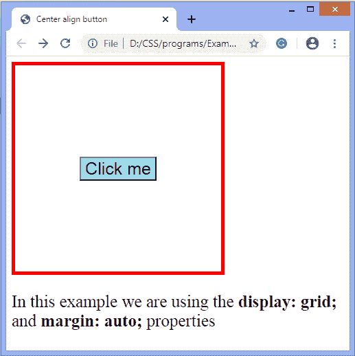

# 如何在 CSS 中居中一个按钮？

> 原文：<https://www.javatpoint.com/how-to-center-a-button-in-css>

CSS 主要是给 [HTML](https://www.javatpoint.com/html-tutorial) 网页提供最好的样式。使用 [CSS](https://www.javatpoint.com/css-tutorial) ，我们可以指定页面上元素的排列。

有各种方法可以对齐网页中心的按钮。我们可以水平和垂直对齐按钮。我们可以使用以下方法使按钮居中:

*   **文本对齐:居中** -通过将父 div 标签的文本对齐属性值设置为居中。
*   **边距:自动** -通过将边距属性的值设置为自动。
*   **显示:伸缩** -通过设置显示属性的值为伸缩，**调整-内容**属性的值为**居中**。
*   **显示:网格** -通过设置网格的显示属性值。

让我们用一些例子来理解上面的方法。

### 例子

在本例中，我们使用**文本对齐**属性，并将其值设置为**中心**。它可以放在主体标签中，也可以放在元素的父 div 标签中。

这里，我们放置**文本-对齐:居中；按钮元素的父 div 标签中的**。

```css

<!DOCTYPE html>
<html lang="en">
<head>
<meta charset="UTF-8">
<title>Center align button</title>
<style>
.container{
text-align: center;
border: 7px solid red;
width: 300px;
height: 200px;
padding-top: 100px;
}
#btn{
font-size: 25px;
}
</style>
</head>
<body>
<div class="container">
<button id ="btn"> Click me </button>
</div>
</body>
</html>

```

[Test it Now](https://www.javatpoint.com/oprweb/test.jsp?filename=how-to-center-a-button-in-css1)

**输出**


### 例子

在这个例子中，我们使用**显示:网格；**物业，**保证金:汽车；**属性。在这里，我们放置**显示:网格；**在按钮元素的父 div 标签中。

该按钮将放置在水平和垂直位置的中心。

```css

<!DOCTYPE html>
<html>
<head>
<title>Center align button</title>
<style>
.container {
width: 300px;
height: 300px;
border: 5px solid red;
display: grid;
}
button {
background-color: lightblue;
color: black;
font-size: 25px;
margin: auto;
}
p{
font-size: 25px;
}
</style>
</head>
<body>
<div class="container">
<button> Click me </button>
</div>
<p>In this example we are using the <b> display: grid; </b> and <b> margin: auto;</b> properties</p>
</body>
</html>

```

[Test it Now](https://www.javatpoint.com/oprweb/test.jsp?filename=how-to-center-a-button-in-css2)

**输出**



### 例子

这是将按钮放在中心的另一个例子。在这个例子中，我们使用**显示:flex**属性，**自圆其说-内容:中心；**属性，**对齐-项目:居中；**属性。

这个例子将帮助我们把按钮放在水平和垂直位置的中心。

```css

<!DOCTYPE html>
<html>
<head>
<title>Center align button</title>
<style>
.container {
width: 300px;
height: 300px;
border: 5px solid red;
display: flex;
justify-content: center;
align-items: center;
}
button {
background-color: lightblue;
color: black;
font-size: 25px;
}
</style>
</head>
<body>
<div class="container">
<button> Click me </button>
</div>

</body>
</html>

```

[Test it Now](https://www.javatpoint.com/oprweb/test.jsp?filename=how-to-center-a-button-in-css3)

**输出**


* * *