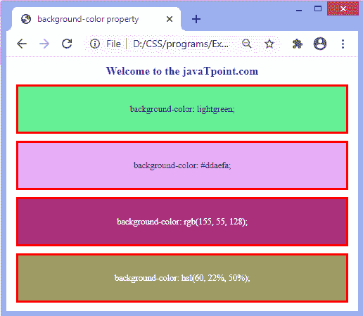

# 如何在 CSS 中改变背景颜色？

> 原文:[https://www . javatpoint . com/如何更改 css 背景色](https://www.javatpoint.com/how-to-change-background-color-in-css)

[CSS](https://www.javatpoint.com/css-tutorial) 中的**背景色**属性用于设置元素的背景色。它应用纯色作为元素的背景。元素的背景覆盖整个大小，包括填充和边框，但不包括边距。可以应用于所有 [HTML](https://www.javatpoint.com/html-tutorial) 元素。

### 句法

```

element {  
    background-color: color_name | transparent | initial | inherit;  
}  

```

该属性的**颜色名称**值定义了[背景颜色](https://www.javatpoint.com/how-to-change-background-color-in-html)的值或指定了颜色代码。它可以通过使用颜色名称、rgb()值或十六进制值来给出。

该属性的**透明**值为默认值，指定透明背景颜色。

### 例子

在本例中，我们使用颜色名称、十六进制值、rgb()值和 hsl()值来定义**背景色**属性的值。我们在四个 div 元素上应用**背景色**属性。

```

<!DOCTYPE html>
<html>
<head>
<title>background-color property</title>
<style>
body {
text-align:center;
}
h1{
color: blue;
}
div{
font-size: 25px;
padding: 50px;
border: 5px solid red;
margin: 20px;
}
#one{
background-color: lightgreen;
}
#two{
background-color: #ddaefa;
}
#three{
background-color: rgb(155, 55, 128);
color: white;
}
#four{
background-color: hsl(60, 22%, 50%);
color: white;
}
</style>
</head>
<body>
<h1>Welcome to the javaTpoint.com</h1>
<div id = "one">
background-color: lightgreen;
</div>
<div id = "two">
background-color: #ddaefa;
</div>
<div id = "three">
background-color: rgb(155, 55, 128);
</div>
<div id = "four">
background-color: hsl(60, 22%, 50%);
</div>
</body>
</html>

```

[Test it Now](https://www.javatpoint.com/oprweb/test.jsp?filename=how-to-change-background-color-in-css1)

**输出**



* * *