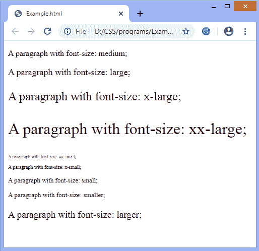
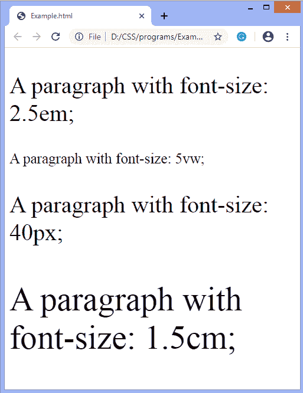

# 如何在 CSS 中改变字体大小？

> 原文：<https://www.javatpoint.com/how-to-change-the-font-size-in-css>

**类似问题**

*   哪个 CSS 属性控制文本大小？
*   如何在 CSS 中更改文本大小？

[CSS](https://www.javatpoint.com/css-tutorial) 中的 **[字号](https://www.javatpoint.com/css-font-size)** 属性会影响元素文本的大小。它用于指定字体的高度和大小。该属性的默认值为**中**，可以应用于每个元素。该属性的值为 **xx-small、small、x-small** 等。

该属性具有许多值，这些值负责更改内容的大小。长度值可以是厘米、像素、像素等。字号中不允许长度为负值。

#### 注意:如果我们没有定义字体大小，那么对于[段落](https://www.javatpoint.com/html-paragraph)这样的普通文本，默认大小是 16px，等于 1em。

字体大小可以是绝对的，也可以是相对的。绝对大小将文本设置为确定的大小，而相对大小将文本设置为相对于相邻元素的大小。

### 句法

```html

font-size: medium | large | x-large | xx-large | xx-small | x-small | small |smaller| larger | length;

```

让我们通过一些插图来了解如何改变字体的大小。

### 示例-使用字体大小值

```html

<!DOCTYPE html>  
<html>  
<head>  
<style>  

#p1 {  
  font-size: medium;  
}  
#p2 {  
  font-size: large;  
}
#p3 {  
  font-size: x-large;  
}  
#p4 {  
  font-size: xx-large;  
}  
#p5 {  
  font-size: xx-small;  
}  
#p6 {  
  font-size: x-small;  
}
#p7 {  
  font-size: small;  
}    
#p8 {  
  font-size: smaller;  
}    
#p9 {  
  font-size: larger;  
}        
</style>  
</head>  
<body>  

<p id="p1">A paragraph with font-size: medium;</p>  
<p id="p2">A paragraph with font-size: large;</p>  
<p id="p3">A paragraph with font-size: x-large;</p>  
<p id="p4">A paragraph with font-size: xx-large;</p>  
<p id="p5">A paragraph with font-size: xx-small;</p>  
<p id="p6">A paragraph with font-size: x-small;</p>  
<p id="p7">A paragraph with font-size: small;</p>  
<p id="p8">A paragraph with font-size: smaller;</p>  
<p id="p9">A paragraph with font-size: larger;</p>  

</body>  
</html>

```

[Test it Now](https://www.javatpoint.com/oprweb/test.jsp?filename=how-to-change-the-font-size-in-css1)

**输出**



### 示例-使用长度值

在这个例子中，我们使用的长度值是 **em，vw，px，**和 **cm** 。

```html

<!DOCTYPE html>  
<html>  
<head>  
<style>  

#p1 {  
  font-size: 2.5em; /* 40px/16=2.5em */  
}  
#p2 {  
  font-size: 5vw;  
}
#p3 {  
  font-size: 40px;  
}  
#p4 {  
  font-size: 1.5cm;  
}  

</style>  
</head>  
<body>  

<p id="p1">A paragraph with font-size: 2.5em;</p>  
<p id="p2">A paragraph with font-size: 5vw;</p>  
<p id="p3">A paragraph with font-size: 40px;</p>  
<p id="p4">A paragraph with font-size: 1.5cm;</p>    
</body>  
</html>

```

[Test it Now](https://www.javatpoint.com/oprweb/test.jsp?filename=how-to-change-the-font-size-in-css2)

**输出**



* * *