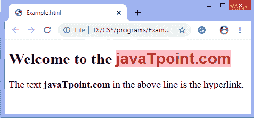
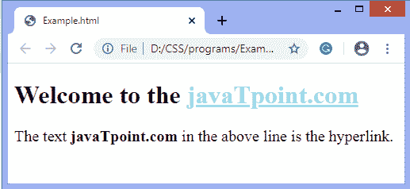
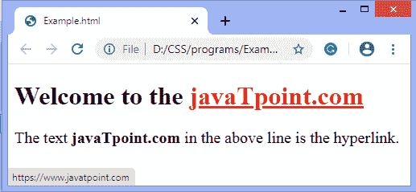

# CSS 中如何改变链接颜色？

> 原文：<https://www.javatpoint.com/how-to-change-link-color-in-css>

链接用于将一个页面连接到其他网页。与文本其余部分具有相同**颜色**的链接很难注意到。CSS 的颜色属性用于更改链接的颜色。

使用 [CSS](https://www.javatpoint.com/css-tutorial) ，我们可以用不同的方式来设计链接的样式。我们可以设置超链接的一些状态如下:

| **a:激活** | 它用于向活动元素添加样式。 |
| **a:悬停** | 当用户将鼠标指针移动到元素上时，它会向元素添加特殊效果。 |
| **a:链接** | 它为未访问的链接添加了样式。 |
| **a:参观过** | 它为访问过的链接增加了风格。 |

需要注意的是，在 CSS 定义中， **a:悬停**必须在 **a:链接**和 **a:已访问**之后，还有 **a:活动**必须在 **a:悬停**之后才能生效。

超链接状态的声明顺序如下:

```

<style type = "text/css">
   a:link {color: lightblue;}
   a:visited {color: #060235}
   a:hover {color: #FCFC0C}
   a:active {color: #C0F0FC}
</style>

```

要改变链接颜色，我们必须使用 CSS 的**颜色**属性。[颜色](https://www.javatpoint.com/css-colors)的名称可以以任何有效的格式给出，例如颜色名称、rgb()值或 HEX 值。

现在，让我们通过一些例子来看看如何设置链接的颜色。

### 例子

默认情况下，正常或未访问链接的颜色为蓝色。在本例中，我们通过使用**颜色**属性来更改默认链接颜色。

```

<!DOCTYPE html> 
<html>
   <head>
      <style type = "text/css">
         a{
		 color: brown;
		 }
     </style>
   </head>

   <body>
      <h1> Welcome to the <a href = "https://www.javatpoint.com/">javaTpoint.com </a></h1>
   </body>
</html>

```

[Test it Now](https://www.javatpoint.com/oprweb/test.jsp?filename=how-to-change-link-color-in-css1)

**输出**


### 例子

在这个例子中，我们在链接上应用了一些 CSS 属性，例如**字体系列、文本装饰**和**背景色**。默认情况下，创建的链接带有下划线，因此要删除下划线，我们可以使用**文本装饰**属性，并将其值设置为**无**。

```

<!DOCTYPE html> 
<html>
   <head>
      <style type = "text/css">
         a{
		 text-decoration: none;
		 color: brown;
		 background-color: pink;
		 font-family: Arial;
		 }
		 p{
		 font-size: 20px;
		 }
     </style>
   </head>

   <body>
      <h1> Welcome to the <a href = "https://www.javatpoint.com/">javaTpoint.com </a></h1>
	  <p> The text <b>javaTpoint.com</b> in the above line is the hyperlink. </P>
   </body>
</html>

```

[Test it Now](https://www.javatpoint.com/oprweb/test.jsp?filename=how-to-change-link-color-in-css2)

**输出**



### 例子

现在，有另一个例子，我们将改变活动和访问链接的颜色，也改变悬停时链接的颜色。默认情况下，已访问的链接显示为紫色，活动的链接显示为红色，因此我们将使用 **color** 属性并使用伪类**:已访问、:活动的**和**:悬停的**来更改它们的颜色。

```

<!DOCTYPE html> 
<html>
   <head>
      <style type = "text/css">
         a:visited{
		color: lightgreen;
		 }
		 a:hover{
		color: blue;
		 }
		 a:active{
		color: red;
		 }
		 p{
		 font-size: 20px;
		 }
     </style>
   </head>

   <body>
      <h1> Welcome to the <a href = "https://www.javatpoint.com/">javaTpoint.com </a></h1>
	  <p> The text <b>javaTpoint.com</b> in the above line is the hyperlink. </P>
   </body>
</html>

```

[Test it Now](https://www.javatpoint.com/oprweb/test.jsp?filename=how-to-change-link-color-in-css3)

**输出**

当程序被执行时，我们会看到下面的屏幕。



悬停时，链接如下所示:


当链接处于活动状态时，链接的颜色为红色，如下图所示。



* * *