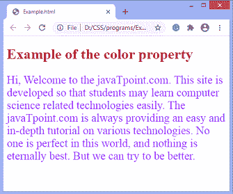

# CSS 中如何改变文字颜色？

> 原文：<https://www.javatpoint.com/how-to-change-text-color-in-css>

CSS 中的**颜色**属性用于改变文本的颜色。颜色值可以用 RGB 颜色编号、颜色关键字或十六进制颜色编号来表示。这个 [CSS](https://www.javatpoint.com/css-tutorial) 属性设置元素内容的前景色。

### 句法

```

color: value;

```

### 例子

```

<!DOCTYPE html>  
<html>  
<head>  
<style>  
h1 {
  color: #ab1232;
}

p {
  color: rgb(145,50,255);
  font-size: 25px;
}

</style>  
</head>  
<body>
<h1> Example of the color property </h1>
<p> Hi, Welcome to the javaTpoint.com. This site is developed so that students may learn computer science related technologies easily. The javaTpoint.com is always providing an easy and in-depth tutorial on various technologies. No one is perfect in this world, and nothing is eternally best. But we can try to be better. </p>
</body>  
</html>  

```

[Test it Now](https://www.javatpoint.com/oprweb/test.jsp?filename=how-to-change-text-color-in-css-1)

**输出**



* * *