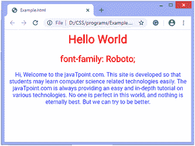
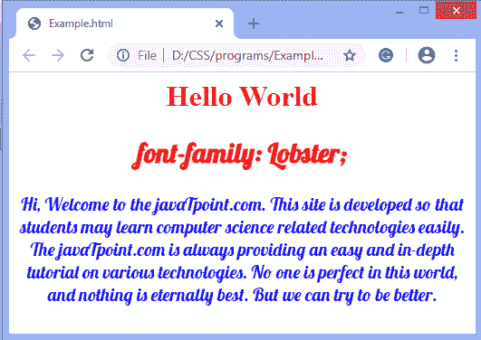
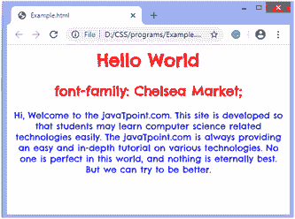
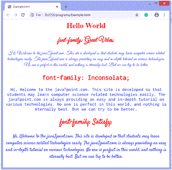

# CSS 中如何使用谷歌字体？

> 原文:[https://www.javatpoint.com/how-to-use-google-fonts-in-css](https://www.javatpoint.com/how-to-use-google-fonts-in-css)

为网页选择合适的字体是任何网页设计的一个重要方面。使用谷歌字体是有利的，因为我们的网站得到了优雅的字体。谷歌字体应用编程接口使每个人使用网络字体变得更加容易和快捷。这些字体已经在各种浏览器配置上进行了测试。

我们不需要做任何编程，只需要给我们的 [HTML](https://www.javatpoint.com/html-tutorial) 文档添加一个特殊的样式表链接，然后在 [CSS](https://www.javatpoint.com/css-tutorial) 样式中引用我们选择的字体系列。

开始使用谷歌字体 [API](https://www.javatpoint.com/api-full-form) 有两个步骤，如下所示:

*   首先，我们必须添加一个样式表链接来请求所需的 web 字体。

```

<link rel = "stylesheet" href = "https://fonts.googleapis.com/css?family=Font+Name">

```

*   然后，我们可以在样式表中或通过内联样式，用所需的 web 字体来设计元素的样式。

```

.css-selector {
font-family: 'Font Name', serif;
}

Or,

<div style = "font-family: 'Font Name', serif;">Your text</div>

```

需要注意的是，在 CSS 样式中指定网页字体时，我们应该始终提到至少一种后备网页安全字体，以避免意外行为。我们可以将**无衬线**或**衬线**等通用字体名称添加到列表末尾，以便[浏览器](https://www.javatpoint.com/browsers)在需要时将其用作默认字体。

## 使用@import

我们可以从谷歌字体等网络字体服务中导入字体系列。它被放置在 [**<样式>** 标签](https://www.javatpoint.com/html-style)中。

```

@import url('https://fonts.googleapis.com/css?family=Lobster');	

```

## 如何在样式表 URL 中指定样式和字体系列

要查看字体列表，请单击以下链接:

```

https://fonts.google.com/

```

我们必须从基于谷歌字体应用编程接口的网址开始，以确定我们的样式表链接中使用的网址。

```

https://fonts.googleapis.com/css

```

然后我们要求使用一个或多个族名和样式添加**族=** [URL](https://www.javatpoint.com/url-full-form) 参数。

例如，假设我们需要请求 [Roboto](https://fonts.google.com/specimen/Roboto) 字体，那么可以这样做:

```

https://fonts.googleapis.com/css?family=Roboto

```

#### 注意:如果字体系列名称中有空格，请用加号(+)替换。

假设，我们必须请求字体，**Open Sans；**那么可以写成如下:

```

https://fonts.googleapis.com/css?family=Open+Sans

```

对于请求多个字体系列，名称应该与管道(|)字符分开。例如-

```

https://fonts.googleapis.com/css?family=Roboto|Inconsolata|Open+Sans

```

让我们通过一些例子来了解谷歌字体在 CSS 中的使用。

**例**

```

<html>

<head>
<link href= 'https://fonts.googleapis.com/css?family=Roboto' rel='stylesheet' />
<style>
h1, p, h2 {
font-family: Roboto;
}
h1, h2{
color: red;
}
p{
color: blue;
}
</style>
</head>

<body>
<center>
<h1> Hello World </h1>
<h2> font-family: Roboto; </h2>
<p> Hi, Welcome to the javaTpoint.com. This site is developed so that students may learn computer science related technologies easily. The javaTpoint.com is always providing an easy and in-depth tutorial on various technologies. No one is perfect in this world, and nothing is eternally best. But we can try to be better. </p>
</center>
</body>

</html>

```

[Test it Now](https://www.javatpoint.com/oprweb/test.jsp?filename=how-to-use-google-fonts-in-css1)

**输出**



**示例-使用@导入规则**

```

<html>

<head>
<style>
@import url('https://fonts.googleapis.com/css?family=Lobster');
h1, h2{
color: red;
}
#div1{
font-family: Lobster;
font-size: 20px;
}
p{
color: blue;
}
</style>
</head>

<body>
<center>
<h1> Hello World </h1>
<div id ="div1">
<h2> font-family: Lobster; </h2>
<p> Hi, Welcome to the javaTpoint.com. This site is developed so that students may learn computer science related technologies easily. The javaTpoint.com is always providing an easy and in-depth tutorial on various technologies. No one is perfect in this world, and nothing is eternally best. But we can try to be better. </p>
</div>
</center>
</body>

</html>

```

[Test it Now](https://www.javatpoint.com/oprweb/test.jsp?filename=how-to-use-google-fonts-in-css2)

**输出**



**例**

在这个例子中，我们在有空格的地方使用字体家族名称**切尔西市场**，所以我们用**加号(+)** 代替这个空格。

```

<html>

<head>
<link href= 'https://fonts.googleapis.com/css?family=Chelsea+Market' rel='stylesheet' />
<style>
h1, p, h2 {
font-family: Chelsea Market;
}
h1, h2{
color: red;
}
p{
color: blue;
}
</style>
</head>

<body>
<center>
<h1>Hello World</h1>
<h2>font-family: Chelsea Market;</h2>
<p> Hi, Welcome to the javaTpoint.com. This site is developed so that students may learn computer science related technologies easily. The javaTpoint.com is always providing an easy and in-depth tutorial on various technologies. No one is perfect in this world, and nothing is eternally best. But we can try to be better.</p>
</center>
</body>

</html>

```

[Test it Now](https://www.javatpoint.com/oprweb/test.jsp?filename=how-to-use-google-fonts-in-css3)

**输出**



**例**

在本例中，我们使用由管道(|)字符分隔的多个字体系列名称。

```

<html>

<head>
<link href= 'https://fonts.googleapis.com/css?family=Lobster|Great+Vibes|Satisfy|Inconsolata|Open+Sans' rel='stylesheet' />
<style>

h1, h2{
color: red;
}
#div1{
font-family: Great Vibes;
}
#div2{
font-family: Inconsolata;
}
#div3{
font-family: Satisfy;
}
div{
font-size: 20px;
}
p{
color: blue;
}
</style>
</head>

<body>
<center>
<h1>Hello World</h1>
<div id ="div1">
<h2>font-family: Great Vibes;</h2>
<p> Hi, Welcome to the javaTpoint.com. This site is developed so that students may learn computer science related technologies easily. The javaTpoint.com is always providing an easy and in-depth tutorial on various technologies. No one is perfect in this world, and nothing is eternally best. But we can try to be better.</p>
</div>
<div id ="div2">
<h2>font-family: Inconsolata;</h2>
<p> Hi, Welcome to the javaTpoint.com. This site is developed so that students may learn computer science related technologies easily. The javaTpoint.com is always providing an easy and in-depth tutorial on various technologies. No one is perfect in this world, and nothing is eternally best. But we can try to be better.</p>
</div>

<div id ="div3">
<h2>font-family: Satisfy;</h2>
<p> Hi, Welcome to the javaTpoint.com. This site is developed so that students may learn computer science related technologies easily. The javaTpoint.com is always providing an easy and in-depth tutorial on various technologies. No one is perfect in this world, and nothing is eternally best. But we can try to be better.</p>
</div>

</center>
</body>

</html>

```

[Test it Now](https://www.javatpoint.com/oprweb/test.jsp?filename=how-to-use-google-fonts-in-css4)

**输出**



* * *