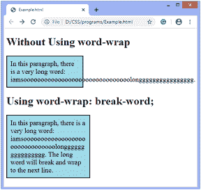

# 如何在 CSS 中换行？

> 原文:[https://www.javatpoint.com/how-to-wrap-text-in-css](https://www.javatpoint.com/how-to-wrap-text-in-css)

CSS **自动换行**属性用于将长单词换行到下一行。当不可破解的字符串太长而无法放入容纳盒时，此属性用于防止溢出。

此属性定义单词中的分隔符，以避免单词太长而无法容纳在容器中时溢出。它指定当内容超出容器边界时的断字。

### 句法

```

word-wrap: normal |  break-word | initial l inherit ;  

```

### 价值观念

**normal:** 是默认值，只用于在允许的断点处断字。

**断字:**用来断牢不可破的字。

**初始值:**用于将属性设置为默认值。

**inherit:** 它从其父元素继承属性。

### 例子

```

<!DOCTYPE html>    
<html>    
<head>    
<style>     
.test {    
    width: 200px;    
    background-color: lightblue;     
    border: 2px solid black;    
    padding: 10px;  
    font-size: 20px;  

}  
.test1 {    
    width: 11em;    
    background-color: lightblue;     
    border: 2px solid black;    
    padding: 10px;    
    word-wrap: break-word;    
    font-size: 20px;  
}      
</style>    
</head>    
<body>  
<h1> Without Using word-wrap </h1>  
<p class="test"> In this paragraph, there is a very long word:    
 iamsooooooooooooooooooooooooooooooolongggggggggggggggg. </p>    
<h1> Using word-wrap: break-word; </h1>  
<p class="test1"> In this paragraph, there is a very long word:    
 iamsooooooooooooooooooooooooooooooolongggggggggggggggg. The long word will break and wrap to the next line. </p>    
</body>    
</html>  

```

[Test it Now](https://www.javatpoint.com/oprweb/test.jsp?filename=how-to-wrap-text-in-css1)

**输出**



* * *