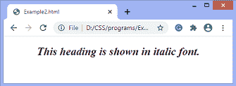

# CSS 中的文字如何斜体？

> 原文：<https://www.javatpoint.com/how-to-italicize-text-in-css>

CSS 中的**字体样式**属性用于设置字体应该用普通、斜体还是斜脸样式。它定义了我们想要显示的字体类型。

[CSS](https://www.javatpoint.com/css-tutorial) 的**字体**属性有三个值，分别是**正常、**斜体、**倾斜**。该 CSS 属性的值 ***斜体*** 用于将文本斜体。该值选择分类为斜体的字体。**倾斜**值使字母倾斜(倾斜)，结果与斜体略有不同。

## 倾斜的

通常，斜体文本本质上是草书，而斜面是正常面的倾斜版本。所以，如果正在使用的字体没有任何斜体字或斜体字可用，那么在大多数情况下，斜体字和斜体字的区别是非常小的。

### 例子

在本例中，我们将标题的样式设置为斜体。如果我们使用倾斜值，结果可能也是一样的。

```html

<!DOCTYPE html>  
<html>  
<head>  
<style>  
body {  
font-size: 100%;  
text-align: center;
}  
h2 { font-style: italic; }  
}  
</style>  
</head>  
<body>  
<h2>This heading is shown in italic font.</h2>    
</body>  
</html>

```

[Test it Now](https://www.javatpoint.com/oprweb/test.jsp?filename=how-to-italicize-text-in-css1)

**输出**



* * *