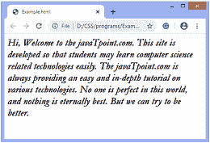
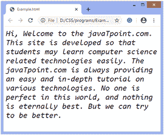

# 如何在 CSS 中改变字体？

> 原文：<https://www.javatpoint.com/how-to-change-the-font-in-css>

CSS 中的**字体**属性用于控制文本的外观。通过使用它，我们可以更改文本大小、颜色、样式等。这个 [CSS](https://www.javatpoint.com/css-tutorial) 属性是一个简写属性，将子属性(即**字体样式、字体变体、字体粗细、字体拉伸、字体大小、行高、**和**字体系列**)组合在一个声明中。

速记**字体**属性的两个值是强制的，即**字体大小**和**字体系列**。如果这两个属性都不包含，那么整个声明将被忽略。还必须在所有值的最后声明 [**字族**](https://www.javatpoint.com/css-font-family) 的值；否则，声明将再次被忽略。其他五个值是可选的。

**字体系列**属性允许多个字体名称作为后备值，因为如果浏览器不支持第一种字体，那么它将尝试下一种字体，以此类推。必须在逗号分隔的列表中指定多个**字体系列**值的声明。

#### 注意:如果字体系列的名称有多个单词，则必须用引号括起来，如:“卢西达控制台”。

如果我们在**字体**速记属性中使用**字体、字体变体、**和 [**字体粗细**](https://www.javatpoint.com/css-font-weight) ，则它们必须在声明中的**字体大小**之前声明。如果不是，就会被忽略，导致对强制性价值观的忽视。

```html

body {
    font: oblique small-caps bolder 30px  cursive;
}

```

在上面的声明中，我们已经包含了可选值，但是它们是在定义**字号**之前定义的。

**行高**也是可选的，但是如果一定要声明的话，就必须在**字号**之后用正斜杠来声明。

```html

body {
    font: oblique small-caps bolder 30px/15px cursive;
}

```

在上面的声明中， **15px** 是行高。如果我们去掉**行高**，那么我们也必须去掉斜线；否则，整个声明将被忽略。

让我们通过例子来了解如何改变 CSS 中的字体。

### 例子

```html

<html>
   <head>
   <style>
   body{
   font-style: italic;
   font-variant: normal;
   font-weight: bolder;
   font-size: 25px;
   font-family: garamond, cursive;
   }
   </style>
   </head>

   <body>
      <p>
 Hi, Welcome to the javaTpoint.com. This site is developed so that students may learn computer science related technologies easily. The javaTpoint.com is always providing an easy and in-depth tutorial on various technologies. No one is perfect in this world, and nothing is eternally best. But we can try to be better.
 </p>
   </body>
</html>

```

[Test it Now](https://www.javatpoint.com/oprweb/test.jsp?filename=how-to-change-the-font-in-css1)

**输出**



### 例子

在上面的例子中，我们单独使用了字体属性。现在，在这个例子中，我们使用**字体**简写属性。我们在这个**字体**速记属性中使用的子属性是**字体样式、字体变体、字体粗细、字体大小和字体系列**。

```html

<html>
   <head>
   <style>
   body{
   font:  oblique normal lighter 25px monospace, garamond;
   }
   </style>
   </head>

   <body>
      <p>
 Hi, Welcome to the javaTpoint.com. This site is developed so that students may learn computer science related technologies easily. The javaTpoint.com is always providing an easy and in-depth tutorial on various technologies. No one is perfect in this world, and nothing is eternally best. But we can try to be better.
 </p>
   </body>
</html>

```

[Test it Now](https://www.javatpoint.com/oprweb/test.jsp?filename=how-to-change-the-font-in-css2)

**输出**



* * *