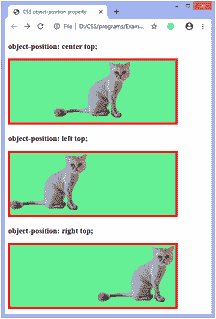
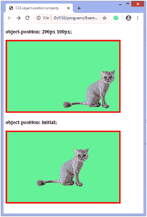
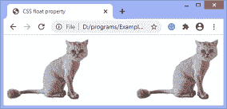

# 如何在 CSS 中定位图像？

> 原文：<https://www.javatpoint.com/how-to-position-an-image-in-css>

在 CSS 中定位图像的方法有很多，比如使用**对象位置**属性，使用**浮动**属性(用于将元素向左或向右对齐)。

## 通过使用对象位置属性

[CSS](https://www.javatpoint.com/css-tutorial) 中的 [**对象位置**属性](https://www.javatpoint.com/css-object-position-property)指定容器内内容的对齐方式。它与 [**object-fit** 属性](https://www.javatpoint.com/css-object-fit-property)一起使用，定义像 [<【视频】>](https://www.javatpoint.com/html-video) 或 [< img >](https://www.javatpoint.com/html-image) 这样的元素如何在其内容框中用 x/y 坐标定位。

使用**对象拟合**属性时，**对象位置**的默认值为 **50% 50%** ，因此，默认情况下，所有图像都位于其内容框的中心。我们可以通过使用**对象位置**属性来更改默认对齐方式。

### 句法

```css

object-position: <position> | initial | inherit;

```

**对象位置**属性的**位置**值定义了视频或图像在容器内的位置。它接受两个数值，其中第一个值控制 x 轴，第二个值控制 y 轴。我们可以使用**左、右**或**中**等弦。用于在容器中定位图像。它允许负值。

通过一些例子，我们可以更清楚地理解它。

### 例子

在本例中，我们使用字符串值，如**“右上”、“中上”、“T1”和**“左上”**来定位图像。**

```css
<!DOCTYPE html>
<head>
<title> CSS object-position property </title>
<style>

#center {
width: 400px;
height: 150px;
border: 5px solid red;
background-color: lightgreen;
object-fit: none;
object-position: center top;
}
#left {
width: 400px;
height: 150px;
border: 5px solid red;
background-color: lightgreen;
object-fit: none;
object-position: left top;
}
#right {
width: 400px;
height: 150px;
border: 5px solid red;
background-color: lightgreen;
object-fit: none;
object-position: right top;
}
</style>
</head>

<body>
<h3>object-position: center top;</h3>


<h3>object-position: left top;</h3>


<h3>object-position: right top;</h3>

</body>
</html>

```

[Test it Now](https://www.javatpoint.com/oprweb/test.jsp?filename=how-to-position-an-image-in-css1)

**输出**



现在，还有一个使用**对象位置**属性的例子。

### 例子

在本例中，我们使用**初始**值，该值将图像定位到中心。因为初始设置属性为默认值 **50% 50%** 。我们也使用数值 **200px** 和 **100px** 。

```css

<!DOCTYPE html>
<head>
<title> CSS object-position property </title>
<style>

#num {
width: 400px;
height: 250px;
border: 5px solid red;
background-color: lightgreen;
object-fit: none;
object-position: 200px 100px;
}
#init {
width: 400px;
height: 250px;
border: 5px solid red;
background-color: lightgreen;
object-fit: none;
object-position: initial;
}

</style>
</head>

<body>
<h3>object-position: 200px 100px;</h3>


<h3>object-position: initial;</h3>


</body>
</html>

```

[Test it Now](https://www.javatpoint.com/oprweb/test.jsp?filename=how-to-position-an-image-in-css2)

**输出**



## 通过使用 float 属性

[CSS float 属性](https://www.javatpoint.com/css-float)是一个定位属性，用于将一个元素向左或向右推，允许其他元素环绕它。通常，它用于图像和布局。

元素仅水平浮动。所以只能向左或向右浮动元素，不能上下浮动。浮动元素可以尽可能向左或向右移动。简单地说，它意味着浮动元素可以显示在最左边或最右边。

让我们举一个使用 **float** 属性的例子。

### 例子

```css

<!DOCTYPE html>
<head>
<title> CSS float property </title>
<style>

#left {
float: left;
}
#right {
float: right;
}

</style>
</head>

<body>


</body>
</html>

```

[Test it Now](https://www.javatpoint.com/oprweb/test.jsp?filename=how-to-position-an-image-in-css3)

**输出**



* * *