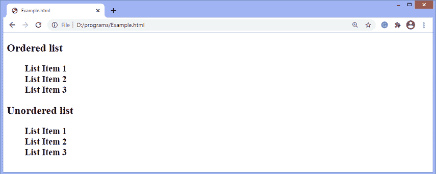

# 如何去掉 CSS 中的项目符号点？

> 原文：<https://www.javatpoint.com/how-to-remove-bullet-points-in-css>

在某些情况下，我们需要删除无序和有序列表的项目符号。移除列表项目符号并不是一个使用 [CSS](https://www.javatpoint.com/css-tutorial) 的复杂任务。通过将 CSS **列表式**或**列表式**属性设置为**无**即可轻松完成。

**列表样式类型** CSS 属性用于设置[列表](https://www.javatpoint.com/css-lists)项目元素的标记(如圆盘、字符或自定义计数器样式)。这个 CSS 属性帮助我们创建没有项目符号的列表。它只能应用于那些显示值设置为**列表项的元素。**继承了**列表样式类型**属性，因此可以应用到父元素(如**<【ul】>**或 **< ol >** )中，使其适用于所有列表项。

默认情况下，有序列表项用阿拉伯数字(1、2、3 等)进行编号。)，无序列表中的项目用圆形项目符号(·)标记。**列表样式类型** CSS 属性允许我们将标记的默认列表类型更改为任何其他类型，如正方形、圆形、罗马数字、拉丁字母等等。

如果我们将其值设置为**无**，它将移除标记/项目符号。我们可以用图片代替列表中的项目符号。这使得网站在视觉上更有吸引力。这可以通过使用**列表样式图像**属性来完成。

让我们通过一个例子来了解如何删除项目符号。

### 例子

在本例中，我们使用有序和无序列表，并应用值为**无**的**列表样式类型**属性来移除列表项的项目符号。

```

<!DOCTYPE html>
<html>
<head>
<style>
ol {
list-style-type: none;
font-weight: bold;
font-size: 20px;
}
ul {
list-style-type: none;
font-weight: bold;
font-size: 20px;
}
</style>
</head>
<body>
<h2>Ordered list</h2>
<ol>
<li>List Item 1</li>
<li>List Item 2</li>
<li>List Item 3</li>
</ol>
<h2>Unordered list</h2>
<ul>
<li>List Item 1</li>
<li>List Item 2</li>
<li>List Item 3</li>
</ul>
</body>
</html>

```

[Test it Now](https://www.javatpoint.com/oprweb/test.jsp?filename=how-to-remove-bullet-points-in-css1)

**输出**



* * *