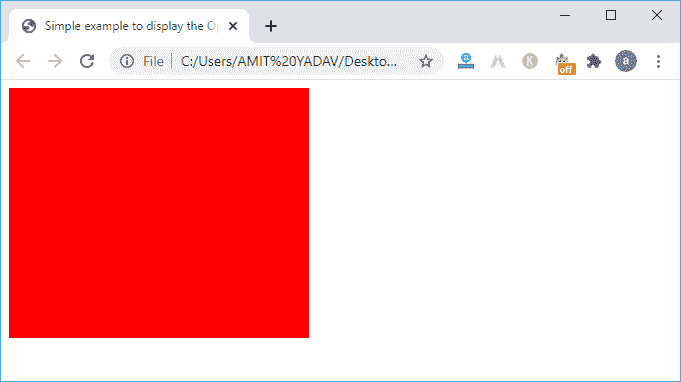
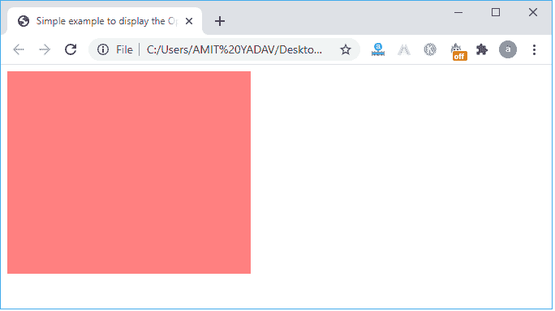
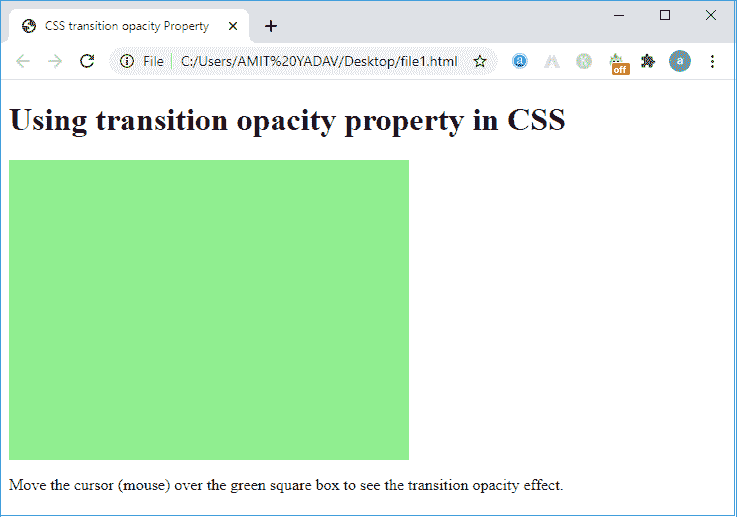
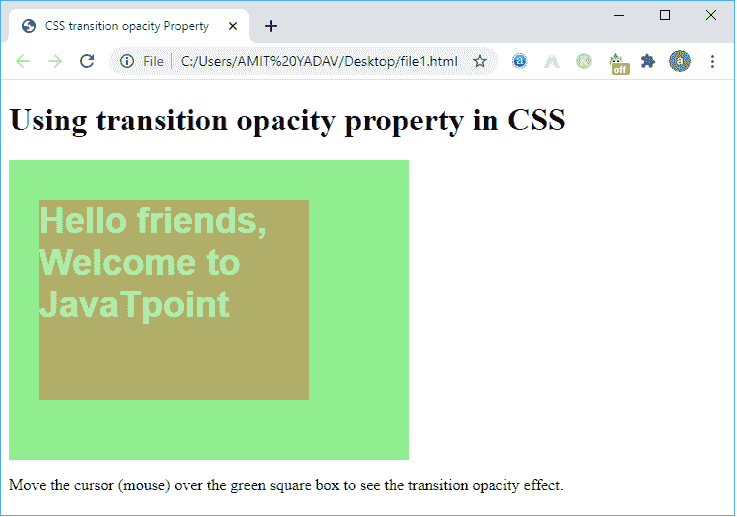
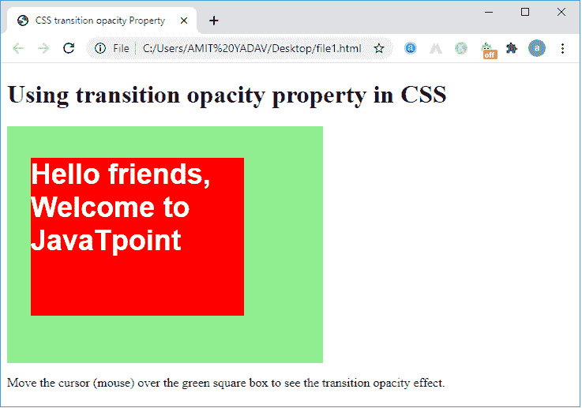
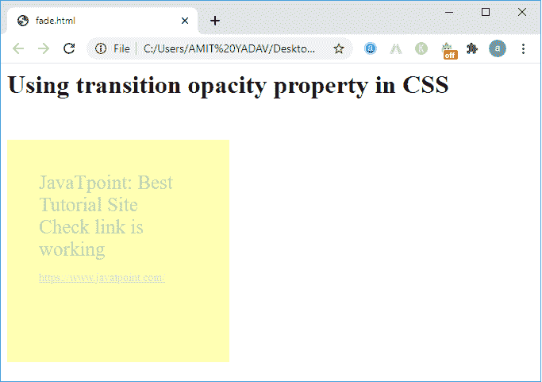

# CSS 过渡不透明度

> 原文：<https://www.javatpoint.com/css-transition-opacity>

CSS 中的**不透明度**是指定控制元素透明度的属性，例如**内容**或**图像**。使用该属性，我们可以将任何图像设置为完全不透明(**可见)**、完全透明(**隐藏**)或半透明(部分可见)。它采用一个介于 0 和 1 之间的数值。其中 0 表示完全透明，1 表示完全可见。不透明度值介于 0 和 1 之间，如 0.2、0.4、0.6 等。，通过逐渐增加小数值将图像从透明更改为不透明。


**语法**

```

opacity : <numeric value>

```

数值必须介于 0 和 1 之间，以使图像半透明。如果我们提供 1，图像将是不透明的，如果数值为 0，图像将变得完全透明。

**示例 1** :在本例中，我们将使用不透明度属性，在元素上移动鼠标时使元素透明。

**Main.html**

```

<!DOCTYPE html>
<html lang="en">
  <head>
    <title>Simple example to display the Opacity</title>
  </head>
  <style>
    .get {
      background: red;
      width: 300px;
      height: 250px;
     border: none;
     color: white;
     padding: 16px 32px;
     text-align: center;
     font-size: 16px;
     margin: 4px 2px;
    }
    .get:hover {  // hover is used to show the impact on element when the mouse on the element.
      opacity: 0.5; // set the opacity value to 0.5
    }
  </style>
  <body>
    <div class="get"></div> // use of class in CSS.
  </body>
</html>

```

**输出**



将鼠标悬停在红色框上以显示透明或不透明效果。



## CSS 中的过渡不透明度

在 [CSS](https://www.javatpoint.com/css-tutorial) 中，**过渡不透明度**是一个用于将不透明度状态从一个级别平滑更改为另一个状态的属性。这意味着过渡不透明度将不透明元素的状态更改为透明，并具有定义的持续时间。过渡有四个属性:[过渡属性](https://www.javatpoint.com/css-transition)、过渡持续时间、过渡定时功能和[过渡延迟](https://www.javatpoint.com/css-transition-delay-property)，用于对图像执行不透明度效果。**过渡持续时间**是渐变或突变的一个重要属性，反映了在以毫秒或秒为单位的定义持续时间内元素的不透明度效果。

**跃迁的简写性质如下:**

```

transition: [transition - property] [transition -duration] [transition -timing -function] [transition - delay];

```

**在 CSS 中定义过渡不透明度的语法**

```

{
transition: opacity 5s;
opacity: 1; // set opacity property to 1, completely visible 
}

Or
{
transition: opacity 0.3s linear 2s; // effect on 0.3 millisecond
}

```

### 过渡属性

以下是用于控制过渡效果的过渡属性。

| 价值 | 描述 |
| **过渡属性** | 它用于定义显示图像过渡效果的 CSS 属性的名称。 |
| **过渡-持续时间** | 它用于定义以秒或毫秒为单位显示过渡效果的时间段。 |
| **过渡-定时-功能** | 它用于定义图像上的速度曲线，以显示过渡效果。 |
| **过渡延迟** | 指定是否在元素或图像上启动过渡效果。 |

#### 注意:在将过渡属性设置为图像或内容时，我们必须定义过渡持续时间属性；否则，持续时间将变为 0，并且不会显示任何效果。

### CSS 中对过渡不透明度的需求

**不透明度**是一个简单的 CSS 属性，用于通过设置不透明度范围从 0 到 1 来控制图像的透明度。它反映了元素上的静态或突然变化，以显示不透明度效果。例如，如果我们想要将图像显示为透明，我们必须将不透明度值设置为 0 到 1。之后，它会立即显示不透明效果，而不是花费一些时间。因此，我们在 CSS 中使用一个**过渡不透明度**，它控制一个元素在一个定义的时间段内的透明度。使用过渡不透明度中的过渡时间函数，我们可以确定指定图像快速不透明度效果的元素的速度曲线。这样，我们使用过渡不透明度效果来反映指定时间段内的变化，而不是立即发生。

**示例 2:** 在本例中，我们将使用过渡不透明度属性，该属性反映指定持续时间内的不透明度效果，而不是立即。

**File1.html**

```

<!DOCTYPE html>  
<html>  
<head>  
<title>  
CSS transition opacity Property  
</title>  
<style>  
.pr{  
	width: 400px;  
	height: 300px;  
	background: lightgreen;  
	position: relative;              
}

.cr{
	width: 270px;  
	height: 200px;  
	position: absolute;  
	/* top: 30px; */
	left: 30px; 
	color: white;
	margin: 40px auto;
	margin-bottom: 30px;
	font-family: Arial, Helvetica, sans-serif;
	background: red; 
	font-weight: Bold;
	font-size: 36px;
	opacity: 0;
}    

.cr:hover {  
	opacity: 1;
	transition: opacity 2s ease-out; /* It slowly shows the element as we place the mouse on the box and when the time reaches 2 seconds, it is fully visible. */
	-webkit-transition: opacity 2s ease-out;
	-moz-transition: opacity 2s ease-in-out; 
}  
</style>  
</head>  
<body>  
<h1> Use of Transition Opacity Property in CSS </h1>
<div class="pr">
<div class="cr">
Hello friends, Welcome to JavaTpoint 
</div>  
</div>
<p> Move the cursor (mouse) over the green square box to see the transition opacity effect. </p>  
</body>  
</html>

```

**输出**



将光标移到**绿色**框上，显示过渡不透明度效果，如下图。



一个元素完全可见需要 **2s** ，如下图。



在上面的例子中，当页面被加载时，它只显示绿色的框。但是当我们将鼠标移到框上时，当我们设置持续时间 **2s** 时，它会逐渐以红色显示框，并显示消息。

**示例 3:** 在本例中，我们使用了过渡不透明度属性，该属性显示了指定持续时间内的不透明度效果，而不是立即检查链接。

**Fade.html**

```

<html>
<head>
<style >

    .c2  { opacity : 0.3; 
	    transition:opacity 1s;
          padding:40px;
          position : absolute;
          margin-top: 30px;
          background-color:yellow;
		  width: 200px;  
	      height: 200px; 
		  font-size: 25px;
		font-style : Bold;
		color: green;
    }
    .c2:hover { opacity : 1}

</style>
 </head>
 <body>
 <h1> Using transition opacity property in CSS </h1>

<div class="c2">
   JavaTpoint: Best Tutorial Site
   <div > Check link is working <br >
 <p style="font-size:14px";> <a target="new" href="https://www.javatpoint.com/">
    https://www.javatpoint.com/
  </a>
  </p>
</div>
</div>

</body>
</html>

```

**输出**



* * *