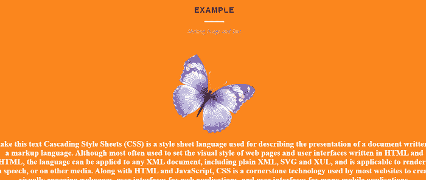

# CSS 摇动文本

> 原文：<https://www.javatpoint.com/css-shake-text>

在本文中，我们将在文本和图像上创建一个 CSS 抖动效果。首先，我们将学习 CSS 的基本含义。之后，我们将借助各种例子来学习这个概念。

## 你说的 CSS 是什么意思？

术语 CSS 代表**层叠样式表。**在这里，层叠是指样式在网页上应用的顺序。它使网站设计者能够更好地控制网页的呈现，因为他们可以将样式应用于网页的各种元素，如列表、边框等。

这是一种通过向 web 文档添加样式来控制其布局的强大方法。它将文档的内容与文档的呈现分开，这提高了内容的可访问性，并提供了更大的灵活性。

## 你说的 CSS Shake 文字是什么意思？

摇动文字和图像是各种网站使用的非常酷的效果；这个效果可以使用基本的 [HTML](https://www.javatpoint.com/html-tutorial) 和 [CSS](https://www.javatpoint.com/css-tutorial) 轻松创建。

**我们来举几个借助 CSS 来抖动文字和图像的例子。**

## 例 1:

```html

<html>
<head>
<title> Shake text on CSS Example
</title>
</head>
<style>
.five h1 {
  text-align: center;
  font-size: 22px;
  font-weight: 700; 
   color: #202020;
  text-transform: uppercase;
  word-spacing: 1px; 
 letter-spacing: 2px;
}
h1 {
  position: relative;
  padding: 0;
  margin: 10;
  font-family: "Raleway", sans-serif;
  font-weight: 300;
  font-size: 40px;
  color: #080808;
  -webkit-transition: all 0.4s ease 0s;
  -o-transition: all 0.4s ease 0s;
  transition: all 0.4s ease 0s;
}
h1 span {
  display: block;
  font-size: 0.5em;
  line-height: 1.3;
}
h1 em {
  font-style: normal;
  font-weight: 600;
}
.five h1 span {
  margin-top: 40px;
  text-transform: none;
  font-size: .75em;
  font-weight: normal;
  font-style: italic; 
 font-family: "Playfair Display","Bookman",serif;
  color: #999; 
 letter-spacing: -0.005em; 
word-spacing: 1px;
  letter-spacing: none;
}
.five h1:before {
  position: absolute;
  left: 0;
  bottom: 38px;
  width: 60px;
  height: 4px;
  content: "";
  left: 50%;
  margin-left: -30px;
  background-color: #dfdfdf;
}
body {
  background-color: #FB861D;
}
.content {
  margin: 5% 0 0 0%;
}
.shake {
	display: inline-block
}
.shake {
	display: block;
	position: relative;
}
img {
display: block;
height: 250px;
width: 250px;
border-radius: 50% 50% 50% 50%;
}
h2.shake {
	display: inline-block
}
.shake.inline {
	display: inline-block
}
h1, p, h2 {
  color: #FFF;
}
@-webkit-keyframes spaceboots {
	0% { -webkit-transform: translate(2px, 1px) rotate(0deg); }
	10% { -webkit-transform: translate(-1px, -2px) rotate(-1deg); }
	20% { -webkit-transform: translate(-3px, 0px) rotate(1deg); }
	30% { -webkit-transform: translate(0px, 2px) rotate(0deg); }
	40% { -webkit-transform: translate(1px, -1px) rotate(1deg); }
	50% { -webkit-transform: translate(-1px, 2px) rotate(-1deg); }
	60% { -webkit-transform: translate(-3px, 1px) rotate(0deg); }
	70% { -webkit-transform: translate(2px, 1px) rotate(-1deg); }
	80% { -webkit-transform: translate(-1px, -1px) rotate(1deg); }
	90% { -webkit-transform: translate(2px, 2px) rotate(0deg); }
	100% { -webkit-transform: translate(1px, -2px) rotate(-1deg); }
}
.shake:hover
       {
	-webkit-animation-name: spaceboots;
	-webkit-animation-duration: 0.8s;
	-webkit-transform-origin:50% 50%;
	-webkit-animation-iteration-count: infinite;
	-webkit-animation-timing-function: linear;
}
.shake:focus {
	-webkit-animation-name: spaceboots;
	-webkit-animation-duration: 0.8s;
	-webkit-transform-origin:50% 50%;
	-webkit-animation-iteration-count: infinite;
	-webkit-animation-timing-function: linear;
}
</style>
<body>
  <center>
    <section class="content">
      <div class="five">
    <h1> Example 
    <span> Shaking Image and Text </span>
  </h1>
        <br>
        <br>
          
      <h2 class="shake"> Shake this text Cascading Style Sheets (CSS) is a style sheet language used for describing the presentation of a document written in a markup language. It is most often used to set the visual style of web pages and user interfaces written in HTML and XHTML. </h2>
</div>
    </section>
  </center>
</body>
</html>

```

**说明:**

在上面的例子中，我们已经在 css 的帮助下在文本和图像上创建了一个抖动效果。

**下面是这个例子的输出:**



## 例 2:

```html

<! DOCTYPE html>
<html lang="en">
<head>
<meta charset="UTF-8">
<meta name="viewport"
		content="width=device-width, initial-scale=1.0">
<title> Shake Text on click </title>
</head>
<style>
* {
	margin: 0;
	padding: 0;
}
div {
	position: absolute;
	top: 50%;
	left: 50%;
	transform: translate(-50%, -50%);
	font-size: 2.5em;
	color: rgb(4, 110, 4);
}
div:hover h2 {
	animation: shake 0.8s ;
}
@keyframes shake {
	0% {
	transform: translateX(0)
	}
	25% {
	transform: translateX(25px);
	}
	50% {
	transform: translateX(-25px);
	}
	100% {
	transform: translateX(0px);
	}
}
.five h1 {
  text-align: center;
  font-size: 22px;
  font-weight: 700; 
   color: #202020;
  text-transform: uppercase;
  word-spacing: 1px; 
 letter-spacing: 2px;
}
h1 {
  position: relative;
  padding: 0;
  margin: 10;
  font-family: "Raleway", sans-serif;
  font-weight: 300;
  font-size: 40px;
  color: #080808;
  -webkit-transition: all 0.4s ease 0s;
  -o-transition: all 0.4s ease 0s;
  transition: all 0.4s ease 0s;
}
h1 span {
  display: block;
  font-size: 0.5em;
  line-height: 1.3;
}
body {
    background-color: #f6f6f6;
    width: 400px;
    margin: 10px auto;
    font: normal 13px/100% sans-serif;
    color: #444;
}
h1 em {
  font-style: normal;
  font-weight: 800;
}
.five h1 span {
  margin-top: 40px;
  text-transform: none;
  font-size:.75em;
  font-weight: normal;
  font-style: italic; font-family: "Playfair Display","Bookman",serif;
  color: #999; 
 letter-spacing: -0.005em; 
word-spacing: 1px;
  letter-spacing: none;
}
.five h2 span {
  margin-top: 40px;
  text-transform: none;
  font-size:.75em;
  font-weight: normal;
  font-style: italic; font-family: "Playfair Display","Bookman",serif;
  color: #999; 
 letter-spacing: -0.005em; 
word-spacing: 1px;
  letter-spacing: none;
}
.five h1:before {
  position: absolute;
  left: 0;
  bottom: 38px;
  width: 60px;
  height: 4px;
  content: "";
  left: 50%;
  margin-left: -30px;
  background-color: #dfdfdf;
}
.area {
    background: #4e54c8;  
    background: -webkit-linear-gradient(to left, #8f94fb, #4e54c8);  
    width: 100%;
    height: 100vh;
   }
.circles {
    position: absolute;
    top: 0;
    left: 0;
    width: 100%;
    height: 100%;
    overflow: hidden;
}
.circles li {
    position: absolute;
    display: block;
    list-style: none;
    width: 20px;
    height: 20px;
    background: rgba(255, 255, 255, 0.2);
    animation: animate 25s linear infinite;
    bottom: -150px;  
}
.circles li:nth-child(1) {
    left: 25%;
    width: 80px;
    height: 80px;
    animation-delay: 0s;
}
.circles li:nth-child(2) {
    left: 10%;
    width: 20px;
    height: 20px;
    animation-delay: 2s;
    animation-duration: 12s;
}
.circles li:nth-child(3){
    left: 70%;
    width: 20px;
    height: 20px;
    animation-delay: 4s;
}
.circles li:nth-child(4) {
    left: 40%;
    width: 60px;
    height: 60px;
    animation-delay: 0s;
    animation-duration: 18s;
}
.circles li:nth-child(5) {
    left: 65%;
    width: 20px;
    height: 20px;
    animation-delay: 0s;
}
.circles li:nth-child(6) {
    left: 75%;
    width: 110px;
    height: 110px;
    animation-delay: 3s;
}
.circles li:nth-child(7) {
    left: 35%;
    width: 150px;
    height: 150px;
    animation-delay: 7s;
}
.circles li:nth-child(8) {
    left: 50%;
    width: 25px;
    height: 25px;
    animation-delay: 15s;
    animation-duration: 45s;
}
.circles li:nth-child(9){
    left: 20%;
    width: 15px;
    height: 15px;
    animation-delay: 2s;
    animation-duration: 35s;
}
.circles li:nth-child(10){
    left: 85%;
    width: 150px;
    height: 150px;
    animation-delay: 0s;
    animation-duration: 11s;
}
@keyframes animate {
	0% {
        transform: translateY(0) rotate(0deg);
        opacity: 1;
        border-radius: 0;
    }
    100% {
        transform: translateY(-1000px) rotate(720deg);
        opacity: 0;
        border-radius: 50%;
    }
}
</style>
<body>
<div class="area" >
            <ul class="circles">
                    <li></li>
                    <li></li>
                    <li></li>
                    <li></li>
                    <li></li>
                    <li></li>
                    <li></li>
                    <li></li>
                    <li></li>
                    <li></li>
            </ul>
    </div >
<div>
 <div class="five">
    <h1> Example 
    <span> <h2> Shake text! </h2> </span>
  </h1>
	</div>
</div>	
</body> 
</html>

```

**说明:**

在上面的例子中，我们已经在 CSS 的帮助下在悬停文本上创建了一个抖动效果。

**下面是这个例子的输出:**


* * *