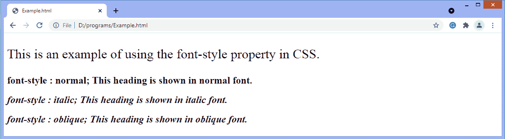

# CSS 字体样式属性

> 原文：<https://www.javatpoint.com/css-font-style-property>

CSS 字体样式属性定义您想要显示的字体类型。它可以是斜体、倾斜或正常的。此 CSS 属性用于定义元素文本内容的字体样式。

### 句法

```html

font-style: normal | italic | oblique | initial | inherit;

```

### 属性值

该 [CSS](https://www.javatpoint.com/css-tutorial) 属性的属性值列表如下:

| 关键字 | 描述 |
| **正常** | 这是默认值。使用该值，浏览器将显示正常字体的文本。 |
| **斜体** | 字体样式属性的这个属性值用于使字体倾斜。斜体是字体的草书版本。 |
| **斜** | 字体样式属性的这个属性值用于使字体倾斜。倾斜字体是字体的倾斜版本。 |
| **初始** | 使用该值，浏览器将显示默认的初始字体样式。基本上，该值将属性设置为默认值。 |
| **继承** | 它从其父元素继承属性。 |

如果给定的字体系列有嵌入的倾斜或倾斜字体，浏览器将选择该字体。如果没有倾斜或斜体字可用，浏览器将模拟倾斜效果。如果我们定义**斜体**值，并且没有斜体字可用，浏览器将在尝试模仿斜体字之前检查斜体字。

同样的过程将适用于倾斜，就像没有倾斜面可用一样，浏览器首先检查倾斜面，然后尝试模仿倾斜面。

为了防止浏览器添加倾斜或斜体面的模拟版本，如果支持的话，我们可以使用**字体合成**属性。

让我们通过一个例子来理解上面的属性值。

### 例子

在这个例子中，我们使用字体样式属性的所有值。

```html

<!DOCTYPE html>  
<html>  
<head>  
<style>  
p
 {  
font-size: 200%;  
}  
</style>  
</head>  
<body>
<p> This is an example of using the font-style property in CSS. </p>  
<h2 style = "font-style : normal;"> font-style : normal;  This heading is shown in normal font. </h2>  
<h2 style = "font-style : italic;"> font-style : italic; This heading is shown in italic font. </h2>  
<h2 style = "font-style : oblique;"> font-style : oblique;  This heading is shown in oblique font. </h2>  
</body>  
</html>

```

**输出:**



* * *