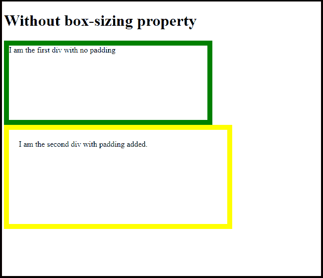
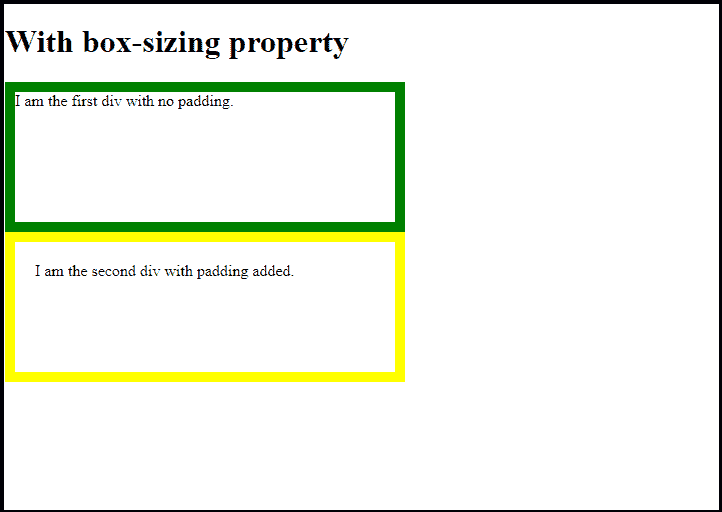
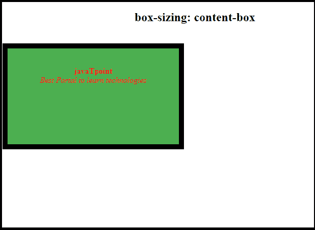
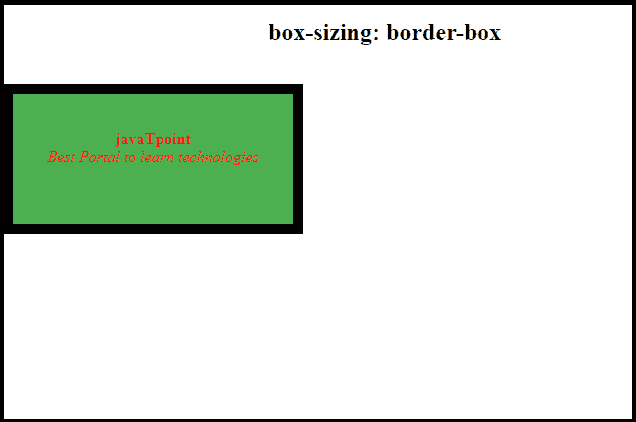

# CSS 框大小

> 原文：<https://www.javatpoint.com/css-box-sizing>

## 什么是 CSS 框大小属性？

*   CSS 框大小属性用于指定如何计算元素的总高度和总宽度。
*   它控制具有指定高度和宽度的元素的大小。
*   它允许您在元素的总高度和总宽度中包含填充和边框。

在开始 CSS 框大小调整之前，让我们先了解一下如果不使用这个属性会出现什么问题。

## 没有 CSS 框大小

如果我们不包括盒子大小属性，那么盒子模型的默认工作方式如下:

```html

width + padding + border = actual visible width of an element's box

height + padding + border = actual visible height of an element's box

```

***意思是如果我们创建一个特定高度和宽度的盒子，然后给它添加填充和边框，它看起来会比实际宽度更宽。*T3】**

为了解决这个问题，开发人员需要调整高度和宽度的值，为边框和填充留出空间。让我们用一个例子来理解它:

**示例:**让我们创建两个高度和宽度相同，但边框和填充不同的 div。

```html

<!DOCTYPE html>
<html lang="en" dir="ltr">
  <head>
    <style media="screen">
      .div1{
        height: 150px;
        width: 400px;
        border: 10px solid green;

      }
      .div2{
        height: 150px;
        width: 400px;
        border: 10px solid yellow;
        padding: 20px;   }
    </style>
  </head>
  <body>
    <h1>Without box-sizing property</h1>

    <div class="div1">
      I am the first div with no padding.
    </div>
    <div class="div2">
      I am the second div with padding added.
    </div>
  </body> 
</html>

```

在上面的代码中，我们创建了两个大小相同的 div。在第一个 div 中，我们没有包含填充，而在第二个 div 中，我们添加了它。

**输出:**

它将生成如下输出:



从上面的输出可以看出，我们得到了两个不同大小的 div。虽然我们指定了两个 div 相同的大小，但是第二个看起来比第一个大。

这是 [CSS 盒子模型](https://www.javatpoint.com/css-box-model)出现的主要问题。这个问题可以通过框大小属性来解决。

## 带有 CSS 框大小属性

上述问题可以通过使用 [CSS](https://www.javatpoint.com/css-tutorial) 框大小属性来解决。现在，我们将使用与上面相同的代码，但也将包括框大小属性。

```html

<!DOCTYPE html>
<html lang="en" dir="ltr">
  <head>
    <style media="screen">
      .div1{
        height: 150px;
        width: 400px;
        border: 10px solid green;
        box-sizing: border-box;

      }
      .div2{
        height: 150px;
        width: 400px;
        border: 10px solid yellow;
        padding: 20px;
        box-sizing: border-box;

      }
    </style>
  </head>
  <body>
    <h1>With box-sizing property</h1>

    <div class="div1">
      I am the first div with no padding.
    </div>
    <div class="div2">
      I am the second div with padding added.
    </div>
  </body>
</html>

```

在上面的代码中，我们使用了两个高度和宽度相同的 div，并且还为每个 div 使用了 box-size 属性。

**输出:**



正如我们在上面的输出中看到的，我们得到了宽度相同的两个 div。

## 句法

框大小属性的语法如下:

```html

box-sizing: border-box;  // for border box
box-sizing: content-box; // for content box

```

**值:** CSS 大小框属性有两个值，边框和内容框。这些内容如下:

*   **内容框:**按照 CSS 标准，是**大小框属性的默认值。**通过使用该值，高度和宽度属性将仅包括内容，而不包括边距、填充或边框值。这意味着如果我们将元素的宽度指定为 200px，那么内容将为 200px 宽，并且边框和填充将通过使其宽于 200 px 而添加到最终显示中。例如，如果一个元素的尺寸规格低于:
    **{宽度:500px**
    **边框:10px 纯黑；}** 然后会显示一个 510px 大小的盒子。

在这种情况下，价值维度的计算如下:

```html

Width= width of the content
Hight= height of the content

```

**示例:**

```html

<!DOCTYPE html>
<html>
	<head>
		<title>box-sizing Property</title>
		<style>
			div {
        width: 300px;
				height: 150px;
				padding: 20px;
				border: 10px solid black;
				background: #4caf50;
				color: red;
      box-sizing: content-box;}
		</style>
	</head>
	<body style = "text-align: center;">
		<h2>box-sizing: content-box</h2>
		<br>
		<div>
      <p><b>javaTpoint</b><br>
      <i>Best Portal to learn technologies</i></p>
    </div>
	</body>
</html>

```

在上面的代码中，我们使用了 box-size 属性的内容框值。

**输出:**



*   **边框框:**边框框是框大小属性的一个广泛使用的值。它通知浏览器在元素的指定高度和宽度内调整边框和填充。这意味着如果我们将元素的宽度指定为 200 px，那么指定的边框和填充将包含在 200 px 内，内容框将调整额外的宽度。例如，如果元素具有以下大小规格:

```html

    {width: 500px;
     border: 10px solid black;}

```

浏览器将显示一个大小为 500 的框，其中包括 480 像素宽的区域。

在这种情况下，宽度和高度通过包含内容、边框和填充来计算。**但不包括保证金。**

元素的尺寸计算如下:

```html

Width = border + padding + width of the content
Height = border + padding + height of the content.

```

**示例:**

```html

<!DOCTYPE html>
<html>
	<head>
		<title>box-sizing Property</title>
		<style>
			div {
				width: 300px;
				height: 150px;
				padding: 20px;
				border: 10px solid black;
				background: #4caf50;
				color: red;
        box-sizing: border-box;
			}
		</style>
	</head>
	<body style = "text-align: center;">
		<h2>box-sizing: border-box</h2>
		<br>
    <div>
      <p><b>javaTpoint</b><br>
      <i>Best Portal to learn technologies</i></p>
    </div>

	</body>
</html>

```

在上面的代码中，我们使用了 box-size 属性的边框值。

**输出:**



* * *