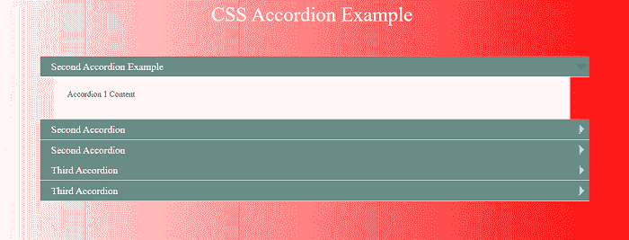
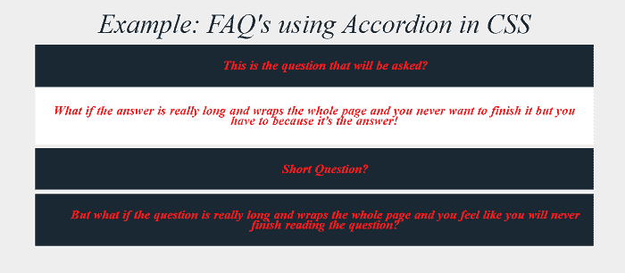
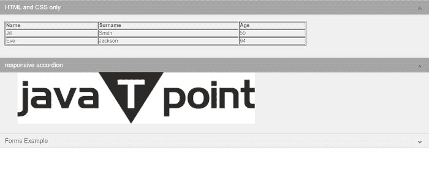

# 手风琴 CSS

> 原文：<https://www.javatpoint.com/accordion-css>

在本文中，我们将借助 CSS 创建一个手风琴。在文章的开头，我们将学习 CSS 中手风琴的一些基础知识。之后，我们将借助各种例子来学习这个概念。

### CSS 中的手风琴是什么意思？

[CSS](https://www.javatpoint.com/css-tutorial) 中的手风琴菜单是一个由垂直堆叠的项目列表组成的图形元素。可以单击该菜单来显示或隐藏与之相关的内容。每个网站都包含一个 CSS 手风琴在至少一个网页上，如果他们有一个常见问题部分。

**我们来举 CSS 中手风琴的各种例子。**

### 例 1:

```html

<! DOCTYPE html>
<html>
<head>
<title> Accordion CSS Example </title>
<meta name="viewport" content="width=device-width, initial-scale=1">
<style>
body {
  background-image: linear-gradient(to right, rgba(255,0,0,0), rgba(255,0,0,1));
  font-family: 'Flamenco', serif;
}
h1 {
  color: #fff;
  font-weight: normal;
  font-size: 2.5rem;
  text-align: center;
}
.readme {
  color: #fff;
  margin: 0 auto;
  width: 80%;
    a {
    color: #00a486;
  }
}
.accordion {
  position: relative;
  margin: 60px auto;
  width: 80%;
}
[id*="open-accordion"] {
  background: #698c86;
  border-bottom: 1px solid #fff;
  line-height: 40px;
  height: 40px;
  display: block;
  margin: 0 auto;
  position: relative;
  width: 99%;
}
[id*="close-accordion"] {
  display: none;
}
[id*="close-accordion"] {
  background: #698c86;
  border-bottom: 1px solid #fff;
  line-height: 40px;
  height: 40px;
  display: block;
  margin: 0 auto;
  position: relative;
  width: 99%;
}
.accordion a {
  color: #fff;
  font-size: 1.25em;
  font-weight: normal;
  padding-left: 2%;
  text-decoration: none;
  text-shadow: none;
}
[id*="open-accordion"]:after {
  content: "";
  border-left: 10px solid transparent;
  border-right: 10px solid transparent;
  border-top: 10px solid rgba(255, 255, 255, 0.6);
  position: absolute;
  right: 5px;
  top: 15px;
  z-index: 999;
  transform: rotate(-90deg);
  -webkit-transform: rotate(-90deg);
}
.target-fix {
  display: block;
  top: 0;
  left: 0;
  position: fixed;
}
[id*="close-accordion"]:after {
  content: "";
  border-left: 10px solid transparent;
  border-right: 10px solid transparent;
  border-top: 10px solid rgba(255, 255, 255, 0.6);
  position: absolute;
  right: 5px;
  top: 15px;
  z-index: 999;
  transform: rotate(-90deg);
  -webkit-transform: rotate(-90deg);
}
.accordion-content {
  background: #fff;
  height: 0;
  margin: -1px auto 0;
  padding: 0 2.5%;
  position: relative;
  overflow: hidden;
  width: 90%;
  transition: all 0.1s ease;
  -webkit-transition: all 0.1s ease;
  -moz-transition: all 0.1s ease;
}
.accordion span:target ~ .accordion-content {
  display: block;
  height: auto;
  padding-bottom: 25px;
  padding-top: 10px;
}
.accordion span:target ~ [id*="close-accordion"] {
  display: block;
}
.accordion span:target ~ [id*="open-accordion"] {
  display: none;
}
.accordion span:target ~ [id*="close-accordion"]:after {
  border-top: 10px solid #333;
  transform: rotate(0deg);
  -webkit-transform: rotate(0deg);
}
</style>
</head>
<body>
<h1> CSS Accordion Example </h1>
<div class="accordion">
        <span class="target-fix" id="accordion"> </span>
            <div>
   <span class="target-fix" id="accordion1"> </span> 
   <a href="#accordion1" id="open-accordion1" title="open"> First Accordion Example </a>
   <a href="#accordion" id="close-accordion1" title="close"> Second Accordion Example </a> 
                <div class="accordion-content">
                <p> Accordion 1 Content </p>
            </div>
        </div>
              <div>
            <span class="target-fix" id="accordion2"> </span>
            <a href="#accordion2" id="open-accordion2" title="open"> Second Accordion </a>
            <a href="#accordion" id="close-accordion2" title="close"> Second Accordion </a>
            <div class="accordion-content">
                <p> Accordion 2 Content. </p>       
            </div>
        </div>
             <div>
            <span class="target-fix" id="accordion3"> </span>
            <a href="#accordion3" id="open-accordion3" title="open"> Third Accordion </a>
            <a href="#accordion" id="close-accordion3" title="close"> Third Accordion </a>
            <div class="accordion-content">
                <p> Accordion 3 Content </p>
            </div>
        </div>
    </div>
</body>
</html>

```

**说明:**

在上面的例子中，我们已经在 CSS 的帮助下创建了一个手风琴。当我们单击特定部分时，该部分的描述就会打开。

**输出:**

下面是这个例子的输出。



### 例 2:

```html

<! DOCTYPE html>
<html>
<head>
<title> Accordion CSS Example </title>
<meta name="viewport" content="width=device-width, initial-scale=1">
<style>
@import url(https://fonts.googleapis.com/css?family=Open+Sans:300,800);
body {
  padding: 20px;
  font: lighter 1.2em/100% 'Open Sans';
  text-align: left;
  background: #eee;
}
 body {
 text-align: center;
 }
.faq {
  width: 80%;
  margin: 0 auto;
}
.centerplease {
  text-align:center;
  margin:0 auto;
  font-size: 40px;
}
.question {
  color: #fff;
  font-weight: normal;
  position: relative;
  background: #4892c7;
  margin: 0 auto;
  opacity: .9;
  padding: 10px 10px 10px 50px;
  display: block;
  cursor: pointer;
  text-shadow:-1px 1px 0px #4892c7, -2px 2px 0px #2a4163;
}
.answers {
  border-top: 1px solid #2a4163;
  background: white;
  padding: 0px 15px;
  margin: 0 0 7px 0;
  height: 0;
  overflow: hidden;
  z-index: -1;
  position: relative;
  opacity: 0;
  -webkit-transition: .7s ease;
  -moz-transition: .7s ease;
  -o-transition: .7s ease;
  transition: .7s ease;
}
.questions:checked ~ .answers{
  height: auto;
  opacity: 1;
  padding: 15px;
}
.plus {
  position: absolute;
  margin-left: 10px;
  z-index: 5;
  font-size: 1.8em;
  line-height: 100%;
  -webkit-user-select: none;    
  -moz-user-select: none;
  -ms-user-select: none;
  -o-user-select: none;
  user-select: none;
  -webkit-transition: .3s ease;
  -moz-transition: .3s ease;
  -o-transition: .3s ease;
  transition: .3s ease;
}
.questions:checked ~ .plus {
  -webkit-transform: rotate(45deg);
  -moz-transform: rotate(45deg);
  -o-transform: rotate(45deg);
  transform: rotate(45deg);
}
.questions {
  display: none;
}
 h1 {
  position: relative;
  padding: 0;
  margin: 10;
  font-weight: 300;
  font-size: 50px;
  color: #080808;
  -webkit-transition: all 0.4s ease 0s;
  -o-transition: all 0.4s ease 0s;
  transition: all 0.4s ease 0s;
  text-align: center;
  font-style: italic; font-family: "Playfair Display","Bookman",serif;
}
 h2 {
 font-style: italic; font-family: "Playfair Display","Bookman",serif;
 color:#999; letter-spacing:-0.005em; word-spacing:1px;
 font-size: 1.25em;
  font-weight: bold;
  }
</style>
<body>
<div class='centerplease'>
  <h1> Example: FAQ's using Accordion in CSS </h1>
</div>
<br>
<div class="faq">
<div>
  <input type="checkbox" id="question1" name = "q"  class="questions">
  <div class="plus">  +  </div>
  <label for="question1" class="question">
   <h2> This is the question that will be asked? </h2>
  </label>
  <div class="answers">
   <h2> What if the answer is really long and wraps the whole page and you never want to finish it but you have to because it?s the answer! </h2>
  </div>
</div>
<div>
  <input type="checkbox" id="question2" name="q" class="questions">
  <div class="plus"> + </div>
  <label for="question2" class="question">
    <h2> Short Question? </h2>
  </label>
  <div class="answers">
    <h2> short! </h2>
  </div>
</div>
<div>
  <input type="checkbox" id="question3" name="q" class="questions">
  <div class="plus"> + </div>
  <label for="question3" class="question">
    <h2> But what if the question is really long and wraps the whole page and you feel like you will never finish reading the question? </h2>
  </label>
  <div class="answers">
   <h2> this is the answer! </h2>
  </div>
</div>
</div>
</body>
</html>

```

**说明:**

在上面的例子中，我们已经在 CSS 的帮助下创建了一个手风琴。当我们单击特定部分时，该部分的描述就会打开。

**输出:**

以下是该示例的输出:



### 例 3:

```html

<! DOCTYPE html>
<html>
<head>
<title> Accordion CSS Example </title>
<meta name="viewport" content="width=device-width, initial-scale=1">
<style>
html { 
  min-width: 150px;
  height: 100%;
  margin: 0 auto;
  overflow-y: scroll;
  font-family:  sans-serif;
  color: rgba(48, 69, 92, 0.8);
}
.accordion-bral {
  min-height: 0;
  min-width: 220px;
  width: 100%;
  height: 100%;
  background-color: #FFF;
  margin: 0px!important;
}
.accordion-bral .ac-label {
  font-family: Arial, sans-serif;
  padding: 5px 20px;
  position: relative;
  display: block;
  height: auto;
  cursor: pointer;
  color: #777;
  line-height: 33px;
  font-size: 19px;
  background: #EFEFEF;
  border: 1px solid #CCC;
}
.accordion-bral .ac-label:hover {
  background: #BBB;
}
.accordion-bral input + .ac-label {
  -webkit-transition: all 0.3s ease-in-out;
  -moz-transition: all 0.3s ease-in-out;
  -o-transition: all 0.3s ease-in-out;
  -ms-transition: all 0.3s ease-in-out;
  transition: all 0.3s ease-in-out;
}
.accordion-bral input:checked + .ac-label,
.accordion-bral input:checked + .ac-label:active {
  background-color: rgba(79, 79, 79, 0.5) !important;
  color: #FFF;
  box-shadow: 0px 0px 0px 1px rgba(155, 155, 155, 0.3), 0px 2px 2px rgba(0, 0, 0, 0.1);
}
.accordion-bral input.ac-input {
  display: none;
}
.accordion-bral .article {
  background: rgb(240, 240, 240);
  overflow: hidden;
  height: 0px;
  max-height: auto;
  -webkit-transition: all 0.3s ease-in-out;
  -moz-transition: all 0.3s ease-in-out;
  -o-transition: all 0.3s ease-in-out;
  -ms-transition: all 0.3s ease-in-out;
  transition: all 0.3s ease-in-out;
}
.accordion-bral .article p {
  color: #777;
  line-height: 23px;
  font-size: 14px;
  padding: 20px;
}
.accordion-bral input:checked ~ .article i {
  -webkit-transition: all 0.5s ease-in-out;
  -moz-transition: all 0.5s ease-in-out;
  -o-transition: all 0.5s ease-in-out;
  -ms-transition: all 0.5s ease-in-out;
  transition: all 0.5s ease-in-out;
}
.accordion-bral input:checked ~ .article.ac-content {
  height: auto;
}
.accordion-bral i {
  position: absolute;
  transform: translate(-30px, 0);
  margin-top: 16px;
  right: 0;
}
.accordion-bral input:checked ~ .ac-label i:before {
  transform: translate(2px, 0) rotate(-45deg);
}
.accordion-bral input:checked ~ .ac-label i:after {
  transform: translate(-2px, 0) rotate(45deg);
}
.accordion-bral i:before {
  content: "";
  position: absolute;
  background-color: #808080;
  width: 3px;
  height: 9px;
}
.accordion-bral i:before {
  transform: translate(-2px, 0) rotate(-45deg);
}
.accordion-bral i:after {
  transform: translate(2px, 0) rotate(45deg);
}
accordion-bral i:after {
  content: "";
  position: absolute;
  background-color: #808080;
  width: 3px;
  height: 9px;
}
ul.ac-list {
  padding-left: 40px;
  list-style-type: disc;  
}
table.ac-table {
  margin: 20px 0 20px 20px;
}
table.ac-table th {
  text-align: left;
}
@media (max-width: 550px) {
  .accordion-bral .ac-label {
  font-family: Arial, sans-serif;
  padding: 5px 20px;
  position: relative;
  display: block;
  height: auto;
  padding-right: 40px;
  cursor: pointer;
  color: #777;
  line-height: 33px;
  font-size: 19px;
  background: #EFEFEF;
  border: 1px solid #CCC;
}
  .accordion-bral i {
  position: absolute;
  transform: translate(-30px, 0);
  margin-top: 2%;
  right: 0;
}
}
</style>
<body>
<div class="accordion-bral">
  <div> 
    <input class="ac-input" id="ac-1" name="accordion-1" type="checkbox" checked/>
    <label class="ac-label" for="ac-1"> HTML and CSS only <i> </i> </label>
    <div class="article ac-content">
      <div>
        <table class="ac-table" border="1" style="width:70%">
          <tr>
            <th> Name </th>
            <th> Surname </th>
            <th> Age </th>
          </tr>
          <tr>
            <td> Jill </td>
            <td> Smith </td>
            <td> 50 </td>
          </tr>
          <tr>
            <td> Eve </td>
            <td> Jackson </td>
            <td> 94 </td>
          </tr>
        </table>
      </div>
      <br>
    </div>
  </div>
  <div>
    <input class="ac-input" id="ac-2" name="accordion-1" type="checkbox" checked/>
    <label class="ac-label" for="ac-2"> responsive accordion <i> </i> </label>
    <div class="article ac-content">
      <div style="padding: 0 30px 30px 60px; width:100%;">  </div>
    </div>
  </div>
  <div>
  <div>
    <input class="ac-input" id="ac-4" name="accordion-1" type="checkbox" />
    <label class="ac-label" for="ac-4"> Forms example <i> </i> </label>
    <div class="article ac-content">
      <div style="padding: 0 0 40px 40px;">
      <form id="contact_form" action="#" method="POST" enctype="multipart/form-data">
        <div class="row">
          <label for="name">Your name: </label>
          <br />
          <input id="name" class="input" name="name" type="text" value="" size="30" />
          <br />
        </div>
        <div class="row">
          <label for="email"> Your email: </label>
          <br />
          <input id="email" class="input" name="email" type="text" value="" size="30" />
          <br />
        </div>
        <div class="row">
          <label for="message"> Your message: </label>
          <br />
          <textarea id="message" class="input" name="message" rows="7" cols="30"> </textarea>
          <br />
        </div>
        <input id="submit_button" type="submit" value="Send email" />
      </form>
      </div>
    </div>
  </div>
</div>
</body>
</html>

```

**说明:**

在上面的例子中，我们已经在 CSS 的帮助下创建了一个手风琴。当我们单击特定部分时，该部分的描述就会打开。

**输出:**

以下是该示例的输出:



* * *