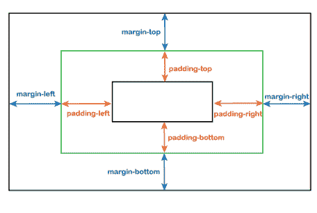
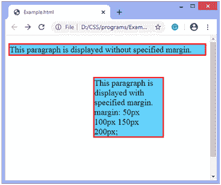
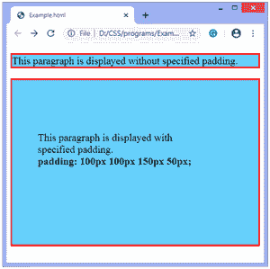

# 边距垂直/垂直填充

> 原文：<https://www.javatpoint.com/margin-vs-padding>

在用户界面的设计过程中，有时填充和边距之间会出现混淆。它们用于提供额外的空间或间隙。边距和填充都以元素的四边为目标，也可以在没有边框属性的情况下工作，但它们在许多方面有所不同。

填充和边距之间的主要区别是:

*   **填充**提供边框和元素内容之间的空间。
*   **边距**提供边框和外部元素之间的空间。

因此，当我们需要元素之间的空间时，最好使用边距，当我们需要内部元素和父框之间的空间时，则使用填充。

边距和填充之间的基本差异列表如下:

| 边缘 | 填料 |
| 边距被认为是元素的外部空间，即边距是元素边框之外的空间。 | 填充被称为元素的内部空间，即填充是元素边框内部的空间。 |
| 我们可以将**余量**设置为**自动**。 | 我们无法将**填充**设置为**自动**。 |
| 它可以是负数或任何浮点数。 | 它不允许负值。 |
| 背景色等元素的样式不会影响边距。 | 填充受元素样式的影响，例如背景颜色。 |

我们可以看到下面的图像来消除边距和填充之间的差异。在此图像中，边距表示边框外的区域，填充表示边框内的区域。



让我们分别讨论边距和填充。

### 边缘

[CSS 边距](https://www.javatpoint.com/css-margin)属性定义元素周围的空间。完全透明，没有任何底色。它会清除元素周围的区域。

我们可以通过使用单独的属性**页边距-顶部、页边距-底部、页边距-左侧**和**页边距-右侧**来独立地更改顶部、底部、左侧和右侧的页边距。我们还可以使用速记**边距**属性一次更改所有属性。

有四种方式可以指定速记**边距**属性，如下所示:

*   **边距:50px 100px 150px 200px**
    表示**顶部**边距值为 50px，**右侧**边距值为 100px，**底部**边距值为 150px，**左侧**边距值为 200px。
*   **边距:50px 100px 150px**
    表示**顶部**边距值为 50px，**左侧**和**右侧**边距值为 100px，**底部**边距值为 150px。
*   **边距:50px 100px**
    表示**顶****底**边距值为 50px，**左****右**边距值为 100px。
*   **边距:50px**
    设置**上、右、下**和**左**边距的相等值。

速记**边距**属性的示例如下:

### 例子

```css

<!DOCTYPE html>
<html>
<head>
<style>
p {
background-color: lightskyblue;
font-size: 20px;
border: 3px solid red;
}
p.margin {
margin: 50px 100px 150px 200px;
}
</style>
</head>
<body>
<p>This paragraph is displayed without specified margin. </p>
<p class = "padding">This paragraph is displayed with specified margin.

margin: 50px 100px 150px 200px;
</p>
</body>
</html>

```

[Test it Now](https://www.javatpoint.com/oprweb/test.jsp?filename=margin-vs-padding1)

**输出**

在下面的输出中，我们可以看到屏幕上的滚动条。因为**边距-底**的值是 150px。



### 填料

与**边距**属性不同， [CSS](https://www.javatpoint.com/css-tutorial) **填充**属性定义元素内容和元素边框之间的空间。

[CSS 填充](https://www.javatpoint.com/css-padding)受背景颜色影响。它会清除内容周围的区域。

我们可以通过使用单独的属性**填充-顶部、填充-底部、填充-左侧、**和**填充-右侧**来独立地更改顶部、底部、左侧和右侧的填充。我们也可以通过使用速记**填充**属性来一次更改所有属性。

有四种方法可以指定速记填充属性，如下所示:

*   **填充:50px 100px 150px 200px**
    表示**顶部**填充值为 50px，**右侧**填充值为 100px，**底部**填充值为 150px，**左侧**填充值为 200px。
*   **填充:50px 100px 150px**
    表示**顶部**填充值为 50px，**左侧**和**右侧**填充值为 100px，**底部**填充值为 150px。
*   **填充:50px 100px**
    表示**顶部****底部**填充值为 50px，**左侧****右侧**填充值为 100px。
*   **填充:50px**
    设置**顶部、右侧、底部**和**左侧**填充的相等值。

### 例子

在这个例子中，我们使用速记属性**填充**来指定内容和边框之间的间距。

```css

<!DOCTYPE html>
<html>
<head>
<style>
p {
background-color: lightskyblue;
font-size: 20px;
border: 3px solid red;
}
p.padding {
padding: 100px 100px 150px 50px;
}
</style>
</head>
<body>
<p>This paragraph is displayed without specified padding. </p>
<p class = "padding">This paragraph is displayed with specified padding.<br>
<b>padding: 100px 100px 150px 50px; </b>
</p>
</body>
</html>

```

[Test it Now](https://www.javatpoint.com/oprweb/test.jsp?filename=margin-vs-padding2)

**输出**



* * *