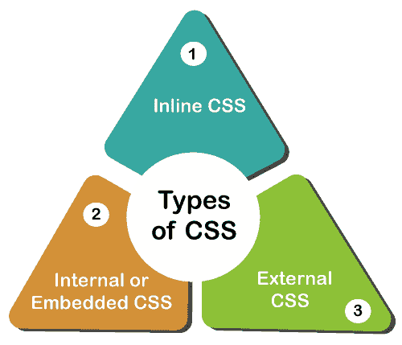

# CSS 的类型

> 原文：<https://www.javatpoint.com/types-of-css>

**CSS(层叠样式表)**描述显示在**屏幕、纸张**或**其他媒体**中的 HTML 元素。它节省了很多时间。它一次控制多个网页的布局。它在页面上设置**字体大小、字体系列、颜色、背景颜色**。

它允许我们在网站上添加**效果**或**动画**。我们使用 **CSS** 来显示**动画**，如**按钮、效果、加载器**或**旋转器**，以及**动画背景**。

不使用 [**CSS**](https://www.javatpoint.com/css-tutorial) ，网站看起来就没有吸引力。 **3** 类型 **CSS** 如下:

*   内嵌 CSS
*   内部/嵌入式 CSS
*   外部 CSS



### 1.内部 CSS

[内部 CSS](https://www.javatpoint.com/internal-css) 在 **HTML** 文档的 [**<头部>**](https://www.javatpoint.com/html-head) 部分有 [**<样式>** 标签](https://www.javatpoint.com/html-style)。这种 CSS 样式是设计单页样式的有效方法。对多个网页使用 CSS 样式非常耗时，因为我们需要在每个网页上放置**样式**。

我们可以通过以下步骤使用内部 CSS:

1.首先打开 **HTML** 页面，定位 **<头像>**

2.将以下代码放在 **<头>** 后

```

<style type="text/css">

```

3.在新行中添加 CSS 的**规则**。

**示例:**

```

body {
    background-color: black;
}
h1 {
    color: white;
    padding: 50px;
}

```

4.关闭样式标签。

```

</style>

```

添加内部 CSS 后，完整的 [HTML](https://www.javatpoint.com/html-tutorial) 文件如下图所示:

```

<!DOCTYPE html>
<html>
<head>
<style>
body {
    background-color: black;
}
h1 {
    color: red;
    padding: 50px;
} 
</style>
</head>
<body>
<h2>CSS types</h2>
<p>Cascading Style sheet types: inline, external and internal</p>
</body>
</html>

```

我们也可以在样式表中使用选择器**(类和标识)**。

**示例:**

```

.class {
    property1 : value1; 
    property2 : value2; 
    property3 : value3; 
}

#id {
    property1 : value1; 
    property2 : value2; 
    property3 : value3; 
}

```

**内部 CSS 的优点**

*   **内部 CSS** 我们用 HTML 页面添加代码时，无法上传多个文件。

**内部 CSS 的缺点:**

*   在 **HTML** 文档中添加代码会减少**页面大小**和**加载网页的时间**。

### 2.外部 CSS

在[外部 CSS](https://www.javatpoint.com/external-css) 中，我们将网页链接到外部**。css** 文件。由**文本编辑器**创建。CSS 是设计网站样式的更有效的方法。通过编辑**。css** 文件，我们可以一次改变整个网站。

要使用外部 CSS，请按照下面给出的步骤操作:

1.创建新的**。css** 文件带有**文本编辑器**，并且添加**层叠样式表**规则。

**例如:**

```

.xleftcol {
   float: right;
   width: 35%;
   background:#608800;
}
.xmiddlecol {
   float: right;
   width: 35%;
   background:#eff3df;
}

```

2.添加对外部**的引用。css** 文件右后 [**<标题>** 标签 **<头部>** 部分 **HTML 表单**:](https://www.javatpoint.com/html-title)

```

<link rel="stylesheet" type="text/css" href="style.css" />

```

**外部 CSS 的优点:**

*   我们的文件结构更清晰，尺寸更小。
*   我们用同样的**。外部 css 中多个网页的 css** 文件。

**外部 CSS 的缺点:**

*   在加载外部 CSS 之前，无法正确传递页面。
*   在 External CSS 中，上传很多 CSS 文件会增加网站的下载时间。

### 3 .内联 CSS

[内联 CSS](https://www.javatpoint.com/inline-css) 用于为特定的 **HTML** 元素设置样式。在不使用选择器的情况下，为每个 HTML 标签添加一个**样式**属性。如果我们只使用**内嵌 CSS** ，管理一个网站可能会很困难。但是，HTML 中的 Inline **CSS** 在某些情况下是有用的。我们没有访问 **CSS 文件**或对元素应用样式。

在下面的例子中，我们已经在 [**< p >**](https://www.javatpoint.com/html-paragraph) 和 [**< h1 >** 标记中使用了内联 CSS。](https://www.javatpoint.com/html-heading)

```

<!DOCTYPE html>
<html>
<body style="background-color:white;">
<h1 style="color:Red;padding:20px;">CSS Tutorials</h1>
<p style="color:blue;">It will be useful here.</p>
</body>
</html>

```

**内嵌 CSS 的优点:**

*   我们可以在 HTML 页面上创建 CSS 规则。
*   我们无法在内嵌 CSS 中创建和上传单独的文档。

**内嵌 CSS 的缺点:**

*   内嵌 CSS，给 HTML 元素添加 **CSS** 规则是**费时的**和**弄乱了**的 HTML 结构。
*   它可以同时样式化多个元素，这会影响页面的大小和下载时间。

* * *