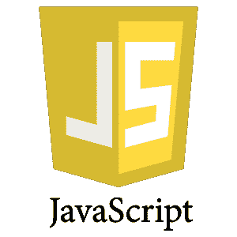

# 学习 JavaScript 教程

> 原文:[https://www.javatpoint.com/javascript-tutorial](https://www.javatpoint.com/javascript-tutorial)



我们的 **JavaScript 教程**是为初学者和专业人士设计的。JavaScript 用于创建客户端动态页面。

JavaScript 是*一种轻量级、跨平台的基于对象的脚本语言*。

JavaScript 不是编译语言，但它是翻译语言。JavaScript 翻译器(嵌入在浏览器中)负责为网络浏览器翻译 JavaScript 代码。

## 什么是 JavaScript

JavaScript (js)是一种轻量级的面向对象编程语言，被多个网站用来编写网页脚本。它是一种经过解释的、成熟的编程语言，当应用于 HTML 文档时，可以在网站上实现动态交互。它于 1995 年推出，用于在网景导航浏览器中向网页添加程序。从那以后，它被所有其他图形网络浏览器所采用。有了 JavaScript，用户可以构建现代网络应用程序来直接交互，而无需每次都重新加载页面。传统网站使用 js 来提供几种形式的交互性和简单性。

虽然，JavaScript 与 Java 编程语言没有连接性。这个名字是在 Java 在市场上越来越受欢迎的时候提出和提供的。除了网络浏览器，像 CouchDB 和 MongoDB 这样的数据库也使用 JavaScript 作为它们的脚本和查询语言。

## JavaScript 的特性

JavaScript 有以下特性:

1.  所有流行的网络浏览器都支持 JavaScript，因为它们提供了内置的执行环境。
2.  JavaScript 遵循 C 编程语言的语法和结构。因此，它是一种结构化编程语言。
3.  JavaScript 是一种弱类型语言，其中某些类型是隐式转换的(取决于操作)。
4.  JavaScript 是一种面向对象的编程语言，它使用原型而不是使用类进行继承。
5.  这是一种轻量级的解释语言。
6.  这是一种区分大小写的语言。
7.  JavaScript 在几个操作系统中都是可支持的，包括 Windows、macOS 等。
8.  它为用户提供了对网络浏览器的良好控制。

## JavaScript 的历史

1993 年，第一款流行的网络浏览器**马赛克**问世。【1994 年**网景**由**马克·安德森**创立。他意识到网络需要变得更有活力。因此，一种“胶水语言”被认为是提供给 HTML，使网页设计容易为设计师和兼职程序员。因此，在 1995 年，该公司招募了 **Brendan Eich** ，打算在浏览器中实现并嵌入 Scheme 编程语言。但是，在布兰登开始之前，该公司与**太阳微系统公司**合并，将 Java 添加到其导航器中，以便在网络技术和平台上与微软竞争。现在，有两种语言:Java 和脚本语言。此外，网景决定给脚本语言起一个类似于 Java 的名字。它导致了“Javascript”。最后，在 1995 年 5 月，马克·安德森创造了第一个名为“**摩卡**”的 Javascript 代码。后来营销团队把名字换成了“ **LiveScript** ”。但是，由于商标原因和某些其他原因，1995 年 12 月，这种语言最终被改名为“JavaScript”。从那时起，JavaScript 应运而生。

## JavaScript 的应用

JavaScript 用于创建交互式网站。它主要用于:

*   客户端验证，
*   动态下拉菜单，
*   显示日期和时间，
*   显示弹出窗口和对话框(如警报对话框、确认对话框和提示对话框)，
*   显示时钟等。

### JavaScript 示例

```

<script>
document.write("Hello JavaScript by JavaScript");
</script>

```

[Test it Now](https://www.javatpoint.com/oprweb/test.jsp?filename=hellojs)

下一章将给出第一个 JavaScript 例子的详细解释。

* * *

## JavaScript 索引

* * *

**JavaScript 教程**

*   [JavaScript 简介](javascript-tutorial)
*   [JavaScript 示例](javascript-example)
*   [外部 JavaScript](external-javascript-file)

**JavaScript 基础知识**

*   JavaScript comment
*   [JavaScript 变量](javascript-variable)
*   [JavaScript 全局变量](javascript-global-variable)
*   [JavaScript 数据类型](javascript-data-types)
*   [JavaScript 操作符](javascript-operators)
*   [JavaScript If 语句](javascript-if)
*   [JavaScript 切换](javascript-switch)
*   [JavaScript 循环](javascript-loop)
*   [JavaScript 函数](javascript-function)

**JavaScript 对象**

*   [JavaScript 对象](javascript-objects)
*   [JavaScript 数组](javascript-array)
*   [JavaScript 字符串](javascript-string)
*   JavaScript 日期
*   [JavaScript 数学](javascript-math)
*   [JavaScript 编号](javascript-number)
*   [JavaScript 布尔](javascript-boolean)
*   [JavaScript DataView](post/javascript-dataview)
*   [JavaScript 函数](javascript-function)
*   [JavaScript 处理程序](javascript-handler)
*   JavaScript JSON
*   [JavaScript 编号](javascript-number)
*   [JavaScript 反射](javascript-reflect)
*   [JavaScript RegExp](javascript-regexp)
*   [JavaScript 符号](javascript-symbol)

JavaScript BOM

*   [浏览器对象](browser-object-model)
*   [1)窗口对象](window-object)
*   [2)历史对象](javascript-history-object)
*   [3)导航对象](javascript-navigator-object)
*   [4)屏幕对象](javascript-screen)

JavaScript DOM

*   [5)文档对象](document-object-model)
*   [getElementById](document-getElementById()-method)
*   [获取商品名称](document-getElementsByName()-method)
*   [getElementsByTagName](document-getElementsByTagName()-method)
*   [JavaScript innerHTML 属性](javascript-innerHTML)
*   [JavaScript innerText 属性](javascript-innerText)

**JavaScript 验证**

*   [JavaScript 表单验证](javascript-form-validation)
*   [JavaScript 邮件验证](javascript-form-validation#email)

**JavaScript OOPs**

*   [JavaScript 类](javascript-oops-classes)
*   [JavaScript 对象](javascript-objects)
*   [JavaScript 原型](javascript-oops-prototype-object)
*   [JavaScript 构造器方法](javascript-oops-constructor-method)
*   [JavaScript 静态方法](javascript-oops-static-method)
*   [JavaScript 封装](javascript-oops-encapsulation)
*   [JavaScript 继承](javascript-oops-inheritance)
*   [JavaScript 多态性](javascript-oops-polymorphism)
*   [JavaScript 抽象](javascript-oops-abstraction)

JavaScript cookie

*   JavaScript cookie
*   [饼干属性](javascript-cookie-attributes)
*   [多名称饼干](javascript-cookie-with-multiple-name)
*   [删除饼干](javascript-deleting-cookies)

**JavaScript 事件**

[HTML/DOM Events](understanding-html-dom-events)

**JavaScript 杂项**

*   [JavaScript 这个关键词](javascript-this-keyword)
*   [JavaScript 调试](javascript-debugging)
*   [JavaScript 吊装](javascript-hoisting)
*   [JavaScript 严格模式](javascript-strict-mode)

**JavaScript 高级**

*   [JavaScript TypedArray](javascript-typedarray)
*   [JavaScript 设置](javascript-set)
*   [JavaScript 图](javascript-map)
*   [JavaScript WeakSet](javascript-weakset)
*   [JavaScript WeakMap](javascript-weakmap)

**面试问题**

*   [JavaScript 面试问题](javascript-interview-questions)

**JavaScript 方法**

**JavaScript 数组对象**

*   [JavaScript 数组](javascript-array)
*   [数组 concat()方法](javascript-array-concat-method)
*   [数组复制内()方法](javascript-array-copywithin-method)
*   [阵列隔()法](javascript-array-every-method)
*   [数组填充()方法](javascript-array-fill-method)
*   [阵列滤波()方法](javascript-array-filter-method)
*   [数组查找()方法](javascript-array-find-method)
*   [数组 findIndex()方法](javascript-array-findindex-method)
*   [数组 forEach()方法](javascript-array-foreach-method)
*   [数组包含()方法](javascript-array-includes-method)
*   [数组 indexOf()方法](javascript-array-indexof-method)
*   [数组连接()方法](javascript-array-join-method)
*   [数组 lastIndexOf()方法](javascript-array-lastindexof-method)
*   [阵图()方法](javascript-array-map-method)
*   [阵列 pop()方法](javascript-array-pop-method)
*   [阵推()法](javascript-array-push-method)
*   [阵列反转()法](javascript-array-reverse-method)
*   [数组移位()方法](javascript-array-shift-method)
*   [阵列切片()方法](javascript-array-slice-method)
*   [数组排序()方法](javascript-array-sort-method)
*   [阵列拼接()方法](javascript-array-splice-method)
*   [数组 unshift()方法](javascript-array-unshift-method)

**JavaScript 数据视图对象**

*   [JavaScript DataView](post/javascript-dataview)
*   [DataView getFloat32()方法](post/javascript-dataview-getfloat32-method)
*   [DataView getFloat64()方法](post/javascript-dataview-getfloat64-method)
*   [DataView getInt8()方法](post/javascript-dataview-getint8-method)
*   [DataView getInt16()方法](post/javascript-dataview-getint16-method)
*   [DataView getInt32()方法](post/javascript-dataview-getint32-method)
*   [DataView getUint8()方法](post/javascript-dataview-getuint8-method)
*   [DataView getUint16()方法](post/javascript-dataview-getuint16-method)
*   [DataView getUint32()方法](post/javascript-dataview-getuint32-method)

**JavaScript 函数对象**

*   [JavaScript 函数](javascript-function)
*   [功能应用()方法](javascript-function-apply-method)
*   [功能绑定()方法](javascript-function-bind-method)
*   [函数调用()方法](javascript-function-call-method)
*   [函数 toString()方法](javascript-function-tostring-method)

**JavaScript 日期对象**

*   JavaScript 日期
*   [日期 getDate()方法](javascript-date-getdate-method)
*   [日期 getDay()方法](javascript-date-getday-method)
*   [日期 getFullYears()方法](javascript-date-getfullyear-method)
*   [日期 getHours()方法](javascript-date-gethours-method)
*   [日期 get 毫秒()方法](javascript-date-getmilliseconds-method)
*   [日期 getMinutes()方法](javascript-date-getminutes-method)
*   [日期 getMonth()方法](javascript-date-getmonth-method)
*   [日期 getSeconds()方法](javascript-date-getseconds-method)
*   [日期 getUTCDate()方法](javascript-date-getutcdate-method)
*   [日期 getUTCDay()方法](javascript-date-getutcday-method)
*   [日期 getUTCFullYears()方法](javascript-date-getutcfullyears-method)
*   [日期 getUTCHours()方法](javascript-date-getutchours-method)
*   [日期 getUTCMinutes()方法](javascript-date-getutcminutes-method)
*   [日期 getUTCMonth()方法](javascript-date-getutcmonth-method)
*   [日期 getUTCSeconds()方法](javascript-date-getutcseconds-method)
*   date setDate()方法
*   date setDay()方法
*   date setFullYears()方法
*   [日期设置小时()方法](javascript-date-sethours-method)
*   [日期设置毫秒()方法](javascript-date-setmilliseconds-method)
*   [日期设置分钟()方法](javascript-date-setminutes-method)
*   date setMonth()方法
*   [日期设置秒()方法](javascript-date-setseconds-method)
*   [日期设置日期()方法](javascript-date-setutcdate-method)
*   date setUTCDay()方法
*   [日期设置方法](javascript-date-setutcfullyears-method)
*   [日期设置时间()方法](javascript-date-setutchours-method)
*   date setutcmails()方法
*   [日期设置分钟()方法](javascript-date-setutcminutes-method)
*   [日期设置月()方法](javascript-date-setutcmonth-method)
*   [日期设置秒()方法](javascript-date-setutcseconds-method)
*   [日期 toDateString()方法](javascript-date-todatestring-method)
*   [日期至字符串()方法](javascript-date-toisostring-method)
*   [日期 toJSON()方法](javascript-date-tojson-method)
*   [日期 toString()方法](javascript-date-tostring-method)
*   [日期 toTimeString()方法](javascript-date-totimestring-method)
*   [日期 toUTCString()方法](javascript-date-toutcstring-method)
*   [日期值的()方法](javascript-date-valueof-method)

**JavaScript 处理程序对象**

*   [JavaScript 处理程序](javascript-handler)
*   [处理程序应用()方法](javascript-handler-apply-method)
*   [处理程序构造()方法](javascript-handler-construct-method)
*   [处理程序定义属性()方法](javascript-handler-defineproperty-method)
*   [处理程序 deleteProperty()方法](javascript-handler-deleteproperty-method)
*   [处理程序 get()方法](javascript-handler-get-method)
*   [处理程序 getOwnPropertyDescriptor()方法](javascript-handler-getownpropertydescriptor-method)
*   [处理程序 getPrototypeOf()方法](javascript-handler-getprototypeof-method)
*   [处理程序有()方法](javascript-handler-has-method)
*   [处理程序 isExtensible()方法](javascript-handler-isextensible-method)
*   [处理程序 ownKeys()方法](javascript-handler-ownkeys-method)
*   [处理程序预防措施()方法](javascript-handler-preventextensions-method)
*   [处理器设置()方法](javascript-handler-set-method)
*   [处理程序设置协议类型()方法](javascript-handler-setprototypeof-method)

**JavaScript JSON 对象**

*   JavaScript JSON
*   [JSON.parse()方法](javascript-json-parse-method)
*   [JSON.stringify()方法](javascript-json-stringify-method)

**JavaScript 地图对象**

*   [JavaScript 图](javascript-map)
*   [地图清除()方法](javascript-map-clear-method)
*   [地图删除()方法](javascript-map-delete-method)
*   [地图条目()方法](javascript-map-entries-method)
*   [地图 forEach()方法](javascript-map-foreach-method)
*   [地图获取()方法](javascript-map-get-method)
*   [地图有()方法](javascript-map-has-method)
*   [地图键()方法](javascript-map-keys-method)
*   [地图设置()方法](javascript-map-set-method)
*   [地图值()方法](javascript-map-values-method)

**JavaScript 数学对象**

*   [JavaScript 数学](javascript-math)
*   [数学 abs()方法](javascript-math-abs-method)
*   [数学 acos()方法](javascript-math-acos-method)
*   [数学 asin()方法](javascript-math-asin-method)
*   [数学 atan()方法](javascript-math-atan-method)
*   [数学 cbrt()方法](javascript-math-cbrt-method)
*   [数学上限()方法](javascript-math-ceil-method)
*   [数学 cos()方法](javascript-math-cos-method)
*   [数学 cosh()方法](javascript-math-cosh-method)
*   [数学 exp()方法](javascript-math-exp-method)
*   [数学地板()方法](javascript-math-floor-method)
*   [数学海波()方法](javascript-math-hypot-method)
*   [数学日志()方法](javascript-math-log-method)
*   [数学最大()方法](javascript-math-max-method)
*   [数学最小()方法](javascript-math-min-method)
*   [数学幂()方法](javascript-math-pow-method)
*   [数学随机()方法](javascript-math-random-method)
*   [数学圆()法](javascript-math-round-method)
*   [数学符号()方法](javascript-math-sign-method)
*   [数学罪恶()法](javascript-math-sin-method)
*   [数学 sinh()方法](javascript-math-sinh-method)
*   [数学 sqrt()方法](javascript-math-sqrt-method)
*   [数学 tan()方法](javascript-math-tan-method)
*   [数学 tanh()方法](javascript-math-tanh-method)
*   [数学 trunc()方法](javascript-math-trunc-method)

**JavaScript 数字对象**

*   [JavaScript 编号](javascript-number)
*   [编号为 inite()方法](javascript-number-isfinite-method)
*   [Number isInteger()方法](javascript-number-isinteger-method)
*   [Number parseFloat()方法](javascript-number-parsefloat-method)
*   [Number parsent()方法](javascript-number-parseint-method)
*   [数转指数()法](javascript-number-toexponential-method)
*   [编号为固定()的方法](javascript-number-tofixed-method)
*   [数字精确()方法](javascript-number-toprecision-method)
*   [数字 toString()方法](javascript-number-tostring-method)

**JavaScript 正则表达式对象**

*   [JavaScript RegExp](javascript-regexp)
*   [RegExp.exec()方法](javascript-regexp-exec-method)
*   [RegExp.test()方法](javascript-regexp-test-method)
*   [RegExp.toString()方法](javascript-regexp-tostring-method)

**JavaScript 对象**

*   [JavaScript 对象](javascript-objects)
*   [Object.assign()方法](javascript-object-assign-method)
*   [Object.create()方法](javascript-object-create-method)
*   [Object.defineProperty()方法](javascript-object-defineproperty-method)
*   [对象定义属性()方法](javascript-object-defineproperties-method)
*   [Object.entries()方法](javascript-object-entries-method)
*   [物体冻结()方法](javascript-object-freeze-method)
*   [getOwn 属性描述符（） 方法](javascript-object-getownpropertydescriptor-method)
*   [getowntpropertysdescriptors()方法](javascript-object-getownpropertydescriptors-method)
*   [getowntpropertynames()方法](javascript-object-getownpropertynames-method)
*   [getowntpropertymars()方法](javascript-object-getownpropertysymbols-method)
*   [Object.getPrototypeOf()方法](javascript-object-getprototypeof-method)
*   [Object.is()方法](javascript-object-is-method)
*   [预防措施()方法](javascript-object-preventextensions-method)
*   [物体密封()方法](javascript-object-seal-method)
*   [object . set rototypeof()方法](javascript-object-setprototypeof-method)
*   [目标值()方法](javascript-object-values-method)

**JavaScript 反射对象**

*   [JavaScript 反射](javascript-reflect)
*   [反射.应用()方法](javascript-reflect-apply-method)
*   [Reflect.construct()方法](javascript-reflect-construct-method)
*   [Reflect.defineProperty()方法](javascript-reflect-defineproperty-method)
*   [Reflect.deleteProperty()方法](javascript-reflect-deleteproperty-method)
*   [Reflect.get()方法](javascript-reflect-get-method)
*   [getOwn 属性描述符（） 方法](javascript-reflect-getownpropertydescriptor-method)
*   [Reflect.getPrototypeOf()方法](javascript-reflect-getprototypeof-method)
*   [Reflect.has()方法](javascript-reflect-has-method)
*   [reflect . iseextensible()方法](javascript-reflect-isextensible-method)
*   [Reflect.ownKeys()方法](javascript-reflect-ownkeys-method)
*   [预防措施()方法](javascript-reflect-preventextensions-method)
*   [Reflect.set()方法](javascript-reflect-set-method)
*   [reflect . set rototypof()方法](javascript-reflect-setprototypeof-method)

**JavaScript 设置对象**

*   [JavaScript 设置](javascript-set)
*   [设置 add()方法](javascript-set-add-method)
*   [设置清除()方法](javascript-set-clear-method)
*   [设置删除()方法](javascript-set-delete-method)
*   [设置条目()方法](javascript-set-entries-method)
*   [设置 forEach()方法](javascript-set-foreach-method)
*   [设置有()方法](javascript-set-has-method)
*   [设定值()方法](javascript-set-values-method)

**JavaScript 字符串对象**

*   [字符串 charAt()方法](javascript-string)
*   [字符串 charAt()方法](javascript-string-charat-method)
*   [字符串 charCodeAt()方法](javascript-string-charcodeat-method)
*   [字符串 concat()方法](javascript-string-concat-method)
*   [字符串 indexOf()方法](javascript-string-indexof-method)
*   [字符串最后索引的（） 方法](javascript-string-lastindexof-method)
*   [字符串搜索()方法](javascript-string-search-method)
*   [字符串匹配()](javascript-string-match-method)
*   [字符串替换()方法](javascript-string-replace-method)
*   [字符串 substr()方法](javascript-string-substr-method)
*   [字符串子串()方法](javascript-string-substring-method)
*   [串片()法](javascript-string-slice-method)
*   [String toLowerCase()方法](javascript-string-tolowercase-method)
*   [toLocaleLowerCase()方法](javascript-string-tolocalelowercase-method)
*   [弦向塞()法](javascript-string-touppercase-method)
*   [to localeupperccase()方法](javascript-string-tolocaleuppercase-method)
*   [字符串 toString()方法](javascript-string-tostring-method)
*   [字符串值 Of()方法](javascript-string-valueof-method)

**JavaScript 符号对象**

*   [JavaScript 符号](javascript-symbol)
*   [符号 for()方法](javascript-symbol-for-method)
*   [Symbol.keyFor()方法](javascript-symbol-keyfor-method)
*   [符号. toString()方法](javascript-symbol-tostring-method)

**符号属性**

*   [符号有固定属性](javascript-symbol-hasinstance-property)
*   [是可预测属性](javascript-symbol-isconcatspreadable-property)
*   [符号匹配属性](javascript-symbol-match-property)
*   [符号.原型属性](javascript-symbol-prototype-property)
*   [符号.替换属性](javascript-symbol-replace-property)
*   [符号搜索属性](javascript-symbol-search-property)
*   [符号分割属性](javascript-symbol-split-property)
*   [符号. toStringTag 属性](javascript-symbol-tostringtag-property)
*   [符号不可分割属性](javascript-symbol-unscopables-property)

**JavaScript TypedArray 对象**

*   [JavaScript TypedArray](javascript-typedarray)
*   [type darray copy inner()方法](javascript-typedarray-copywithin-method)
*   [TypedArray 条目()方法](javascript-typedarray-entries-method)
*   [TypedArray every()方法](javascript-typedarray-every-method)
*   [TypedArray 填充()方法](javascript-typedarray-fill-method)
*   [TypedArray 过滤器()方法](javascript-typedarray-filter-method)
*   [TypedArray find()方法](javascript-typedarray-find-method)
*   [TypedArray findIndex()方法](javascript-typedarray-findindex-method)
*   [TypedArray forEach()方法](javascript-typedarray-foreach-method)
*   [TypedArray 包含()方法](javascript-typedarray-includes-method)
*   [TypedArray indexof()方法](javascript-typedarray-indexof-method)
*   [TypedArray join()方法](javascript-typedarray-join-method)
*   [打字键()方法](javascript-typedarray-keys-method)
*   [类型化阵列最后一个索引（） 方法](javascript-typedarray-lastindexof-method)
*   [TypedArray 地图()方法](javascript-typedarray-map-method)
*   [TypedArray reduce()方法](javascript-typedarray-reduce-method)
*   [TypedArray reduceRight()方法](javascript-typedarray-reduceright-method)
*   [TypedArray 反向()方法](javascript-typedarray-reverse-method)
*   [TypedArray set()方法](javascript-typedarray-set-method)
*   [TypedArray Slice()方法](javascript-typedarray-slice-method)
*   [打字打一些()方法](javascript-typedarray-some-method)
*   [TypedArray 排序()方法](javascript-typedarray-sort-method)
*   [TypedArray subarray()方法](javascript-typedarray-subarray-method)
*   [TypedArray 值()方法](javascript-typedarray-values-method)
*   [toLocaleString()方法](javascript-typedarray-tolocalestring-method)
*   [TypedArray toString()方法](javascript-typedarray-tostring-method)

**JavaScript WeakMap 对象**

*   [JavaScript WeakMap](javascript-weakmap)
*   [WeakMap 删除()方法](javascript-weakmap-delete-method)
*   [WeakMap get()方法](javascript-weakmap-get-method)
*   [WeakMap 有()方法](javascript-weakmap-has-method)
*   [WeakMap set()方法](javascript-weakmap-set-method)

**JavaScript WeakSet 对象**

*   [JavaScript WeakSet](javascript-weakset)
*   [WeakSet add()方法](javascript-weakset-add-method)
*   [WeakSet delete()方法](javascript-weakset-delete-method)
*   [WeakSet 有()方法](javascript-weakset-has-method)

* * *

## 先决条件

在深入学习 JavaScript 之前，必须具备 HTML 的基础知识。

## 观众

我们为初学者和专业人士开发了这个 JavaScript 教程。有很多关于 JavaScript 编辑器的例子。因此，您可以轻松编辑您的 JavaScript 代码，这将有助于您轻松学习 JavaScript。

## 问题

我们向您保证，您不会在我们的 JavaScript 教程中发现任何问题。但是，如果你发现任何错误，你可以在我们的评论区发布。

* * *