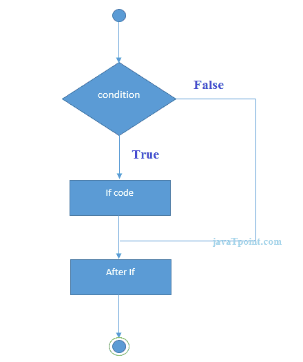
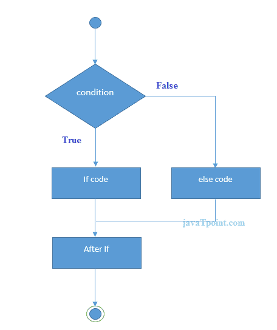

# JavaScript If-else

> 原文:[https://www.javatpoint.com/javascript-if](https://www.javatpoint.com/javascript-if)

无论条件为真或假，使用 **JavaScript if-else 语句***执行代码。JavaScript 中 if 语句有三种形式。*

1.  如果语句
2.  If else 语句
3.  if 否则 if 语句

### JavaScript If 语句

仅当表达式为真时，它才计算内容。JavaScript if 语句的签名如下。

```
if(expression){
//content to be evaluated
}

```

### JavaScript If 语句流程图



让我们看看 javascript 中 if 语句的简单例子。

```
<script>
var a=20;
if(a>10){
document.write("value of a is greater than 10");
}
</script>

```

[Test it Now](https://www.javatpoint.com/oprweb/test.jsp?filename=jsif1)

#### 上述示例的输出

* * *

### 如果 JavaScript...else 语句

它评估内容条件是真还是假。JavaScript if-else 语句的语法如下。

```
if(expression){
//content to be evaluated if condition is true
}
else{
//content to be evaluated if condition is false
}

```

### JavaScript If 的流程图...else 语句



让我们看看 JavaScript 中 if-else 语句的例子，找出偶数或奇数。

```
<script>
var a=20;
if(a%2==0){
document.write("a is even number");
}
else{
document.write("a is odd number");
}
</script>

```

[Test it Now](https://www.javatpoint.com/oprweb/test.jsp?filename=jsif2)

#### 上述示例的输出

* * *

### 如果 JavaScript...否则 if 语句

仅当多个表达式中的表达式为真时，它才计算内容。下面给出了 JavaScript if else if 语句的签名。

```
if(expression1){
//content to be evaluated if expression1 is true
}
else if(expression2){
//content to be evaluated if expression2 is true
}
else if(expression3){
//content to be evaluated if expression3 is true
}
else{
//content to be evaluated if no expression is true
}

```

让我们看看 javascript 中 if else if 语句的简单例子。

```
<script>
var a=20;
if(a==10){
document.write("a is equal to 10");
}
else if(a==15){
document.write("a is equal to 15");
}
else if(a==20){
document.write("a is equal to 20");
}
else{
document.write("a is not equal to 10, 15 or 20");
}
</script>

```

[Test it Now](https://www.javatpoint.com/oprweb/test.jsp?filename=jsif3)

#### 上述示例的输出