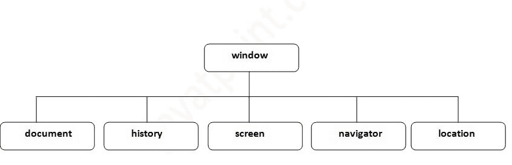

# 浏览器对象模型

> 原文：<https://www.javatpoint.com/browser-object-model>

1.  [浏览器对象模型(BOM)](#)

**浏览器对象模型** (BOM)用于与浏览器交互。

浏览器的默认对象是窗口，这意味着您可以通过指定窗口或直接调用窗口的所有功能。例如:

```js
window.alert("hello javatpoint");

```

与以下相同:

```js
alert("hello javatpoint");

```

您可以使用窗口对象下定义的许多属性(其他对象)，如文档、历史、屏幕、导航器、位置、内部高度、内部宽度，

#### 注意:文档对象代表一个 html 文档。它形成了文档对象模型。



请访问下一页，通过示例全面了解窗口对象。