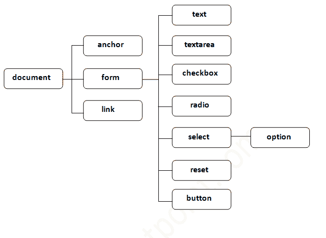

# 文档对象模型

> 原文：<https://www.javatpoint.com/document-object-model>

1.  [文档对象](#)
2.  [文档对象的属性](#)
3.  [文档对象的方法](#)
4.  [文档对象示例](#)

**文档对象**代表整个 html 文档。

当 html 文档加载到浏览器中时，它就变成了一个文档对象。代表 html 文档的是**根元素**。它有属性和方法。借助文档对象，我们可以向网页添加动态内容。

如前所述，它是窗口的对象。因此

```
window.document

```

与相同

```
document

```

根据 W3C-*“W3C 文档对象模型(DOM)是一个平台和语言中立的接口，允许程序和脚本动态访问和更新文档的内容、结构和风格。”*

* * *

## 文档对象的属性

让我们看看文档对象可以访问和修改的属性。

* * *

## 文档对象的方法

我们可以通过文档的方法来访问和更改文档的内容。

文档对象的重要方法如下:

| 方法 | 描述 |
| 写(“字符串”) | 在 doucment 上写入给定的字符串。 |
| writeln(“字符串”) | 在 doucment 上写入给定的字符串，并在末尾加上换行符。 |
| getElementById() | 返回具有给定 id 值的元素。 |
| getElementsByName() | 返回具有给定名称值的所有元素。 |
| getElementsByTagName（） | 返回具有给定标记名的所有元素。 |
| getElementsByClassName() | 返回具有给定类名的所有元素。 |

* * *

### 按文档对象访问字段值

在本例中，我们将获取用户输入文本的值。这里，我们使用**document . form 1 . name . value**来获取 name 字段的值。

这里，**文档**是表示 html 文档的根元素。

**表单 1** 是表单的名称。

**名称**是输入文本的属性名称。

**值**是返回输入文本值的属性。

让我们来看一个简单的例子，文档对象打印带有欢迎信息的名称。

```
<script type="text/javascript">
function printvalue(){
var name=document.form1.name.value;
alert("Welcome: "+name);
}
</script>

<form name="form1">
Enter Name:<input type="text" name="name"/>
<input type="button" onclick="printvalue()" value="print name"/>
</form>

```

* * *

#### 上述示例的输出

<form name="form1">Enter Name:<input type="text" name="name"> <input type="button" onclick="printvalue()" value="print name"></form>