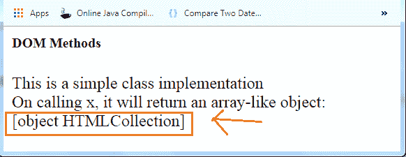

# GetElementsByClassName()

> 哎哎哎:# t0]https://www . javatppoint . com/JavaScript-getelementsbyclasname

getElementsByClassName()方法用于通过元素的类名值来选择或获取元素。这个 DOM 方法返回一个类似数组的对象，该对象由具有指定类名的所有元素组成。在任何特定元素上调用 getElementsByClassName()方法时，它将搜索整个文档，并将只返回那些与指定或给定类名匹配的元素。

### 句法

```js

var ele=document.getELementsByClassName('name');

```

这里，名称是要传递的强制参数。它是指定要匹配的单个类名或多个类名的字符串。

## getElementsByClassName()方法示例

让我们看一些例子来了解和理解方法的实际实现。

**例**

这是一个简单的类实现，在调用变量 x 时返回一个类似数组的对象。

```js

<html>
<head> <h5>DOM Methods </h5> </head>
<body>
<div class="Class">
This is a simple class implementation
</div>
<script type="text/javascript">
var x=document.getElementsByClassName('Class');
document.write("On calling x, it will return an arrsy-like object: <br>"+x);
</script>
</body>
</html>

```

**输出:**



同样，我们可以实现 getElementsByClassName()方法来返回多个类的元素集合。

### getElementsByClassName()，querySelector()和 querySelectorAll()方法之间的区别

**getElementsByClassName():**匹配指定类名的元素，返回一组匹配的元素。返回的元素是活动的 [HTML](https://www.javatpoint.com/html-tutorial) 元素集合。如果在文档对象模型中进行了任何更改，这些活动元素可以进一步更新。

**querySelector():** 它只返回与指定类名匹配的单个元素。如果它没有找到任何匹配的元素，它将返回 null。

要理解的要点是，上述所有方法要么返回一个元素，要么返回一个列表，但是 getELementsByClassName()方法服务于**动态**上升，另外两个方法服务于**静态**。

* * *