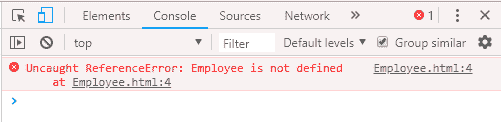

# JavaScript 类

> 原文：<https://www.javatpoint.com/javascript-oops-classes>

在 JavaScript 中，类是函数的特殊类型。我们可以像定义函数声明和函数表达式一样定义这个类。

JavaScript 类包含主体中的各种类成员，包括方法或构造函数。该类以严格模式执行。因此，包含静默错误或错误的代码会抛出一个错误。

类语法包含两个组件:

*   类声明
*   类表达式

## 类声明

可以通过使用类声明来定义类。class 关键字用于声明具有任何特定名称的类。根据 JavaScript 命名约定，类名总是以大写字母开头。

### 类声明示例

让我们看一个声明类的简单例子。

```js

<script>
//Declaring class
class Employee
  {
//Initializing an object
    constructor(id,name)
    {
      this.id=id;
      this.name=name;
    }
//Declaring method
    detail()
    {
  document.writeln(this.id+" "+this.name+"<br>")
    }
  }
//passing object to a variable 
var e1=new Employee(101,"Martin Roy");
var e2=new Employee(102,"Duke William");
e1.detail(); //calling method
e2.detail();
</script>

```

[Test it Now](https://www.javatpoint.com/oprweb/test.jsp?filename=JavaScriptClassDeclarationsExample)

**输出:**

```js
101 Martin Roy
102 Duke William

```

### 类声明示例:提升

与函数声明不同，类声明不是 JavaScript 提升的一部分。因此，需要在调用该类之前声明它。

我们来看一个例子。

```js

<script>
//Here, we are invoking the class before declaring it.
var e1=new Employee(101,"Martin Roy");
var e2=new Employee(102,"Duke William");
e1.detail(); //calling method
e2.detail();

//Declaring class
class Employee
  {
//Initializing an object
    constructor(id,name)
    {
      this.id=id;
      this.name=name;
    }
    detail()
    {
  document.writeln(this.id+" "+this.name+"<br>")
    }
  }
</script>

```

[Test it Now](https://www.javatpoint.com/oprweb/test.jsp?filename=JavaScriptClassDeclarationsHoistingExample)

**输出:**



### 类声明示例:重新声明类

一个类只能声明一次。如果我们多次尝试声明类，它会抛出一个错误。

我们来看一个例子。

```js

<script>
//Declaring class
class Employee
  {
//Initializing an object
    constructor(id,name)
    {
      this.id=id;
      this.name=name;
    }
    detail()
    {
  document.writeln(this.id+" "+this.name+"<br>")
    }
  }
//passing object to a variable 
var e1=new Employee(101,"Martin Roy");
var e2=new Employee(102,"Duke William");
e1.detail(); //calling method
e2.detail();
//Re-declaring class
class Employee
  {
  }
</script>

```

[Test it Now](https://www.javatpoint.com/oprweb/test.jsp?filename=JavaScriptClassDeclarationsRedeclaringClassExample)

**输出:**


* * *

## 类表达式

定义类的另一种方法是使用类表达式。这里，不强制指定类名。因此，类表达式可以是命名的，也可以是未命名的。类表达式允许我们获取类名。但是，这在类声明中是不可能的。

### 未命名的类表达式

该类可以在不指定任何名称的情况下表达。

我们来看一个例子。

```js

<script>
var emp = class {
  constructor(id, name) {
    this.id = id;
    this.name = name;
  }
};
document.writeln(emp.name);
</script>

```

[Test it Now](https://www.javatpoint.com/oprweb/test.jsp?filename=JavaScriptUnnamedClassExpressionExample)

**输出:**

```js
emp

```

### 类表达式示例:重新声明类

与类声明不同，类表达式允许我们重新声明同一个类。所以，如果我们多次尝试声明这个类，它会抛出一个错误。

```js

<script>
//Declaring class
var emp=class 
  {
//Initializing an object
    constructor(id,name)
    {
      this.id=id;
      this.name=name;
    }
//Declaring method    
detail()
    {
  document.writeln(this.id+" "+this.name+"<br>")
    }
  }
//passing object to a variable 
var e1=new emp(101,"Martin Roy");
var e2=new emp(102,"Duke William");
e1.detail(); //calling method
e2.detail();

//Re-declaring class
var emp=class 
  {
//Initializing an object
    constructor(id,name)
    {
      this.id=id;
      this.name=name;
    }
    detail()
    {
  document.writeln(this.id+" "+this.name+"<br>")
    }
  }
//passing object to a variable 
var e1=new emp(103,"James Bella");
var e2=new emp(104,"Nick Johnson");
e1.detail(); //calling method
e2.detail();
</script>

```

[Test it Now](https://www.javatpoint.com/oprweb/test.jsp?filename=JavaScriptClassExpressionRedeclaringClassExample)

**输出:**

```js
101 Martin Roy
102 Duke William
103 James Bella
104 Nick Johnson

```

### 命名类表达式示例

我们可以用特定的名字来表达这个类。这里，类名的范围是由类体决定的。使用 class.name 属性检索该类。

```js

<script>
var emp = class Employee {
  constructor(id, name) {
    this.id = id;
    this.name = name;
  }
};
document.writeln(emp.name);
/*document.writeln(Employee.name);
Error occurs on console:
"ReferenceError: Employee is not defined
*/
</script>

```

[Test it Now](https://www.javatpoint.com/oprweb/test.jsp?filename=JavaScriptNamedClassExpressionExample)

**输出:**

```js
Employee

```