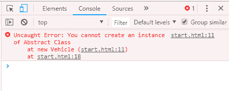

# JavaScript 抽象

> 原文：<https://www.javatpoint.com/javascript-oops-abstraction>

抽象是隐藏实现细节并只向用户显示功能的一种方式。换句话说，它忽略了无关的细节，只显示了所需的细节。

## 需要记住的要点

*   我们无法创建抽象类的实例。
*   它减少了代码的重复。

## JavaScript 抽象示例

### 例 1

让我们检查一下是否可以创建抽象类的实例。

```js
<script>
//Creating a constructor function
function Vehicle()
{
    this.vehicleName= vehicleName;
    throw new Error("You cannot create an instance of Abstract class");

}
Vehicle.prototype.display=function()
{
    return this.vehicleName;
}
var vehicle=new Vehicle();
 </script>

```



### 例 2

让我们看一个实现抽象的例子。

```js
<script>
//Creating a constructor function
 function Vehicle()
{
    this.vehicleName="vehicleName";
    throw new Error("You cannot create an instance of Abstract Class");
}
Vehicle.prototype.display=function()
{
    return "Vehicle is: "+this.vehicleName;
}
//Creating a constructor function
function Bike(vehicleName)
{
    this.vehicleName=vehicleName;
}
//Creating object without using the function constructor
Bike.prototype=Object.create(Vehicle.prototype);
var bike=new Bike("Honda");
document.writeln(bike.display());

 </script>

```

[Test it Now](https://www.javatpoint.com/oprweb/test.jsp?filename=JavaScriptAbstractionExample2)

**输出:**

```js
Vehicle is: Honda

```

### 例 3

在本例中，我们使用 instanceof 运算符来测试对象是否引用了相应的类。

```js
<script>
//Creating a constructor function
 function Vehicle()
{
    this.vehicleName=vehicleName;
    throw new Error("You cannot create an instance of Abstract class");
}
//Creating a constructor function
function Bike(vehicleName)
{
    this.vehicleName=vehicleName;
}
Bike.prototype=Object.create(Vehicle.prototype);
var bike=new Bike("Honda");
document.writeln(bike instanceof Vehicle);
document.writeln(bike instanceof Bike);

 </script>

```

[Test it Now](https://www.javatpoint.com/oprweb/test.jsp?filename=JavaScriptAbstractionExample3)

**输出:**

```js
true true

```