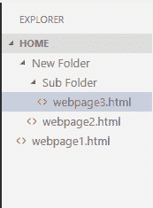

# Cookie 属性

> 原文:[https://www.javatpoint.com/javascript-cookie-attributes](https://www.javatpoint.com/javascript-cookie-attributes)

JavaScript 提供了一些增强 cookies 功能的可选属性。下面是一些属性的列表及其描述。

| 属性 | 描述 |
| 期满 | 它将 cookie 的状态保持到指定的日期和时间。 |
| 最大年龄 | 它将 cookie 的状态保持到指定的时间。这里，时间以秒为单位。 |
| 小路 | 它将 cookie 的范围扩展到网站的所有页面。 |
| 领域 | 它用于指定 cookie 对其有效的域。 |

## Cookie 过期属性

cookie 过期属性提供了创建持久 cookie 的方法之一。这里，声明了一个日期和时间，表示 cookie 的活动周期。一旦声明的时间过去，cookie 就会自动删除。

让我们看一个 cookie 过期属性的例子。

```

<!DOCTYPE html>
<html>
<head>
</head>
<body>
<input type="button" value="setCookie" onclick="setCookie()">
<input type="button" value="getCookie" onclick="getCookie()">
    <script>
    function setCookie()
    {
        document.cookie="username=Duke Martin;expires=Sun, 20 Aug 2030 12:00:00 UTC";
    }
    function getCookie()
    {
        if(document.cookie.length!=0)
        {
            var array=document.cookie.split("=");
        alert("Name="+array[0]+" "+"Value="+array[1]);
        }
        else
        {
        alert("Cookie not available");
        }
    }
    </script>
</body>
</html>

```

## Cookie 最大年龄属性

cookie 最大年龄属性提供了另一种创建持久 cookie 的方法。这里，时间以秒为单位。cookie 仅在声明的时间内有效。

让我们看一个 cookie 最大年龄属性的例子。

```

<!DOCTYPE html>
<html>
<head>
</head>
<body>
<input type="button" value="setCookie" onclick="setCookie()">
<input type="button" value="getCookie" onclick="getCookie()">
    <script>
    function setCookie()
    {
        document.cookie="username=Duke Martin;max-age=" + (60 * 60 * 24 * 365) + ";"
    }
    function getCookie()
    {
        if(document.cookie.length!=0)
        {
            var array=document.cookie.split("=");
        alert("Name="+array[0]+" "+"Value="+array[1]);
        }
        else
        {
        alert("Cookie not available");
        }
    }
    </script>
</body>
</html>

```

## Cookie 路径属性

如果为网页创建了 cookie，默认情况下，它只对当前目录和子目录有效。JavaScript 提供了一个路径属性，将 cookie 的范围扩展到网站的所有页面。

## Cookie 路径属性示例

让我们借助一个例子来理解路径属性。



这里，如果我们为 webpage3.html 创建一个 cookie，它只对它自己和它的子目录(即网页 3.html)有效。它对 webpage1.html 文件无效。

在这个例子中，我们使用路径属性来增强所有页面的 cookies 的可见性。在这里，您只需要维护上面的目录结构，并将下面的程序放在所有三个网页中。现在，cookie 对每个网页都有效。

```

<!DOCTYPE html>
<html>
<head>
</head>
<body>
<input type="button" value="setCookie" onclick="setCookie()">
<input type="button" value="getCookie" onclick="getCookie()">
    <script>
    function setCookie()
    {
        document.cookie="username=Duke Martin;max-age=" + (60 * 60 * 24 * 365) + ";path=/;"
    }
    function getCookie()
    {
        if(document.cookie.length!=0)
        {
            var array=document.cookie.split("=");
        alert("Name="+array[0]+" "+"Value="+array[1]);
        }
        else
        {
        alert("Cookie not available");
        }
    }
    </script>
</body>
</html>

```

## Cookie 域属性

JavaScript 域属性指定 cookie 对其有效的域。假设我们为属性提供了任何域名，例如:

```

domain=javatpoint.com

```

这里，cookie 对给定的域及其所有子域有效。

但是，如果我们为属性提供任何子域，例如:

```

omain=training.javatpoint.com

```

这里，cookie 只对给定的子域有效。因此，提供域名而不是子域是更好的方法。