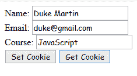
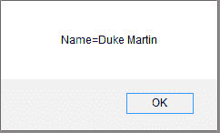
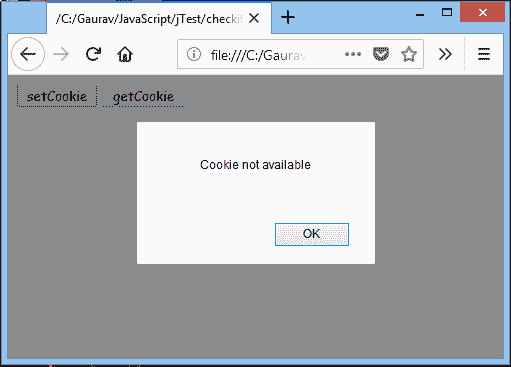
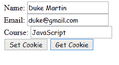
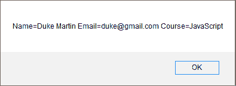
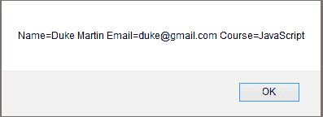

# 具有多个名称-值对的 Cookie

> 原文：<https://www.javatpoint.com/javascript-cookie-with-multiple-name>

在 JavaScript 中，一个 cookie 只能包含一个名称-值对。但是，要存储多个名称-值对，我们可以使用以下方法:-

*   将自定义对象序列化为 JSON 字符串，解析它，然后存储在 cookie 中。
*   对于每个名称-值对，使用单独的 cookie。

## 在 Cookie 中存储名称-值对的示例

### 例 1

让我们看一个例子来检查一个 cookie 是否包含多个名称-值对。

```

<!DOCTYPE html>
<html>
<head>
</head>
<body>
    Name: <input type="text" id="name"><br>
    Email: <input type="email" id="email"><br>
    Course: <input type="text" id="course"><br>
<input type="button" value="Set Cookie" onclick="setCookie()">
<input type="button" value="Get Cookie" onclick="getCookie()">
<script>
    function setCookie()
    {
//Declaring 3 key-value pairs
        var info="Name="+ document.getElementById("name").value+";Email="+document.getElementById("email").value+";Course="+document.getElementById("course").value;
//Providing all 3 key-value pairs to a single cookie
        document.cookie=info;
    }

    function getCookie()
    {
        if(document.cookie.length!=0)
        {
       //Invoking key-value pair stored in a cookie
        alert(document.cookie);
        }
        else
        {
        alert("Cookie not available")
        }
    }
</script>
</body>
</html>

```

**输出:**

[Test it Now](https://www.javatpoint.com/oprweb/test.jsp?filename=JavaScriptCookiewithmultipleNameExample1) 

点击**获取 Cookie** 按钮，出现如下对话框。



在这里，我们可以看到只显示了一个名称-值。

但是，如果点击**获取 Cookie** 而不填写表单，则会出现下面的对话框。



### 例 2

让我们看一个使用 JSON 在 cookie 中存储不同名称-值对的例子。

```

<!DOCTYPE html>
<html>
<head>
</head>
<body>
    Name: <input type="text" id="name"><br>
    Email: <input type="email" id="email"><br>
    Course: <input type="text" id="course"><br>
<input type="button" value="Set Cookie" onclick="setCookie()">
<input type="button" value="Get Cookie" onclick="getCookie()">

<script>
    function setCookie()
{
    var obj = {};//Creating custom object
    obj.name = document.getElementById("name").value;
    obj.email = document.getElementById("email").value;
    obj.course = document.getElementById("course").value;

//Converting JavaScript object to JSON string    
var jsonString = JSON.stringify(obj);

    document.cookie = jsonString;
}
         function getCookie()
{
    if( document.cookie.length!=0)
    {
//Parsing JSON string to JSON object
    var obj = JSON.parse(document.cookie);

        alert("Name="+obj.name+" "+"Email="+obj.email+" "+"Course="+obj.course);
    }
    else
    {
        alert("Cookie not available");
    }
}
    </script>
</body>
</html>

```

[Test it Now](https://www.javatpoint.com/oprweb/test.jsp?filename=JavaScriptCookiewithmultipleNameExample2)

**输出:**



点击**获取 Cookie** 按钮，出现如下对话框。



在这里，我们可以看到显示了所有存储的名称-值对。

### 例 3

让我们看一个将每个名称-值对存储在不同 cookie 中的例子。

```

<!DOCTYPE html>
<html>
<head>
</head>
<body>
    Name: <input type="text" id="name"><br>
    Email: <input type="email" id="email"><br>
    Course: <input type="text" id="course"><br>
<input type="button" value="Set Cookie" onclick="setCookie()">
<input type="button" value="Get Cookie" onclick="getCookie()">

<script>
 function setCookie()
{
    document.cookie = "name=" + document.getElementById("name").value;
    document.cookie = "email=" + document.getElementById("email").value;
    document.cookie = "course=" + document.getElementById("course").value;
}
function getCookie()
{
    if (document.cookie.length != 0)
    {
        alert("Name="+document.getElementById("name").value+" Email="+document.getElementById("email").value+" Course="+document.getElementById("course").value);
    }    
    else
    {
        alert("Cookie not available");
    }
}   
 </script>
</body>
</html>

```

**输出:**

[Test it Now](https://www.javatpoint.com/oprweb/test.jsp?filename=JavaScriptCookiewithmultipleNameExample3) 

点击**获取 Cookie** 按钮，出现如下对话框。



在这里，我们还可以看到显示了所有存储的名称-值对。