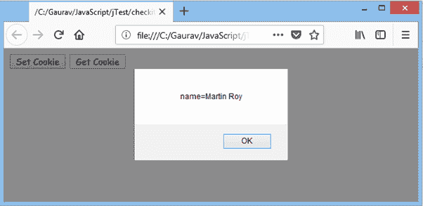
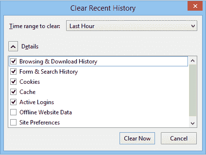
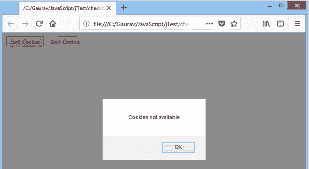

# 删除 JavaScript 中的 Cookie

> 原文:[https://www.javatpoint.com/javascript-deleting-cookies](https://www.javatpoint.com/javascript-deleting-cookies)

在前一节中，我们学习了在 JavaScript 中设置和更新 cookie 的不同方法。除此之外，JavaScript 还允许我们删除一个 cookie。在这里，我们看到了删除 cookie 的所有可能方法。

## 删除 Cookie 的不同方法

以下是删除 cookie 的方法:

*   可以使用 expire 属性删除 cookie。
*   还可以使用最大年龄属性删除 cookie。
*   我们可以通过使用网络浏览器显式删除 cookie。

## 删除 Cookie 的示例

### 例 1

在这个例子中，我们使用 expire 属性通过向 cookie 提供到期日期(即任何过去的日期)来删除它。

```
<!DOCTYPE html>
<html>
<head>
</head>
<body>

<input type="button" value="Set Cookie" onclick="setCookie()">
<input type="button" value="Get Cookie" onclick="getCookie()">
<script>
function setCookie() 
{
    document.cookie="name=Martin Roy; expires=Sun, 20 Aug 2000 12:00:00 UTC";

} 
function getCookie()
{
    if(document.cookie.length!=0)
    {
    alert(document.cookie);
    }
    else
    {
        alert("Cookie not avaliable");
    }
}
</script>
</body>
</html>

```

### 例 2

在这个例子中，我们使用**最大年龄**属性，通过向 cookie 提供零或负数(表示秒)来删除它。

```
<!DOCTYPE html>
<html>
<head>
</head>
<body>

<input type="button" value="Set Cookie" onclick="setCookie()">
<input type="button" value="Get Cookie" onclick="getCookie()">
<script>
function setCookie() 
{
    document.cookie="name=Martin Roy;max-age=0";
} 
function getCookie()
{
    if(document.cookie.length!=0)
    {
    alert(document.cookie);
    }
    else
    {
        alert("Cookie not avaliable");
    }
}

</script>
</body>
</html>

```

### 例 3

让我们看一个设置、获取和删除多个 cookies 的例子。

```
<!DOCTYPE html>
<html>
<head>
</head>
<body>

<input type="button" value="Set Cookie1" onclick="setCookie1()">
<input type="button" value="Get Cookie1" onclick="getCookie1()">
<input type="button" value="Delete Cookie1" onclick="deleteCookie1()">
<br>
<input type="button" value="Set Cookie2" onclick="setCookie2()">
<input type="button" value="Get Cookie2" onclick="getCookie2()">
<input type="button" value="Delete Cookie2" onclick="deleteCookie2()">
<br>
<input type="button" value="Display all cookies" onclick="displayCookie()">

<script>
function setCookie1() 
{
    document.cookie="name=Martin Roy";
     cookie1=  document.cookie;
} 
function setCookie2() 
{
    document.cookie="name=Duke William";
     cookie2=  document.cookie;
} 

function getCookie1()
{
    if(cookie1.length!=0)
    {
    alert(cookie1);
    }
    else
    {
        alert("Cookie not available");
    }
}

function getCookie2()
{
    if(cookie2.length!=0)
    {
    alert(cookie2);
    }
    else
    {
        alert("Cookie not available");
    }
}

function deleteCookie1()
{
    document.cookie=cookie1+";max-age=0";
    cookie1=document.cookie;
    alert("Cookie1 is deleted");
}

function deleteCookie2()
{
    document.cookie=cookie2+";max-age=0";
    cookie2=document.cookie;
   alert("Cookie2 is deleted");
}

function displayCookie()
{
if(cookie1!=0&&cookie2!=0)
{
    alert(cookie1+" "+cookie2);
}
else if(cookie1!=0)
{
    alert(cookie1);
}
else if(cookie2!=0)
{
    alert(cookie2);
}
else{
    alert("Cookie not available");
}

}

</script>
</body>
</html>

```

### 例 4

让我们看一个显式删除 cookie 的例子。

```
<!DOCTYPE html>
<html>
<head>
</head>
<body>

<input type="button" value="Set Cookie" onclick="setCookie()">
<input type="button" value="Get Cookie" onclick="getCookie()">
<script>
function setCookie() 
{
    document.cookie="name=Martin Roy";

} 
function getCookie()
{
    if(document.cookie.length!=0)
    {
    alert(document.cookie);
    }
    else
    {
        alert("Cookie not avaliable");
    }
}
</script>
</body>
</html>

```

点击**设置 Cookie** 一次后，每当我们点击**获取 Cookie** 时，Cookie 的键和值都会显示在屏幕上。



要显式删除 cookie，请执行以下步骤:

*   打开 Mozilla Firefox。
*   点击**打开菜单-图库-历史记录-清除近期历史记录-详细信息**。



*   在这里我们可以看到一个已经被标记的**饼干**复选框。现在，点击**立即清除**明确删除 cookies。

现在，点击**获取 Cookie** ，出现如下对话框。



在这里，我们可以看到 cookies 被删除了。