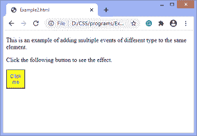

# addevent listener()JavaScript

> 哎哎哎:# t0]https://www . javatppoint . com/JavaScript-addevent listener

**addEventListener()** 方法用于将事件处理程序附加到特定元素。它不会重写现有的事件处理程序。据说事件是 JavaScript 的重要组成部分。网页根据发生的事件做出响应。事件可以由用户生成，也可以由应用编程接口生成。事件侦听器是一个等待事件发生的 JavaScript 过程。

addEventListener()方法是 [JavaScript](https://www.javatpoint.com/javascript-tutorial) 的内置函数。我们可以向特定元素添加多个事件处理程序，而不会覆盖现有的事件处理程序。

### 句法

```js

element.addEventListener(event, function, useCapture);

```

虽然它有三个参数，但是参数***事件****和**T5【功能】** 被广泛使用。第三个参数是可选定义的。该函数的值定义如下。*

 *### 参数值

**事件:**是必选参数。它可以定义为指定事件名称的字符串。

#### 注意:不要在参数值中使用任何前缀，如“on”。例如，使用“单击”而不是“onclick”。

**功能:**也是必选参数。这是一个响应事件发生的 [JavaScript 函数](https://www.javatpoint.com/javascript-function)。

**使用捕捉:**这是一个可选参数。它是一个布尔值，指定事件是在冒泡阶段还是在捕获阶段执行。它的可能值是**真**和**假**。当设置为 true 时，事件处理程序在捕获阶段执行。当设置为 false 时，处理程序在冒泡阶段执行。其默认值为**假**。

让我们看一些使用 addEventListener()方法的例子。

### 例子

这是一个使用 addEventListener()方法的简单示例。我们要点击给定的 [HTML 按钮](https://www.javatpoint.com/html-button-tag)才能看到效果。

```js

<!DOCTYPE html>
<html>
<body>
<p> Example of the addEventListener() method. </p>
<p> Click the following button to see the effect. </p>
<button id = "btn"> Click me </button>
<p id = "para"></p>
<script>
document.getElementById("btn").addEventListener("click", fun);
function fun() {
document.getElementById("para").innerHTML = "Hello World" + "<br>" + "Welcome to the  javaTpoint.com";
}
</script>
</body>
</html>

```

[Test it Now](https://www.javatpoint.com/oprweb/test.jsp?filename=javascript-addeventlistener1)

**输出**


点击给定的 [HTML](https://www.javatpoint.com/html-tutorial) 按钮后，输出会是-


现在，在下一个示例中，我们将看到如何在不覆盖现有事件的情况下向同一个元素添加许多事件。

### 例子

在这个例子中，我们向同一个元素添加了多个事件。

```js

<!DOCTYPE html>
<html>
<body>
<p> This is an example of adding multiple events to the same element. </p>
<p> Click the following button to see the effect. </p>
<button id = "btn"> Click me </button>
<p id = "para"></p>
<p id = "para1"></p>
<script>
function fun() {
    alert("Welcome to the javaTpoint.com");
}

function fun1() {
   document.getElementById("para").innerHTML =  "This is second function";

}
function fun2() {
   document.getElementById("para1").innerHTML =  "This is third function";
}
var mybtn = document.getElementById("btn");
mybtn.addEventListener("click", fun);
mybtn.addEventListener("click", fun1);
mybtn.addEventListener("click", fun2);
</script>
</body>
</html>

```

[Test it Now](https://www.javatpoint.com/oprweb/test.jsp?filename=javascript-addeventlistener2)

**输出**


现在，当我们单击按钮时，将显示一条警报。单击给定的 HTML 按钮后，输出将是-


当我们退出警报时，输出是-


### 例子

在本例中，我们将不同类型的多个事件添加到同一个元素中。

```js

<!DOCTYPE html>
<html>
<body>
<p> This is an example of adding multiple events of different type to the same element. </p>
<p> Click the following button to see the effect. </p>
<button id = "btn"> Click me </button>
<p id = "para"></p>
<script>
function fun() {
    btn.style.width = "50px";
	btn.style.height = "50px";
	btn.style.background = "yellow";
	btn.style.color = "blue";
}

function fun1() {
   document.getElementById("para").innerHTML =  "This is second function";

}
function fun2() {
    btn.style.width = "";
	btn.style.height = "";
	btn.style.background = "";
	btn.style.color = "";
}
var mybtn = document.getElementById("btn");
mybtn.addEventListener("mouseover", fun);
mybtn.addEventListener("click", fun1);
mybtn.addEventListener("mouseout", fun2);
</script>
</body>
</html>

```

[Test it Now](https://www.javatpoint.com/oprweb/test.jsp?filename=javascript-addeventlistener3)

**输出**


当我们将光标移到按钮上时，输出将是-



点击按钮并离开光标后，输出将是-


## 事件冒泡或事件捕获

现在，我们理解了 JavaScript 的 addEventListener()的第三个参数的用法，即 ***useCapture。*T3】**

在 HTML DOM 中，**冒泡**和**捕捉**是事件传播的两种方式。我们可以通过一个例子来理解这些方式。

假设我们有一个 div 元素和一个段落元素，我们使用 **addEventListener()** 方法将**“click”**事件应用到这两个元素。现在的问题是点击段落元素，首先处理哪个元素的点击事件。

所以在**冒泡中，**首先处理段落元素的事件，然后处理 div 元素的事件。这意味着在冒泡中，首先处理内部元素的事件，然后处理最外层元素的事件。

在**捕捉**中，首先处理 div 元素的事件，然后处理段落元素的事件。这意味着在捕获时，首先处理外部元素的事件，然后处理最里面的元素的事件。

```js

addEventListener(event, function, useCapture);

```

我们可以使用 ***使用*** 参数指定传播。当它设置为 false(这是它的默认值)时，事件使用冒泡传播，当它设置为 true 时，有捕获传播。

我们可以用一个例子来理解*冒泡*和*捕捉*。

### 例子

在这个例子中，有两个 div 元素。我们可以看到第一个 div 元素的冒泡效果和第二个 div 元素的捕获效果。

当我们双击第一个 div 元素的 span 元素时，首先处理 span 元素的事件，而不是 div 元素。叫做*冒泡*。

但是当我们双击第二个 div 元素的 span 元素时，div 元素的事件比 span 元素先处理。叫做*捕捉*。

```js

<!DOCTYPE html>
<html>
<head>
<style>
div{
background-color: lightblue;
border: 2px solid red;
font-size: 25px;
text-align: center;
}
span{
border: 2px solid blue;
}
</style>
</head>
<body>
<h1> Bubbling </h1>
<div id = "d1">
This is a div element.
<br><br>
<span id = "s1"> This is a span element. </span>
</div>
<h1> Capturing </h1>
<div id = "d2"> This is a div element.
<br><br>
<span id = "s2"> This is a span element. </span>
</div>

<script>
document.getElementById("d1").addEventListener("dblclick", function() {alert('You have double clicked on div element')}, false);
document.getElementById("s1").addEventListener("dblclick", function() {alert('You have double clicked on span element')}, false);
document.getElementById("d2").addEventListener("dblclick", function() {alert('You have double clicked on div element')}, true);
document.getElementById("s2").addEventListener("dblclick", function() {alert('You have double clicked on span element')}, true);
</script>
</body>
</html>

```

[Test it Now](https://www.javatpoint.com/oprweb/test.jsp?filename=javascript-addeventlistener4)

**输出**


我们要双击具体的元素才能看到效果。

* * **