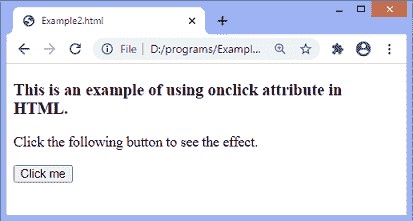
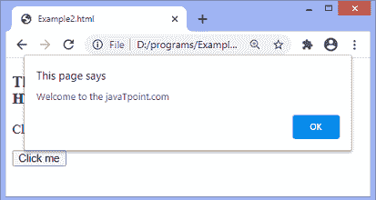
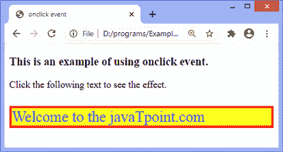
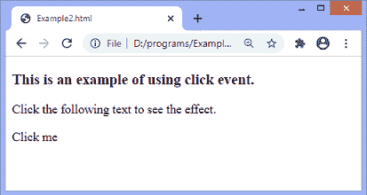
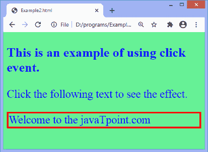

# JavaScript onclick 事件

> 原文：<https://www.javatpoint.com/javascript-onclick-event>

**onclick** 事件通常在用户单击某个元素时发生。它允许程序员在一个元素被点击时执行一个 JavaScript 函数。此事件可用于验证表单、警告消息等。

使用 JavaScript，可以将此事件动态添加到任何元素中。它支持除 **[< html >](https://www.javatpoint.com/html-html-tag) 、 [<头部>](https://www.javatpoint.com/html-head) 、 [<标题>](https://www.javatpoint.com/html-title) 、 [<样式](https://www.javatpoint.com/html-style)、 [<脚本>](https://www.javatpoint.com/html-script-tag) 、 [<基础>](https://www.javatpoint.com/html-base-tag) 、 [< iframe >、](https://www.javatpoint.com/html-iframes)、[T42】bdo<之外的所有 HTML 元素这意味着我们不能在给定的标签上应用 **onclick** 事件。](https://www.javatpoint.com/html-bdo-tag)**

在 HTML 中，我们可以使用 **onclick** 属性，并为其分配一个 [JavaScript 函数](https://www.javatpoint.com/javascript-function)。我们也可以使用 JavaScript 的 **addEventListener()** 方法，并传递一个**点击**事件给它，以获得更大的灵活性。

### 句法

现在，我们看到了在 [HTML](https://www.javatpoint.com/html-tutorial) 和 [javascript](https://www.javatpoint.com/javascript-tutorial) 中使用 **onclick** 事件的语法(没有 **addEventListener()** 方法或使用 **addEventListener()** 方法)。

### 在 HTML 中

```js

<element onclick = "fun()">

```

### 在 JavaScript 中

```js

object.onclick = function() { myScript };

```

### 在 JavaScript 中，通过使用 addEventListener()方法

```js

object.addEventListener("click", myScript);

```

通过一些插图来看看如何使用 **onclick** 事件。现在，我们将看到在 HTML 和 JavaScript 中使用 **onclick** 事件的例子。

### 示例 1 -在 HTML 中使用 onclick 属性

在这个例子中，我们使用了 [HTML **onclick**](https://www.javatpoint.com/html-button-onclick) 属性，并给它分配了一个 JavaScript 的函数。当用户点击给定的按钮时，相应的功能将被执行，屏幕上将显示一个警告对话框。

```js

<!DOCTYPE html>
<html>
<head>
<script>
function fun() {
alert("Welcome to the javaTpoint.com");
}
</script>
</head>
<body>
<h3> This is an example of using onclick attribute in HTML. </h3>
<p> Click the following button to see the effect. </p>
<button onclick = "fun()">Click me</button>
</body>
</html>

```

[Test it Now](https://www.javatpoint.com/oprweb/test.jsp?filename=javascript-onclick-event1)

**输出**



点击给定按钮后，输出将是-



### 示例 2 -使用 JavaScript

在这个例子中，我们使用的是 JavaScript 的 **onclick** 事件。这里我们使用带有段落元素的 **onclick** 事件。

当用户点击[段落](https://www.javatpoint.com/html-paragraph)元素时，相应的功能将被执行，段落的文本将被更改。在点击 **< p >** 元素时，[背景颜色](https://www.javatpoint.com/html-background-color)、大小、边框和文本颜色也将得到改变。

```js

<!DOCTYPE html>
<html>
<head>
<title> onclick event </title>
</head>
<body>
<h3> This is an example of using onclick event. </h3>
<p> Click the following text to see the effect. </p>
<p id = "para">Click me</p>
<script>
document.getElementById("para").onclick = function() {
fun()
};
function fun() {
document.getElementById("para").innerHTML = "Welcome to the javaTpoint.com";
document.getElementById("para").style.color = "blue";
document.getElementById("para").style.backgroundColor = "yellow";
document.getElementById("para").style.fontSize = "25px";
document.getElementById("para").style.border = "4px solid red"; 
}
</script>

</body>
</html>

```

[Test it Now](https://www.javatpoint.com/oprweb/test.jsp?filename=javascript-onclick-event2)

**输出**


点击文字 ***后点击我，*** 输出会是-



### 示例 3 -使用 addEventListener()方法

在这个例子中，我们使用 JavaScript 的 **addEventListener()** 方法将 **click** 事件附加到段落元素。当用户单击段落元素时，段落的文本会发生变化。

单击段落时，元素的背景颜色和字体大小也会发生变化。

```js

<!DOCTYPE html>
<html>
<head>
</head>
<body>
<h3> This is an example of using click event. </h3>
<p> Click the following text to see the effect. </p>
<p id = "para">Click me</p>
<script>
document.getElementById("para").onclick = function() {
fun()
};
function fun() {
document.getElementById("para").innerHTML = "Welcome to the javaTpoint.com";
document.getElementsByTagName("body")[0].style.color = "blue";
document.getElementsByTagName("body")[0].style.backgroundColor = "lightgreen";
document.getElementsByTagName("body")[0].style.fontSize = "25px";
document.getElementById("para").style.border = "4px solid red"; 
}
</script>

</body>
</html>

```

[Test it Now](https://www.javatpoint.com/oprweb/test.jsp?filename=javascript-onclick-event3)

**输出**



点击文本 ***点击我*** ，输出将为-



* * *