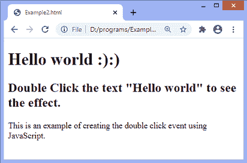

# JavaScript dblclick 事件

> 原文：<https://www.javatpoint.com/javascript-dblclick-event>

双击元素时， **dblclick** 事件会生成一个事件。当元素在很短的时间内被单击两次时，会触发事件。我们也可以使用 JavaScript 的 **addEventListener()** 方法来触发双击事件。

在 [HTML](https://www.javatpoint.com/html-tutorial) 中，我们可以使用 **ondblclick** 属性来创建双击事件。

### 句法

现在，我们看到了在 HTML 和 [javascript](https://www.javatpoint.com/javascript-tutorial) 中创建双击事件的语法(不使用 **addEventListener()** 方法或使用 **addEventListener()** 方法)。

### 在 HTML 中

```js

<element ondblclick = "fun()">

```

### 在 JavaScript 中

```js

object.ondblclick = function() { myScript };

```

### 在 JavaScript 中，通过使用 addEventListener()方法

```js

object.addEventListener("dblclick", myScript);

```

让我们看一些插图来理解双击事件。

### 示例-在 HTML 中使用 ondblclick 属性

在这个例子中，我们使用 HTML **ondblclick** 属性来创建双击事件。

```js

<!DOCTYPE html>
<html>
<head>
</head>

<body>
<h1 id = "heading" ondblclick = "fun()"> Hello world :):) </h1>
<h2> Double Click the text "Hello world" to see the effect. </h2>
<p> This is an example of using the <b> ondblclick </b> attribute. </p>
<script>
function fun() {
document.getElementById("heading").innerHTML = " Welcome to the javaTpoint.com ";
}
</script>
</body>
</html>

```

[Test it Now](https://www.javatpoint.com/oprweb/test.jsp?filename=javascript-dblclick-event1)

**输出**

执行上述代码后，输出将是-


双击文本**“你好世界”**后，输出将为-


现在，我们将看到如何使用 JavaScript 创建双击事件。

### 示例-使用 JavaScript

```js

<!DOCTYPE html>
<html>
<head>
</head>

<body>
<h1 id = "heading"> Hello world :):) </h1>
<h2> Double Click the text "Hello world" to see the effect. </h2>
<p> This is an example of creating the double click event using JavaScript. </p>
<script>
document.getElementById("heading").ondblclick = function() { fun() };
function fun() {
document.getElementById("heading").innerHTML = " Welcome to the javaTpoint.com ";
}
</script>
</body>

</html>

```

[Test it Now](https://www.javatpoint.com/oprweb/test.jsp?filename=javascript-dblclick-event2)

**输出**



双击文本**“你好世界”**后，输出将为-


### 示例-使用 JavaScript 的 addEventListener()方法

```js

<!DOCTYPE html>
<html>
<head>
</head>

<body>
<h1 id = "heading"> Hello world :):) </h1>
<h2> Double Click the text "Hello world" to see the effect. </h2>
<p> This is an example of creating the double click event using the <b> addEventListener() method </b>. </p>
<script>
document.getElementById("heading").addEventListener("dblclick", fun);
function fun() {
document.getElementById("heading").innerHTML = " Welcome to the javaTpoint.com ";
}
</script>
</body>

</html>

```

[Test it Now](https://www.javatpoint.com/oprweb/test.jsp?filename=javascript-dblclick-event3)

**输出**


双击文本**“你好世界”**后，输出将为-


* * *