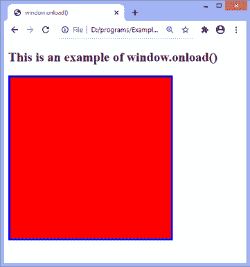
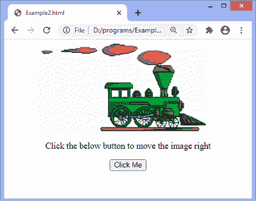
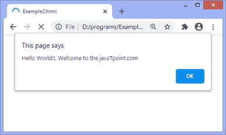

# JavaScript onload

> 原文:[https://www.javatpoint.com/javascript-onload](https://www.javatpoint.com/javascript-onload)

在 JavaScript 中，当页面完全显示时，此事件可以应用于启动特定的功能。它还可以用来验证访问者浏览器的类型和版本。我们可以通过使用 **onload** 属性来检查一个页面使用了哪些 cookies。

在 HTML 中，当对象被加载时，onload 属性会激发。该属性的目的是在相关元素加载时执行脚本。

在 [HTML](https://www.javatpoint.com/html-tutorial) 中， **onload** 属性一般与 **< body >** 元素一起使用，执行一次脚本内容(包括 CSS 文件、图片、脚本等)。)的网页被完全加载。不必只和 [<正文>标签](https://www.javatpoint.com/html-body-tag)一起使用，因为可以和其他 HTML 元素一起使用。

**document.onload** 和 **window.onload** 的区别在于: **document.onload** 在加载图像和其他外部内容之前触发。在**窗口前点火。而 **window.onload** 则在整个页面加载时触发，包括 [CSS](https://www.javatpoint.com/css-tutorial) 文件、脚本文件、图片等。**

### 句法

```

window.onload = fun()

```

让我们通过一些例子来理解这个事件。

### 示例 1

在这个例子中，有一个高度为 200px、宽度为 200px 的 div 元素。在这里，我们使用 **window.onload()** 来[在加载网页后更改 **div** 元素的背景颜色](https://www.javatpoint.com/how-to-change-background-color-in-html)、宽度和高度。

背景颜色设置为**【红色】**，宽度和高度各设置为 **300px** 。

```

<!DOCTYPE html>
<html>
<head>
<meta charset = " utf-8">
<title> window.onload() </title>
<style type = "text/css">
#bg{
width: 200px;
height: 200px;
border: 4px solid blue;
}
</style>
<script type = "text/javascript">
window.onload = function(){
document.getElementById("bg").style.backgroundColor = "red";
document.getElementById("bg").style.width = "300px";
document.getElementById("bg").style.height = "300px";
}
</script>
</head>
<body>
<h2> This is an example of window.onload() </h2>
<div id = "bg"></div>
</body>
</html>

```

[Test it Now](https://www.javatpoint.com/oprweb/test.jsp?filename=javascript-onload1)

**输出**

在执行代码和加载页面之后，输出将是-



### 示例 2

在这个例子中，我们通过使用 DOM 对象的属性和 [javascript](https://www.javatpoint.com/javascript-tutorial) 的函数来实现一个简单的动画。我们使用 [JavaScript 函数](https://www.javatpoint.com/javascript-function) [getElementById()](https://www.javatpoint.com/document-getElementById()-method) 来获取 DOM 对象，然后将该对象分配到一个全局变量中。

```

<html>   
   <head>   
      <script type = "text/javascript">   

            var img = null;   
            function init(){    
               img = document.getElementById('myimg');  
               img.style.position = 'relative';       
               img.style.left = '50px';     
            }       
            function moveRight(){    
               img.style.left = parseInt(  
               img.style.left) + 100 + 'px';    
            }    
            window.onload = init;    

      </script>   
   </head>   

   <body>   
      <form>   
            
         <center>  
            <p>Click the below button to move the image right</p>   
         <input type = "button" value = "Click Me" onclick = "moveRight();" />  
      </center>   
      </form>  
   </body>  

</html>

```

[Test it Now](https://www.javatpoint.com/oprweb/test.jsp?filename=javascript-onload2)

**输出**

成功执行上述代码后，输出将是-



现在，有一个例子，我们将使用 HTML **onload** 属性和 JavaScript 函数。

### 示例 3

这是一个使用 HTML **onload** 属性和 JavaScript 中定义的函数的简单例子。在本例中， **alert()** 函数在文档刷新时被调用。

```

<!DOCTYPE html>
<html>
<head>
<style>
</style>
<script>
   function fun() {
      alert("Hello World!!, Welcome to the javaTpoint.com");
   }
</script>
</head>
<body onload = "fun()">
<h1> Example of the HTML onload attribute </h1>
<p> Try to refresh the document to see the effect. </p>
</body>
</html>

```

[Test it Now](https://www.javatpoint.com/oprweb/test.jsp?filename=javascript-onload3)

**输出**

执行上述代码后，输出将是-



* * *