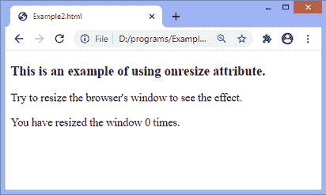
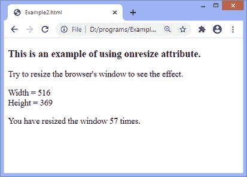
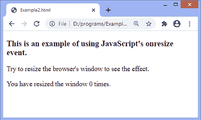
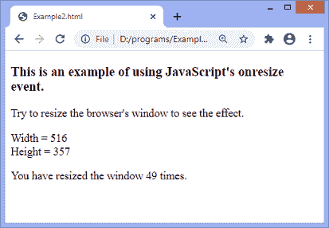
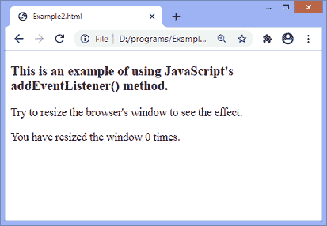
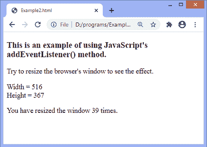

# JavaScript onresize 事件

> 原文:[https://www.javatpoint.com/javascript-onresize-event](https://www.javatpoint.com/javascript-onresize-event)

JavaScript 中的 **onresize** 事件一般发生在窗口调整大小时。要获取窗口的大小，我们可以使用 JavaScript 的**T3【窗口外宽】T4**和**T7【窗口外高】T8**事件。我们还可以使用 JavaScript 的属性，如***【inner width】【inner height】【client width】【client height】【offset with】***来获取元素的大小。

在 HTML 中，我们可以使用 **onresize** 属性，并为其分配一个 JavaScript 函数。我们也可以使用 [JavaScript 的 **addEventListener()**](https://www.javatpoint.com/javascript-addeventlistener) 方法，并传递一个**调整**大小的事件给它，以获得更大的灵活性。

### 句法

现在，我们看到了在 [HTML](https://www.javatpoint.com/html-tutorial) 和 [javascript](https://www.javatpoint.com/javascript-tutorial) 中使用 **onresize** 事件的语法(没有 **addEventListener()** 方法或使用 **addEventListener()** 方法)。

### 在 HTML 中

```

<element onresize = "fun()">

```

### 在 JavaScript 中

```

object.onresize = function() { myScript };

```

### 在 JavaScript 中，通过使用 addEventListener()方法

```

object.addEventListener("resize", myScript);

```

让我们看一些插图来理解 **onresize** 事件。

### 例子

在这个例子中，我们使用的是 HTML **onresize** 属性。在这里，我们使用 JavaScript 的***window . outwidth***和***window . outheight***事件来获取窗口的高度和宽度。

当用户调整窗口大小时，更新后的窗口宽度和高度将显示在屏幕上。它还将显示用户尝试调整窗口大小的次数。当我们改变窗口的高度时，更新的高度也会相应地改变。同样，当我们改变窗口的宽度时，更新的宽度也会相应地改变。

```

<!DOCTYPE html>
<html>
<head>
<script>
var i = 0;

function fun() {
var res = "Width = " + window.outerWidth + "<br>" + "Height = " + window.outerHeight;
document.getElementById("para").innerHTML = res;

var res1 = i += 1;
document.getElementById("s1").innerHTML = res1;
}
</script>
</head>
<body onresize = "fun()">
<h3> This is an example of using onresize attribute. </h3>
<p> Try to resize the browser's window to see the effect. </p>

<p id = "para"> </p>
<p> You have resized the window <span id = "s1"> 0 </span> times.</p>
</body>
</html>

```

[Test it Now](https://www.javatpoint.com/oprweb/test.jsp?filename=javascript-onresize-event1)

**输出**

执行上述代码后，输出将是-



当我们尝试调整窗口大小时，输出将是-



### 示例-使用 JavaScript

在这个例子中，我们使用的是 JavaScript 的 **onresize** 事件。

```

<!DOCTYPE html>
<html>
<head>
</head>
<body>
<h3> This is an example of using JavaScript's onresize event. </h3>
<p> Try to resize the browser's window to see the effect. </p>

<p id = "para"> </p>
<p> You have resized the window <span id = "s1"> 0 </span> times.</p>
<script>
document.getElementsByTagName("BODY")[0].onresize = function() {fun()};
var i = 0;

function fun() {
var res = "Width = " + window.outerWidth + "<br>" + "Height = " + window.outerHeight;
document.getElementById("para").innerHTML = res;

var res1 = i += 1;
document.getElementById("s1").innerHTML = res1;
}
</script>
</body>
</html>

```

[Test it Now](https://www.javatpoint.com/oprweb/test.jsp?filename=javascript-onresize-event2)

**输出**

执行上述代码后，输出将是-



当我们尝试调整窗口大小时，输出将是-



### 示例-使用 addEventListener()方法

在这个例子中，我们使用的是 JavaScript 的 **addEventListener()** 方法。

```

<!DOCTYPE html>
<html>
<head>
</head>
<body>
<h3> This is an example of using JavaScript's addEventListener() method. </h3>
<p> Try to resize the browser's window to see the effect. </p>

<p id = "para"> </p>
<p> You have resized the window <span id = "s1"> 0 </span> times.</p>
<script>
window.addEventListener("resize", fun);
var i = 0;

function fun() {
var res = "Width = " + window.outerWidth + "<br>" + "Height = " + window.outerHeight;
document.getElementById("para").innerHTML = res;

var res1 = i += 1;
document.getElementById("s1").innerHTML = res1;
}
</script>
</body>
</html>

```

[Test it Now](https://www.javatpoint.com/oprweb/test.jsp?filename=javascript-onresize-event3)

**输出**

执行上述代码后，输出将是-



当我们尝试调整窗口大小时，输出将是-



* * *