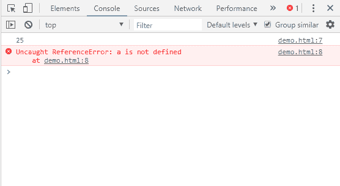
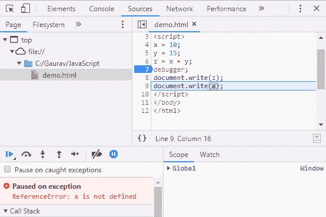

# JavaScript 调试

> 原文：<https://www.javatpoint.com/javascript-debugging>

有时代码可能包含某些错误。作为一种脚本语言，JavaScript 在浏览器中不会显示任何错误消息。但是这些错误会影响输出。

找出错误的最佳做法是调试代码。使用谷歌 Chrome、Mozilla Firebox 等网络浏览器可以轻松调试代码。

## JavaScript 调试示例

这里，我们将使用内置的 web 浏览器调试器找出错误。要执行调试，我们可以使用以下任何方法:

*   使用 console.log()方法
*   使用调试器关键字

### 使用 console.log()方法

**console.log()** 方法在浏览器的控制台显示结果。如果代码中有任何错误，它会生成错误消息。

让我们看看在控制台上打印结果的简单示例。

```js
<script>
x = 10;
y = 15;
z = x + y;
console.log(z);
console.log(a);//a is not intialized
</script>

```

**输出:**

要在浏览器上打开控制台，请按 F12 键。



### 使用调试器关键字

在调试中，通常我们设置断点来逐步检查每一行代码。在 JavaScript 中不需要手动执行这个任务。

JavaScript 提供**调试器**关键字，通过代码本身设置断点。**调试器**在应用程序的位置停止程序的执行。现在，我们可以手动启动执行流程。如果出现异常，执行将在该特定行再次停止。

```js
<script>
x = 10;
y = 15;
z = x + y;
debugger;
document.write(z);
document.write(a);
</script>

```

**输出:**



* * *