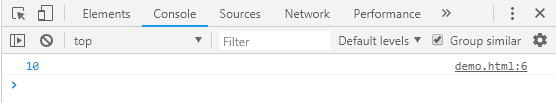
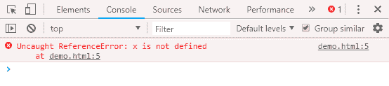
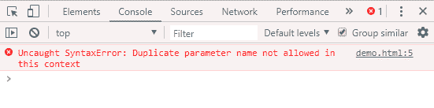

# JavaScript 严格模式

> 原文：<https://www.javatpoint.com/javascript-strict-mode>

作为一种脚本语言，有时 JavaScript 代码会显示正确的结果，即使它有一些错误。为了克服这个问题，我们可以使用 JavaScript 严格模式。

JavaScript 提供了“使用严格”；表达式来启用严格模式。如果代码中有任何无声的错误，它就会抛出一个错误。

#### 注意——“使用严格”；表达式只能作为脚本或函数中的第一条语句。

## JavaScript 使用严格示例

### 例 1

让我们看看不使用严格模式的例子。

```
<script>
x=10;
console.log(x);
</script>

```

**输出:**

这里，我们没有提供变量的类型。我们仍在取得成果。



让我们通过启用严格模式来看同样的例子。

```
<script>
"use strict";
x=10;
console.log(x);
</script>

```

**输出:**

现在，它会抛出一个错误，因为 x 的类型没有定义。



### 例 2

让我们再看一个打印两个数之和的例子。

```
<script>
console.log(sum(10,20));
function sum(a,a)
{
"use strict";
return a+a;
}
</script>

```

**输出:**

这里，当我们使用重复的元素时会出现错误。



* * *